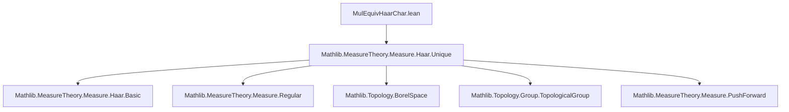
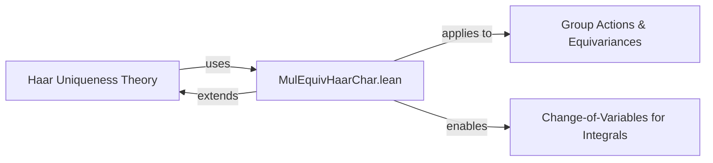

### Technical Brief: `MulEquivHaarChar.lean`

---

#### **1. Key Definitions & Theorems**

| Name | Type | Purpose |
|------|------|---------|
| `mulEquivHaarChar φ` | `G ≃ₜ* G → ℝ≥0` | Defines the positive real scaling factor by which a continuous multiplicative equivalence `φ` transforms a regular Haar measure `μ` on a locally compact group `G`, i.e., `mulEquivHaarChar φ • map φ μ = μ`. |
| `addEquivAddHaarChar` (to-additive variant) | `A ≃ₜ+ A → ℝ≥0` | Additive analog of `mulEquivHaarChar`. |
| `mulEquivHaarChar_pos` | `0 < mulEquivHaarChar φ` | Positivity of the scaling factor. |
| `mulEquivHaarChar_eq` | Equality of `mulEquivHaarChar φ` with `haarScalarFactor μ (μ.map φ)` for any regular Haar measure `μ`. | Enables computation of the factor relative to any regular Haar measure, not just `haar`. |
| `mulEquivHaarChar_smul_map` | `mulEquivHaarChar φ • μ.map φ = μ` | Core defining property: `φ` scales `μ` by this factor. |
| `mulEquivHaarChar_smul_eq_comap` | `(mulEquivHaarChar φ) • μ = μ.comap φ` | Dual formulation using pullback (`comap`). |
| `mulEquivHaarChar_smul_integral_map` | `mulEquivHaarChar φ • ∫ f ∂(μ.map φ) = ∫ f ∂μ` | Change-of-variables formula for integrals under `φ`. |
| `integral_comap_eq_mulEquivHaarChar_smul` | `∫ f ∂(μ.comap φ) = mulEquivHaarChar φ • ∫ f ∂μ` | Integral version of the pullback scaling. |
| `mulEquivHaarChar_smul_preimage` | `mulEquivHaarChar φ • μ(φ⁻¹' X) = μ(X)` | Measure scaling on preimages (set-level change of variables). |
| `mulEquivHaarChar_refl` | `mulEquivHaarChar (refl G) = 1` | Identity equivalence scales by 1. |
| `mulEquivHaarChar_trans` | `mulEquivHaarChar (ψ.trans φ) = mulEquivHaarChar ψ * mulEquivHaarChar φ` | Multiplicativity under composition (contravariant group homomorphism to `ℝ≥0ˣ`). |
| `mulEquivHaarChar_symm` | `mulEquivHaarChar φ.symm = (mulEquivHaarChar φ)⁻¹` | Inverses invert the scaling factor. |

---

#### **2. Naming Conventions**

- **Prefixes**:
  - `mulEquivHaarChar_`, `addEquivAddHaarChar_`: for multiplicative/additive versions.
  - `smul_`, `integral_`, `preimage`: indicate the context (scalar multiplication, integration, preimage).
- **Suffixes**:
  - `_pos`, `_eq`, `_smul_map`, `_smul_eq_comap`, `_smul_integral_map`, `_smul_preimage`: describe the property being asserted.
  - `_refl`, `_trans`, `_symm`: reflect algebraic structure (identity, composition, inverse).
- **Pattern**: `mulEquivHaarChar_<property>` consistently used for lemmas about the multiplicative version.

---

#### **3. Tactic Stack**

- **Core tactics**:
  - `simp`, `simp_rw`, `conv`, `rw`, `exact`, `symm`, `apply`, `let`, `change`, `nth_rw`
- **Domain-specific automation**:
  - `fun_prop`: for proving measurability/continuity goals (e.g., `Measurable φ`, `Continuous φ`).
  - `aesop`: likely used implicitly (not visible here, but standard in MeasureTheory).
- **Algebraic simplification**:
  - `ring` (implied via `mulEquivHaarChar_trans` proof sketch).
  - `ext`, `simp [e]`, `congr` (commented out due to `to_additive` incompatibility).

---

#### **4. Proof Logic**

- **Structure**:
  - **Definition**: Noncomputable definition via `haarScalarFactor`, leveraging uniqueness of Haar measure up to scalar.
  - **Lemmas**:
    - Most proofs follow a pattern:
      1. Reduce to the canonical Haar measure `haar` using `mulEquivHaarChar_eq`.
      2. Use properties of `haarScalarFactor`, `map`, `comap`, and regularity.
      3. Apply `fun_prop` to justify measurability/continuity assumptions.
      4. Use algebraic simplifications (`map_map`, `map_symm`, etc.).
    - **Inductive/algebraic structure**:
      - `trans` and `symm` lemmas use groupoid structure of `≃ₜ*` and properties of `haarScalarFactor`.
      - `integral_comap_eq_mulEquivHaarChar_smul` uses change-of-variables via `map_map` and composition identities.
- **Key reasoning**:
  - Uniqueness of Haar measure up to scalar (`isMulLeftInvariant_eq_smul_of_regular`).
  - Regularity preserved under pushforward (`Regular.map`).
  - Measurable equivalence induced by homeomorphism (`toHomeomorph.toMeasurableEquiv`).

---

#### **5. Imports**

- **Primary dependency**:
  ```lean
  Mathlib.MeasureTheory.Measure.Haar.Unique
  ```
  - Provides:
    - `haarScalarFactor`, `IsHaarMeasure`, `Regular`, `haar`, `isMulLeftInvariant_eq_smul_of_regular`.
    - Core uniqueness and scaling theory of Haar measures.

- **Scoped namespaces & imports**:
  - `MeasureTheory.Measure`
  - `NNReal`, `Pointwise`, `ENNReal` (for scalar multiplication and measure theory)
  - `Group`, `TopologicalSpace`, `MeasurableSpace`, `BorelSpace`, `IsTopologicalGroup`, `LocallyCompactSpace`

---

#### **6. Mermaid Diagrams**

##### **Dependency Graph (Module Level)**



##### **Conceptual Overview (Theory Flow)**

```mermaid
flowchart LR
  subgraph Setup
    G[Locally Compact Group G]
    μ[Regular Haar Measure μ]
    φ[G ≃ₜ* G]
  end

  subgraph Core Definition
    def[mulEquivHaarChar φ := haarScalarFactor haar (haar.map φ)]
  end

  subgraph Key Properties
    smul[mulEquivHaarChar φ • μ.map φ = μ]
    comap[(mulEquivHaarChar φ) • μ = μ.comap φ]
    int[∫ f ∂(μ.map φ) = (mulEquivHaarChar φ)⁻¹ • ∫ f ∂μ]
    preimage[mulEquivHaarChar φ • μ(φ⁻¹' X) = μ(X)]
  end

  subgraph Algebraic Structure
    refl[mulEquivHaarChar refl = 1]
    trans[mulEquivHaarChar (ψ.trans φ) = mulEquivHaarChar ψ * mulEquivHaarChar φ]
    symm[mulEquivHaarChar φ.symm = (mulEquivHaarChar φ)⁻¹]
  end

  def --> smul
  def --> comap
  def --> int
  def --> preimage
  smul --> trans
  comap --> symm
  refl --> trans
```

##### **Relationship to Haar Uniqueness Theory**



---

#### **7. Summary**

This module formalizes the **scaling behavior of Haar measures under continuous group automorphisms**, defining a canonical positive real factor (`mulEquivHaarChar`) and proving its algebraic and analytic properties. It leverages deep results from Haar measure uniqueness and regularity, and serves as a foundation for change-of-variables formulas, groupoid representations, and integration theory on homogeneous spaces. The additive version (`addEquivAddHaarChar`) is included via `to_additive`, ensuring broad applicability to abelian groups (e.g., `ℝⁿ`, locally compact abelian groups in Fourier analysis).
