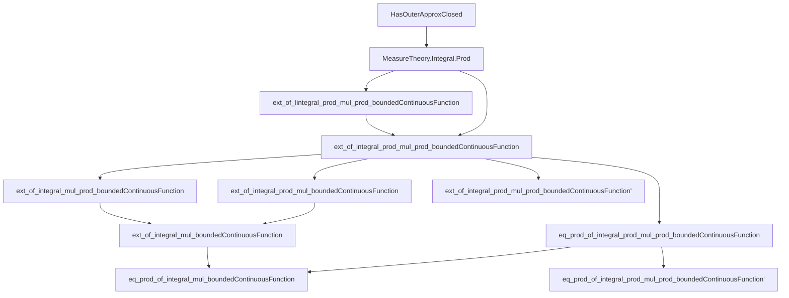
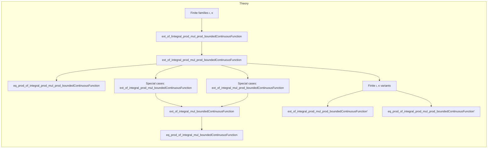

### Technical Brief: `HasOuterApproxClosedProd.lean`

---

#### **1. Key Definitions & Theorems**

| Name | Type | Purpose |
|------|------|---------|
| `HasOuterApproxClosed` | Class | Assumes each space `X i` (resp. `Y j`) is a Borel space with outer approximation by closed sets — crucial for dominated convergence arguments. |
| `BoundedContinuousFunction →ᵇ ℝ` / `→ᵇ ℝ≥0` | Type | Space of bounded continuous real-valued (resp. nonnegative) functions; used to define test functions for measure characterization. |
| `ext_of_lintegral_prod_mul_prod_boundedContinuousFunction` | `Measure → Measure → Prop → Prop` | Extends equality of measures from integrals of products of *nonnegative* bounded continuous functions over product spaces. |
| `ext_of_integral_prod_mul_prod_boundedContinuousFunction` | `Measure → Measure → Prop → Prop` | Main extension result: equality of finite measures is determined by integrals of products of bounded continuous functions over product spaces. |
| `eq_prod_of_integral_prod_mul_prod_boundedContinuousFunction` | `Measure → Measure → Measure → Prop → Prop` | Uniqueness of product measure: if a finite measure satisfies the product integral identity for all such test functions, it must be the product measure. |
| `ext_of_integral_mul_boundedContinuousFunction` | `Measure → Measure → Prop → Prop` | Classical uniqueness result for product spaces `X × Y`, using simple tensor products `f(x)·g(y)`. |
| `eq_prod_of_integral_mul_boundedContinuousFunction` | `Measure → Measure → Measure → Prop → Prop` | Uniqueness of product measure in the classical setting `X × Y`. |
| `ext_of_integral_prod_mul_boundedContinuousFunction`, `ext_of_integral_mul_prod_boundedContinuousFunction` | Variants | Specializations where one factor is a single space (e.g., `T` or `Z`) instead of a dependent product. |
| `ext_of_integral_prod_mul_prod_boundedContinuousFunction'`, `eq_prod_of_integral_prod_mul_prod_boundedContinuousFunction'` | Variants | Strengthenings for `Finite ι, κ`, using *global* bounded continuous functions on the full product spaces `(Π i, X i) →ᵇ ℝ`, not just finite products of coordinate functions. |

---

#### **2. Naming Conventions**

- **Prefixes**:
  - `ext_`: *Extension/uniqueness* lemmas — showing two measures are equal if their integrals agree on a class of test functions.
  - `eq_prod_`: *Characterization of product measure* — showing a given measure equals the product of two others.
- **Infixes**:
  - `prod_mul_prod_`: Integrals over `(Π i, X i) × (Π j, Y j)` of products of *families* of functions: `(∏ i f i) * (∏ j g j)`.
  - `prod_mul_` / `mul_prod_`: Mixed cases where one side is a single space (e.g., `(Π i, X i) × T`).
  - `mul_`: Classical case `X × Y`, integrals of `f(x)·g(y)`.
- **Suffixes**:
  - `_boundedContinuousFunction`: Test functions are bounded continuous.
  - `_nonneg` / `_nnreal`: Variant for nonnegative functions (used in intermediate lemmas).
  - `'` (prime): Variant using *global* bounded continuous functions on full product spaces (not just finite products of coordinate functions).

---

#### **3. Tactic Stack**

- **Core tactics**:
  - `simp`, `simp_rw`: Simplify using measurable structure, product sigma-algebra, indicator functions.
  - `convert`: Match goals up to definitional equality (e.g., after applying lemmas).
  - `rw [← integral_prod_mul]`: Use known formula for integrals of product measures.
  - `fun_prop`: Prove measurability/continuity of composite functions (e.g., `eval i ∘ Prod.fst`).
  - `aesop`, `linarith`: Not heavily used; this file is mostly structural and measure-theoretic.
- **Advanced measure-theoretic tactics**:
  - `tendsto_lintegral_filter_of_dominated_convergence`: Key for passing to limits in integrals using monotone/dominated convergence.
  - `lintegral_lt_top_of_nnreal`: Ensures integrability for nonnegative functions.
  - `ae_of_all`: Replace almost-everywhere statements with universal ones (when integrands are continuous).
  - `measurableSet.univ_pi`, `MeasurableSet.prod`: Measurability of cylinder sets.

---

#### **4. Proof Logic**

- **Structure**:
  1. **Reduction to nonnegative case** (`ext_of_lintegral_prod_mul_prod_boundedContinuousFunction`):
     - Define a π-system `π` of products of closed cylinders.
     - Show the σ-algebra is generated by `π`.
     - Use `ext_of_generate_finite` to reduce to checking equality on `π`.
     - Approximate indicators of closed sets via `apprSeq` (from `HasOuterApproxClosed`).
     - Apply dominated convergence to pass from approximants to indicators.
  2. **Extension to signed functions**:
     - Use `toReal_eq_toReal_iff'` and positivity to lift from nonnegative to real-valued bounded continuous functions.
  3. **Uniqueness of product measure**:
     - Show that `μ × ν` satisfies the integral identity (via `integral_prod_mul`).
     - Apply uniqueness lemma (`ext_of_integral_...`) to conclude equality.
  4. **Special cases**:
     - Use measurable equivalences (`prodComm`, `funUnique`, etc.) to reduce to the general case.
     - For `Finite ι`, use `Fintype.ofFinite` to embed into `Fintype` setting.

- **Inductive/Recursive structure**: Not used directly; relies on finite product structure and approximation by closed sets.

---

#### **5. Imports**

| Module | Purpose |
|--------|---------|
| `Mathlib.MeasureTheory.Integral.Prod` | Product measure theory, Fubini, `integral_prod_mul`, etc. |
| `Mathlib.MeasureTheory.Measure.HasOuterApproxClosed` | Provides `apprSeq`, approximation of measurable sets by closed sets, and convergence lemmas. |

---

#### **6. Mermaid Diagrams**

##### **Dependency Graph (High-Level)**

##### **Overview of File Structure**

---

#### **7. Summary**

This file establishes a **characterization of finite product measures** via integrals of *tensor products* of bounded continuous functions. It generalizes classical results (`ext_of_integral_mul_boundedContinuousFunction`) to **dependent products** over finite index types, leveraging the `HasOuterApproxClosed` assumption to handle approximation of measurable sets and apply convergence theorems. The proofs are highly structured, with a clear separation between:
- Nonnegative → signed function lifting,
- General product spaces → special cases via measurable equivalences,
- Fintype → Finite type generalizations.

The results are foundational for uniqueness proofs in probability theory (e.g., characterizing joint distributions via expectations of product test functions).
