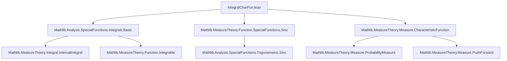
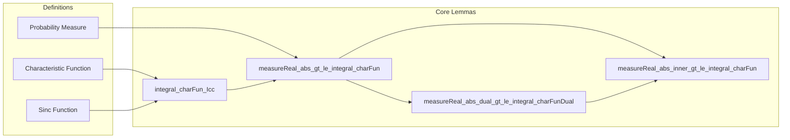
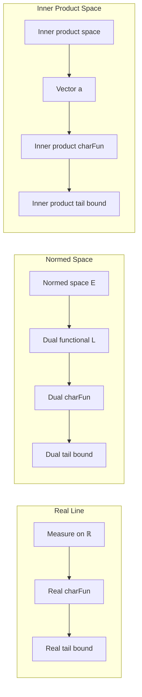

### Technical Brief: `IntegralCharFun.lean`

---

#### **1. Key Definitions & Theorems**

| Name | Type / Signature | Purpose |
|------|------------------|---------|
| `charFun` | `μ : Measure ℝ → ℝ → ℂ` | Characteristic function of a real measure: $\widehat{\mu}(t) = \int e^{i t x} \, d\mu(x)$ |
| `sinc` | `ℝ → ℝ` | Normalized sinc function: $\mathrm{sinc}(x) = \frac{\sin x}{x}$ for $x \ne 0$, $1$ at $0$ |
| `integral_charFun_Icc` | `∫ t in -r..r, charFun μ t = 2 * r * ∫ x, sinc (r * x) ∂μ` | Relates integral of characteristic function over symmetric interval to sinc integral |
| `measureReal_abs_gt_le_integral_charFun` | `μ.real {x | r < |x|} ≤ 2⁻¹ * r * ‖∫ t in (-2 * r⁻¹)..(2 * r⁻¹), 1 - charFun μ t‖` | Tail bound for real-valued random variable using characteristic function |
| `measureReal_abs_dual_gt_le_integral_charFunDual` | `μ.real {x | r < |L x|} ≤ 2⁻¹ * r * ‖∫ t in -2 * r⁻¹..2 * r⁻¹, 1 - charFunDual μ (t • L)‖` | Tail bound for linear functional $L$ in normed space via dual characteristic function |
| `measureReal_abs_inner_gt_le_integral_charFun` | `μ.real {x | r < |⟪a, x⟫|} ≤ 2⁻¹ * r * ‖∫ t in -2 * r⁻¹..2 * r⁻¹, 1 - charFun μ (t • a)‖` | Tail bound for inner product with fixed vector $a$ in inner product space |

---

#### **2. Naming Conventions**

- **Prefixes**:
  - `integral_`: integrals involving `charFun`
  - `measureReal_abs_`: bounds on measure of sets defined by $r < |x|$ or $r < |L x|$, etc.
  - `charFun_`: characteristic function-related lemmas
  - `charFunDual_`: for dual-space characteristic functions

- **Suffixes**:
  - `_Icc`: for integrals over closed interval $[-r, r]$
  - `_gt_le_`: "greater than" set bound "less than or equal to" integral expression
  - `_dual`, `_inner`: indicate application context (dual space / inner product space)

- **Variables**:
  - `μ`: measure (often probability or finite)
  - `r`: positive real parameter (radius/threshold)
  - `L`: linear functional (dual element)
  - `a`: vector in inner product space

---

#### **3. Tactic Stack**

Frequent tactics used:
- `simp_rw`, `simp`, `congr`, `rw`, `norm_cast`
- `field_simp`, `ring`, `field_simp`, `linarith`
- `gcongr`, `grw`, `setIntegral_*`, `intervalIntegral_*`
- `fun_prop`, `measurable_set'`, `aestronglyMeasurable`, `integrable_*`
- `have`, `by_cases`, `swap`, `exact`, `convert`

---

#### **4. Proof Logic**

- **Structure**:
  - **Main technique**: *Integral identities + inequality chaining*.
  - For `integral_charFun_Icc`: 
    - Use Fubini (via `intervalIntegral_integral_swap`) to swap integrals.
    - Compute inner integral explicitly using substitution and known integral of $e^{ix}$.
    - Identify result with sinc function via `integral_exp_mul_I_eq_sinc`.
  - For tail bounds (`measureReal_abs_gt_le_integral_charFun`, etc.):
    - Reduce to known inequality: $1 - \mathrm{sinc}(x) \ge \mathbf{1}_{\{2 < |x|\}}$ (up to scaling).
    - Use monotonicity of integral and norm inequalities.
    - Apply `integral_charFun_Icc` to rewrite in terms of characteristic function.
    - Generalize via pushforward measures (`map_measureReal_apply`, `charFun_map_eq_charFunDual_smul`).

- **Induction**: Not used.
- **Case analysis**: Used for $y = 0$ vs $y \ne 0$ in integral computation.
- **Measure-theoretic tools**: Pushforward measures, integrability checks, Fubini/Tonelli.

---

#### **5. Imports**

- `Mathlib.Analysis.SpecialFunctions.Integrals.Basic`: interval integrals, Fubini, substitution.
- `Mathlib.MeasureTheory.Function.SpecialFunctions.Sinc`: properties of sinc, integrability.
- `Mathlib.MeasureTheory.Measure.CharacteristicFunction`: definition and basic properties of characteristic functions.

---

#### **6. Mermaid Diagrams**

##### **Dependency Graph (File-Level)**

##### **Overview of Theory Flow**

##### **Application Context**

--- 

This file is part of a larger effort to connect *characteristic functions* (Fourier analysis) with *probability tail bounds*, especially in infinite-dimensional settings (normed/dual/inner product spaces), using measure-theoretic tools and Lean’s `Mathlib`.
