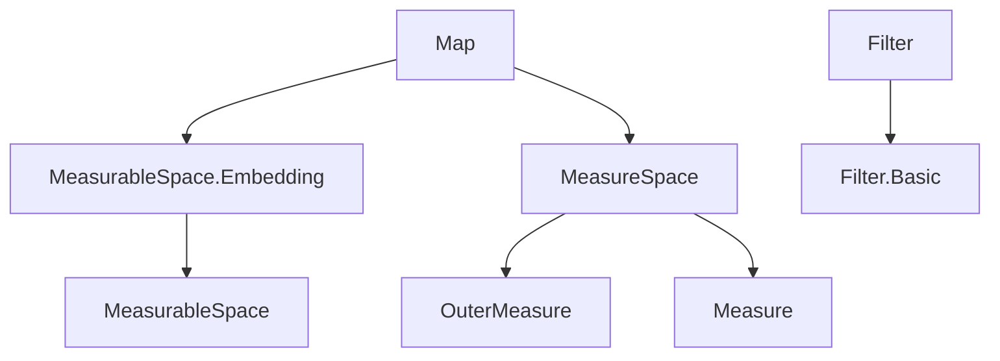

**Technical Brief: `Map.lean` — Pushforward of Measures in Lean 4 / Mathlib**

---

### 1. **Key Definitions & Theorems**

| Name | Type / Signature | Purpose |
|------|------------------|---------|
| `liftLinear` | `(f : OuterMeasure α →ₗ[ℝ≥0∞] OuterMeasure β) → (∀ μ, …) → Measure α →ₗ[ℝ≥0∞] Measure β` | Lifts a linear map on outer measures to one on measures, assuming Carathéodory measurability. |
| `mapₗ` | `(f : α → β) → Measure α →ₗ[ℝ≥0∞] Measure β` | Pushforward of a measure along a *measurable* map `f`, defined as `liftLinear (OuterMeasure.map f)` if `f` is measurable, else `0`. |
| `map` | `(f : α → β) → Measure α → Measure β` | Pushforward of a measure along an *a.e. measurable* map `f`, defined as `mapₗ (hf.mk f) μ` if `AEMeasurable f μ`, else `0`. |
| `map_apply` | `Measurable f → MeasurableSet s → μ.map f s = μ (f ⁻¹' s)` | Evaluates pushforward on measurable sets: standard change-of-variables formula. |
| `map_map` | `Measurable g → Measurable f → (μ.map f).map g = μ.map (g ∘ f)` | Functoriality of pushforward under composition of measurable maps. |
| `map_congr` | `f =ᵐ[μ] g → μ.map f = μ.map g` | Pushforward depends only on the a.e. equivalence class of `f`. |
| `map_eq_zero_iff` | `AEMeasurable f μ → μ.map f = 0 ↔ μ = 0` | Pushforward is zero iff original measure is zero (under a.e. measurability). |
| `tendsto_ae_map` | `AEMeasurable f μ → Tendsto f (ae μ) (ae (μ.map f))` | `f` pushes the almost-everywhere filter of `μ` to that of `μ.map f`. |
| `map_apply` (in `MeasurableEmbedding`) | `MeasurableEmbedding f → μ.map f s = μ (f ⁻¹' s)` | Extends `map_apply` to *all* sets `s` when `f` is a measurable embedding. |
| `MeasurableEquiv.map_apply` | `μ.map f s = μ (f ⁻¹' s)` | For measurable equivalences, pushforward evaluates on *all* sets (not just measurable). |
| `map_symm_map`, `map_map_symm` | `(μ.map e).map e.symm = μ`, etc. | Inverse laws for pushforward under measurable equivalences. |

---

### 2. **Naming Conventions**

- **Prefixes**:
  - `mapₗ`: linearized pushforward (for *measurable* maps).
  - `map`: full pushforward (for *a.e. measurable* maps).
  - `liftLinear`: lifting construction for linear maps on measures.
- **Suffixes**:
  - `_apply`: evaluation on sets (e.g., `map_apply`, `map_apply₀`, `map_apply_of_aemeasurable`).
  - `_congr`: congruence lemmas (e.g., `map_congr`, `mapₗ_congr`).
  - `_iff`: equivalence statements (e.g., `map_eq_zero_iff`, `mapₗ_eq_zero_iff`).
- **Quantifier prefixes**:
  - `ae_`, `aemeasurable`, `AEMeasurable`: denote almost-everywhere variants.
- **Special cases**:
  - `map_id`, `map_id'`: identity map.
  - `map_zero`, `map_add`, `map_smul`: algebraic properties.

---

### 3. **Tactic Stack**

Frequent tactics used in proofs:

| Tactic | Role |
|--------|------|
| `simp` / `simp only` | Simplify using definitional equalities and lemmas like `map_apply`, `mapₗ`, `toMeasure_apply`. |
| `ext` | Extensionality for measures (showing equality by evaluating on measurable sets). |
| `rw` / `rwa` | Rewrite using hypotheses or lemmas (e.g., `hf`, `hs`, `preimage_comp`). |
| `gcongr` | Apply monotonicity in inequalities (e.g., `μ s ≤ μ t` when `s ⊆ t`). |
| `cases` / `rcases` | Case analysis on `eq_or_ne c 0`, `hf : AEMeasurable f μ`, etc. |
| `filter_upwards` | Prove almost-everywhere statements. |
| `nonpos_iff_eq_zero.mp` | Convert `≤ 0` to `= 0` for nonnegative reals/ENNReals. |
| `aesop` (implicit) | Used in `map_add`, `map_smul`, etc., via `by aesop` or `aesop`-like automation in `simp`-heavy proofs. |
| `measurableSet_toMeasurable`, `subset_toMeasurable`, `measure_toMeasurable` | Standard lemmas for handling non-measurable sets via measurable hulls. |

---

### 4. **Proof Logic Flow**

Typical proof structure:

1. **Case split on measurability**:
   - `by_cases hf : AEMeasurable f μ` or `hf : Measurable f`.
   - Then use `dif_pos`/`dif_neg` to unfold `map`/`mapₗ`.

2. **Reduce to outer measure**:
   - Use `mapₗ`, `liftLinear_apply`, `OuterMeasure.map_apply`.
   - Often rely on `hf.measurable_mk` or `hf.ae_eq_mk`.

3. **Apply extensionality (`ext`)**:
   - For measure equality: reduce to showing equality on measurable sets.

4. **Handle non-measurable sets**:
   - Use `toMeasurable`, `subset_toMeasurable`, `measure_toMeasurable`.
   - E.g., in `le_map_apply`, bound from below using measurable hull.

5. **Use congruence lemmas**:
   - `map_congr`, `mapₗ_congr` when dealing with a.e.-equal functions.

6. **Functoriality via composition**:
   - `map_map` uses `preimage_comp` and `map_apply` repeatedly.

7. **Equivalence inverses**:
   - `map_symm_map`, `map_map_symm` follow from `map_map` and `measurable_symm`.

---

### 5. **Imports & Dependencies**

| Module | Role |
|--------|------|
| `Mathlib.MeasureTheory.MeasurableSpace.Embedding` | Provides `MeasurableEmbedding`, `MeasurableEquiv`. |
| `Mathlib.MeasureTheory.Measure.MeasureSpace` | Defines `Measure`, `OuterMeasure`, `toOuterMeasure`, `toMeasure`, null measurable sets, etc. |
| `Filter` (hiding `map`) | Needed for `ae`, `tendsto`, `eventually`, etc. |
| `ENNReal`, `NNReal`, `Set`, `Function` | Basic types and utilities for measure theory. |

---

### 6. **Mermaid Diagrams**

#### **Dependency Graph (Module-Level)**



#### **Conceptual Overview of `map` Construction**

```mermaid
graph TD
  A[Map f μ] -->|if AEMeasurable f μ| B[mapₗ (hf.mk f) μ]
  A -->|else| C[0]
  B --> D[liftLinear (OuterMeasure.map f) _]
  D --> E[OuterMeasure.map f]
  E --> F[Preimage pullback: s ↦ μ(f⁻¹' s)]
  D --> G[Carathéodory condition]
  G --> H[Measurability of preimages]
```

#### **Proof Strategy Flow (e.g., `map_map`)**

```mermaid
graph LR
  Start[Goal: (μ.map f).map g = μ.map (g ∘ f)] --> Case[Case: Measurable g, f]
  Case --> Ext[Apply ext on measurable s]
  Ext --> Simplify[Expand map via map_apply]
  Simplify --> Preimage[Use preimage_comp]
  Preimage --> Done[Equality holds]
```

---

### 7. **Summary**

This file formalizes the **pushforward (or image) measure** in the context of measure theory over measurable spaces. It supports both measurable and almost-everywhere measurable maps, and ensures:

- **Functoriality** under composition (`map_map`).
- **Congruence** under almost-everywhere equality (`map_congr`).
- **Linearity** (`map_add`, `map_smul`).
- **Interaction with null sets** (`preimage_null_of_map_null`, `tendsto_ae_map`).
- **Extension to all sets** under stronger assumptions (measurable embeddings, equivalences).

It serves as a foundational module for integration, change-of-variables, and disintegration of measures in Mathlib.

--- 

*End of Technical Brief.*
