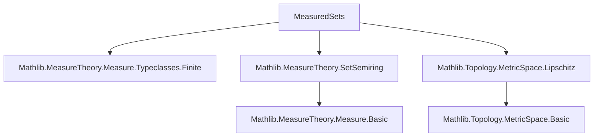
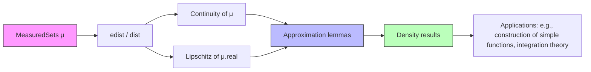

### Technical Brief: `MeasuredSets.lean`

---

#### **1. Key Definitions & Theorems**

| Name | Type / Signature | Purpose |
|------|------------------|---------|
| `MeasuredSets μ` | `Type _` | Subtype of measurable sets w.r.t. `μ`; used as a space for metric geometry. |
| `edist` | `MeasuredSets μ → MeasuredSets μ → ℝ≥0∞` | Extended pseudometric: `edist s t = μ (s ∆ t)` |
| `dist` (when `IsFiniteMeasure μ`) | `MeasuredSets μ → MeasuredSets μ → ℝ` | Actual metric: `dist s t = μ.real (s ∆ t)` |
| `MeasuredSets.sub_le_edist` | `μ s - μ t ≤ edist s t` | Shows measure is 1-Lipschitz w.r.t. `edist`. |
| `MeasuredSets.continuous_measure` | `Continuous (fun s ↦ μ s)` | Continuity of measure as a function on `MeasuredSets μ`. |
| `MeasuredSets.lipschitzWith_measureReal` | `LipschitzWith 1 (fun s ↦ μ.real s)` | Quantitative Lipschitz property under finite measure. |
| `exists_measure_symmDiff_lt_of_generateFrom_isSetRing` | `∃ t ∈ C, μ (t ∆ s) < ε` | Approximation of measurable sets by elements of a *ring* `C`. |
| `exists_measure_symmDiff_lt_of_generateFrom_isSetSemiring` | `∃ t ∈ supClosure C, μ (t ∆ s) < ε` | Approximation by finite unions of a *semiring* `C`. |
| `dense_of_generateFrom_isSetRing` | `Dense ((coe ⁻¹' C))` | Density of sets from ring `C` in `MeasuredSets μ`. |
| `dense_of_generateFrom_isSetSemiring` | `Dense ((coe ⁻¹' (supClosure C)))` | Density of finite unions of semiring `C`. |

---

#### **2. Naming Conventions**

- **Prefixes**:
  - `MeasuredSets.`: All definitions/lemmas live in this namespace.
  - `edist_`, `dist_`: For metric-related lemmas (`edist_def`, `dist_def`).
  - `sub_le_`, `real_sub_real_le_`: For inequalities involving measure differences.
  - `exists_measure_symmDiff_lt_`: For approximation lemmas.
  - `dense_of_generateFrom_`: For density results.

- **Suffixes**:
  - `_def`: Definition lemmas (e.g., `edist_def`, `dist_def`).
  - `_le_`, `_lt_`: Inequality or strict inequality lemmas.
  - `_mem`: Membership in structures like `C`, `supClosure C`.
  - `_of_`: Conditions or assumptions (e.g., `of_generateFrom_isSetRing`).

---

#### **3. Tactic Stack**

Frequently used tactics:
- `simp`, `grind`, `gcongr`, `grw`: Simplification, rewriting, and congruence.
- `exact`, `refine`, `obtain`, `choose!`: Proof construction and existential elimination.
- `rw`, `apply`, `convert`: Rewriting and application.
- `tendsto_measure_iInter_atTop`, `tendsto_measure_biUnion_Ici_zero_of_pairwise_disjoint`: Measure-theoretic continuity lemmas.
- `EMetric.dense_iff`, `MeasurableSpace.induction_on_inter`: Structural induction over σ-algebras.
- `supClosure`, `isSetRing`, `isSetSemiring`: Algebraic structure reasoning.

---

#### **4. Proof Logic**

- **Inductive structure**: Proofs often use *measurable space induction* (`MeasurableSpace.induction_on_inter`) to extend properties from a generating ring/semiring to the full σ-algebra.
- **Approximation strategy**:
  - Show the target property holds for `∅`, `C`, stable under complement (using covering condition `h'C`), and stable under disjoint countable unions.
  - Use continuity of measure (via `tendsto_measure_iInter_atTop`, etc.) to pass to limits.
- **Metric arguments**:
  - Use `edist` to define distance; reduce to `dist` under finite measure.
  - Prove Lipschitz continuity via `sub_le_edist`, then deduce continuity and density.
- **Covering condition `h'C`**:
  - Crucial for complement stability: ensures `univ` is approximable by sets in `C`, enabling `sᶜ ≈ t' \ t`.

---

#### **5. Imports & Dependencies**

| Module | Role |
|--------|------|
| `Mathlib.MeasureTheory.Measure.Typeclasses.Finite` | `IsFiniteMeasure` class and consequences. |
| `Mathlib.MeasureTheory.SetSemiring` | `IsSetRing`, `IsSetSemiring`, `supClosure`, algebraic closure properties. |
| `Mathlib.Topology.MetricSpace.Lipschitz` | Lipschitz continuity, `LipschitzWith`, `PseudoEMetricSpace`. |
| `Mathlib.Topology.MetricSpace.Basic` (via `PseudoEMetricSpace`) | Extended metric space infrastructure. |
| `Mathlib.MeasureTheory.Measure.Basic` (implicit) | Measure theory basics: `∆`, `MeasurableSet`, `measure_mono`, etc. |

---

#### **6. Mermaid Diagrams**

##### **Dependency Graph (Module-Level)**



##### **Overview of Theory Flow**



##### **Approximation Proof Structure**

```mermaid
flowchart LR
  C[Ring/Semiring C] -->|hC| H[IsSetRing / IsSetSemiring]
  H --> I[Induction on σ-algebra]
  I --> J[Stability under ∅, complement, disjoint unions]
  J --> K[Covering condition h'C]
  K --> L[Approximate univ]
  L --> M[Complement stability]
  M --> N[Disjoint union stability via finite approximants]
  N --> O[Conclusion: ∃ t ∈ C, μ(t ∆ s) < ε]
```

---

#### **7. Summary**

This file introduces the **space of measurable sets modulo null sets**, equipped with the **symmetric difference metric** induced by a measure `μ`. It establishes:
- A pseudometric (or metric under finite measure) structure.
- Lipschitz continuity of the measure as a function on this space.
- A **density theorem**: measurable sets can be approximated by sets from a generating ring/semiring, provided it covers the space modulo null sets.

The results are foundational for measure-theoretic constructions (e.g., proving density of simple functions, constructing conditional expectations), and are carefully formalized using Lean’s typeclass inference and induction principles for σ-algebras.
