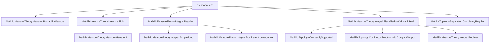
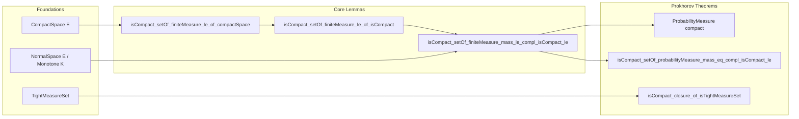

### Technical Brief: Prokhorov.lean

---

#### **1. Key Definitions & Theorems**

| Name | Type / Signature | Purpose |
|------|------------------|---------|
| `isCompact_setOf_finiteMeasure_le_of_compactSpace` | `[CompactSpace E] → (C : ℝ≥0) → IsCompact {μ : FiniteMeasure E | μ.mass ≤ C}` | Proves compactness of finite measures with bounded mass on a compact space. |
| `isCompact_setOf_finiteMeasure_eq_of_compactSpace` | `[CompactSpace E] → (C : ℝ≥0) → IsCompact {μ : FiniteMeasure E | μ.mass = C}` | Specializes previous result to fixed mass `C`. |
| `instance CompactSpaceProbabilityMeasure` | `[CompactSpace E] → CompactSpace (ProbabilityMeasure E)` | Shows space of probability measures is compact when base space is compact. |
| `isCompact_setOf_finiteMeasure_le_of_isCompact` | `(C : ℝ≥0) → {K : Set E} → IsCompact K → IsCompact {μ : FiniteMeasure E | μ.mass ≤ C ∧ μ Kᶜ = 0}` | Compactness of finite measures supported in a fixed compact set. |
| `isCompact_setOf_finiteMeasure_mass_le_compl_isCompact_le` | `{u : ℕ → ℝ≥0} → {K : ℕ → Set E} → C : ℝ≥0 → Tendsto u atTop (𝓝 0) → (∀ n, IsCompact (K n)) → (NormalSpace E ∨ Monotone K) → IsCompact {μ : FiniteMeasure E | μ.mass ≤ C ∧ ∀ n, μ (K n)ᶜ ≤ u n}` | **Prokhorov theorem for finite measures**: tightness + control on complements ⇒ compactness. |
| `isCompact_setOf_finiteMeasure_mass_eq_compl_isCompact_le` | Same hypotheses as above, but with `μ.mass = C`. | Fixed-mass version of Prokhorov. |
| `isCompact_setOf_probabilityMeasure_mass_eq_compl_isCompact_le` | Same hypotheses, but for probability measures: `IsCompact {μ : ProbabilityMeasure E | ∀ n, μ (K n)ᶜ ≤ u n}` | **Prokhorov theorem for probability measures**. |
| `isCompact_closure_of_isTightMeasureSet` | `{S : Set (ProbabilityMeasure E)} → IsTightMeasureSet {μ : Measure E | ∃ μ' ∈ S, μ = μ'} → IsCompact (closure S)` | Closure of a tight set of probability measures is compact. |

---

#### **2. Naming Conventions**

- **Prefixes**:
  - `isCompact_...`: asserts compactness of a set.
  - `inst...`: typeclass instances (`CompactSpaceProbabilityMeasure`).
  - `lemma...`, `theorem...`: standard proof statements.
- **Suffixes**:
  - `_of_compactSpace`: condition on base space.
  - `_of_isCompact`: condition on a specific compact subset.
  - `_mass_le_compl_isCompact_le`: mass control on complements of compact sets.
  - `_mass_eq_compl_isCompact_le`: equality mass constraint.
- **Other patterns**:
  - `toFiniteMeasure`: embedding from `ProbabilityMeasure` to `FiniteMeasure`.
  - `restrict`, `map`, `comap`: standard measure operations.
  - `innerRegular`, `tight`, `disjointed`, `partialSups`: technical constructions.

---

#### **3. Tactic Stack**

| Tactic | Frequency | Purpose |
|--------|-----------|---------|
| `filter_upwards` | High | Ultrafilter convergence arguments. |
| `gcongr` | High | Inequalities involving integrals, norms, measures. |
| `simp only` / `simp_rw` | Very High | Simplification with precise rewrites. |
| `convert` | Medium | Matching goals up to definitional equality. |
| `apply ... using` | Medium | Applying lemmas with specific arguments. |
| `rw [← ...]` | High | Rewriting definitions or characterizations. |
| `apply le_of_tendsto` / `apply le_of_tendsto'` | High | Bounding limits via convergence. |
| `tendsto_iff_forall_integral_tendsto` | Medium | Characterizing weak convergence via integrals. |
| `apply tendsto_of_forall_integral_tendsto` | Medium | Constructing convergence from integral convergence. |
| `apply IsCompact.image _ ...` | Medium | Propagating compactness through maps. |
| `apply (hK n).isClosed...` | Medium | Using measurability/closedness of compact sets. |
| `apply ENNReal.coe_le_coe.1 / .2` | Medium | Translating inequalities between `ℝ≥0∞` and `ℝ≥0`. |
| `apply Summable.tendsto_sum_tsum_nat` | Low | Convergence of infinite sums. |
| `apply tendsto_finset_sum _ ...` | Medium | Convergence of finite sums of measures. |
| `apply measure_empty` | Low | Handling empty sets. |
| `apply disjoint_iff.1` | Low | Disjointness arguments. |

---

#### **4. Proof Logic**

The proofs follow a **measure-theoretic ultrafilter-based compactness strategy**, avoiding second-countability or metrizability assumptions.

- **Ultrafilter approach**: Instead of sequences, use `isCompact_iff_ultrafilter_le_nhds'` to prove compactness: for any ultrafilter `f`, find a limit point `μ` such that `Tendsto id f (𝓝 μ)`.

- **Riesz–Markov–Kakutani (RMK)**: Used to construct limiting measures from linear functionals on `C_c(E, ℝ)` (compactly supported continuous functions). This is key when base space is not metrizable.

- **Decomposition via disjointed sets**: For Prokhorov-type theorems, decompose space into disjoint pieces `disjointed K n`, restrict measures to each, extract convergent subsequences (via compact support), and reassemble as `μ = ∑ νₙ`.

- **Inner regularity trick**: When space is normal, ensure limiting measures are inner regular (via RMK), enabling control of `μ(Kₙᶜ)` via integrals of continuous functions.

- **Monotonicity trick**: When `Kₙ` is monotone, use algebraic properties of `partialSups K n` and `disjointed K n` to bound masses directly.

- **Tightness ⇒ compact closure**: Use existence of a sequence `uₙ ↘ 0` and compact sets `Kₙ` approximating tightness, then embed into the compact set from Prokhorov theorem.

---

#### **5. Imports & Dependencies**

| Module | Role |
|--------|------|
| `Mathlib.MeasureTheory.Measure.ProbabilityMeasure` | Core definitions of probability measures. |
| `Mathlib.MeasureTheory.Measure.Tight` | Tightness of measure sets. |
| `Mathlib.MeasureTheory.Integral.Regular` | Regularity of integrals, needed for RMK. |
| `Mathlib.MeasureTheory.Integral.RieszMarkovKakutani.Real` | Riesz–Markov–Kakutani representation theorem. |
| `Mathlib.Topology.Separation.CompletelyRegular` | Separation axioms (used for normality case). |

---

#### **6. Mermaid Diagrams**

##### **Dependency Graph (High-Level)**

##### **Overview of Theoretical Flow**

---

#### **7. Summary**

This file formalizes **Prokhorov-type compactness theorems** in full generality (no metrizability or second-countability). It leverages:

- **Ultrafilter convergence** for compactness,
- **Riesz–Markov–Kakutani** to construct limits,
- **Inner regularity** and **monotonicity** to handle non-closed constraints like `μ(Kₙᶜ) ≤ uₙ`.

The results are foundational for weak convergence of measures in non-metrizable settings, with applications in probability theory and functional analysis.

--- 

Let me know if you'd like a formalized dependency graph (e.g., `.lean`-level imports), or a breakdown of the `RealRMK` usage.
