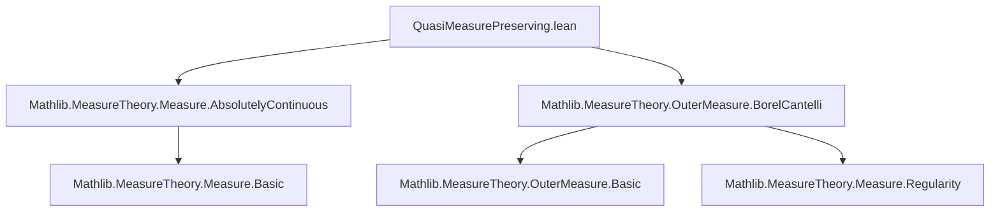
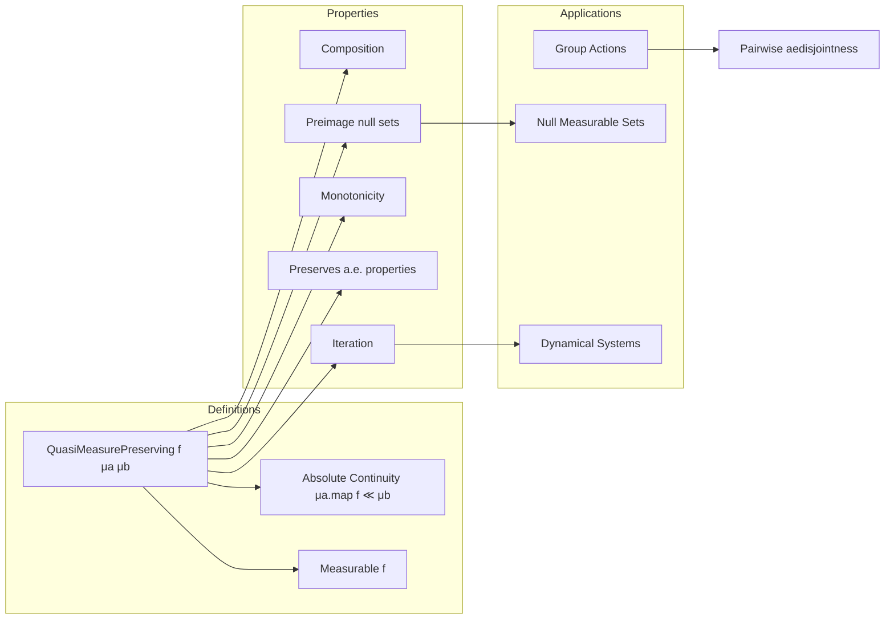

### Technical Brief: `QuasiMeasurePreserving.lean`

---

#### **1. Key Definitions & Theorems**

| Name | Type / Signature | Purpose |
|------|------------------|---------|
| `QuasiMeasurePreserving` | `f : α → β → Prop` | Defines that `f` is measurable and `μa.map f ≪ μb` (i.e., pullback null sets are `μa`-null). |
| `id` | `QuasiMeasurePreserving id μ μ` | Identity map is quasi-measure-preserving. |
| `Measurable.quasiMeasurePreserving` | `Measurable f → QuasiMeasurePreserving f μ (μ.map f)` | Any measurable map is quasi-measure-preserving into its pushforward. |
| `mono_left`, `mono_right`, `mono` | Monotonicity in source/target measures under absolute continuity. | Allows weakening/strengthening of measures while preserving the property. |
| `comp` | `QuasiMeasurePreserving g μb μc → QuasiMeasurePreserving f μa μb → QuasiMeasurePreserving (g ∘ f) μa μc` | Closure under composition. |
| `iterate` | `QuasiMeasurePreserving f μ μ → ∀ n, QuasiMeasurePreserving f^[n] μ μ` | Iterates of self-maps remain quasi-measure-preserving. |
| `aemeasurable` | `QuasiMeasurePreserving f μa μb → AEMeasurable f μa` | Quasi-measure-preserving maps are almost everywhere measurable. |
| `ae`, `ae_eq` | Preservation of almost-everywhere properties under precomposition. | If `p` holds `μb`-a.e., then `p ∘ f` holds `μa`-a.e. |
| `preimage_null` | `μb s = 0 → μa (f ⁻¹' s) = 0` | Direct restatement of absolute continuity of pushforward. |
| `preimage_mono_ae`, `preimage_ae_eq` | Preservation of a.e. inclusion/equality of sets under preimage. |
| `exists_preimage_eq_of_preimage_ae` | For a.e. invariant null-measurable sets, existence of a *measurably* invariant representative. |
| `limsup_preimage_iterate_ae_eq`, `liminf_preimage_iterate_ae_eq` | For a.e. invariant sets under self-map, limsup/liminf of preimages are a.e. equal to the set. |
| `smul_ae_eq_of_ae_eq` | Action of group elements (via quasi-measure-preserving maps) preserves a.e. equality of sets. |
| `pairwise_aedisjoint_of_aedisjoint_forall_ne_one` | Under group action, a.e. disjointness for non-identity elements implies pairwise a.e. disjointness of orbit sets. |
| `NullMeasurable.comp_quasiMeasurePreserving` | Composition with quasi-measure-preserving map preserves null measurability. |
| `MeasurableEquiv.quasiMeasurePreserving_symm` | Measurable equivalence `e : α ≃ᵐ β` implies `e.symm` is quasi-measure-preserving from `μ.map e` to `μ`. |

---

#### **2. Naming Conventions**

- **Prefixes**:
  - `preimage_`: properties of preimages under `f`.
  - `mono_`: monotonicity in measures.
  - `ae_`: almost-everywhere properties.
  - `iterate_`, `limsup_`, `liminf_`: dynamical systems behavior.
  - `smul_`: scalar multiplication / group action compatibility.

- **Suffixes**:
  - `_left`, `_right`: position of monotonicity argument.
  - `_ae_eq`, `_mono_ae`: a.e. variants.
  - `_iff`: biconditional characterizations (e.g., `nullMeasurableSet_smul_measure_iff`).
  - `_symm`: symmetry-related (e.g., `quasiMeasurePreserving_symm`).

- **Structure fields**:
  - `measurable`, `absolutelyContinuous`: explicit projections of `QuasiMeasurePreserving`.

---

#### **3. Tactic Stack**

Frequently used tactics in proofs:

| Tactic | Role |
|--------|------|
| `measurability` | Solves measurable set/map goals automatically. |
| `rw [...]` | Rewriting using lemmas like `map_map`, `preimage_comp`, `inv_mul_cancel`. |
| `simp only [...]` | Simplification with specific lemmas (e.g., `Set.preimage_iterate_eq`). |
| `exact`, `apply`, `convert` | Goal-directed proof construction. |
| `induction ... with` | Structural induction (e.g., on `n : ℕ`). |
| `convert`, `symm`, `trans` | Equality chaining and symmetry handling. |
| `aesop` | Not present — this file avoids automation-heavy tactics. |
| `rwa`, `rw [...] at` | Rewriting in hypotheses. |
| `change`, `exact ... ▸ ...` | Substitution via equality. |

---

#### **4. Proof Logic**

- **Inductive structure** for `iterate` and `preimage_iterate_ae_eq`.
- **Chain of absolute continuity**: `μa.map f ≪ μb` and `μb ≪ μc` ⇒ `μa.map f ≪ μc`.
- **Preimage-based reasoning**: many lemmas reduce to properties of `f ⁻¹' s`, especially using:
  - `preimage_null_of_map_null`
  - `ae_map_le` and `tendsto_ae_map`
- **Dynamical systems flavor**: invariance modulo null sets (`=ᵐ[μ]`) and their lifting to measurable invariance.
- **Group action compatibility**: uses `Equiv`, `MulAction`, `smul`, and `zpow` to handle integer powers and inverses.

---

#### **5. Imports**

| Module | Purpose |
|--------|---------|
| `Mathlib.MeasureTheory.Measure.AbsolutelyContinuous` | Core theory of absolute continuity `≪`, used in `absolutelyContinuous` field. |
| `Mathlib.MeasureTheory.OuterMeasure.BorelCantelli` | Provides tools for limsup/liminf of sets and Borel–Cantelli lemmas (used in `limsup_preimage_iterate_ae_eq`, etc.). |

---

#### **8. Mermaid Diagrams**

##### **Dependency Graph (Top-Level)**

##### **Conceptual Overview of Theory**

##### **Module Scope & Theory Context**

- **Core theory**: Extends absolute continuity to maps between measure spaces.
- **Bridge**: Connects measure theory with:
  - **Dynamical systems** (via iteration, invariance modulo null sets),
  - **Group actions** (via `smul`, `QuasiMeasurePreserving` for group elements),
  - **Descriptive set theory** (via `NullMeasurableSet`, lifting a.e. invariance to true invariance).
- **Foundational role**: Used in ergodic theory, entropy, and classification of measure-preserving transformations.

--- 

Let me know if you'd like a formalized dependency graph (e.g., `leanpkg` tree), or a proof sketch of a key theorem like `exists_preimage_eq_of_preimage_ae`.
