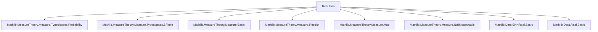
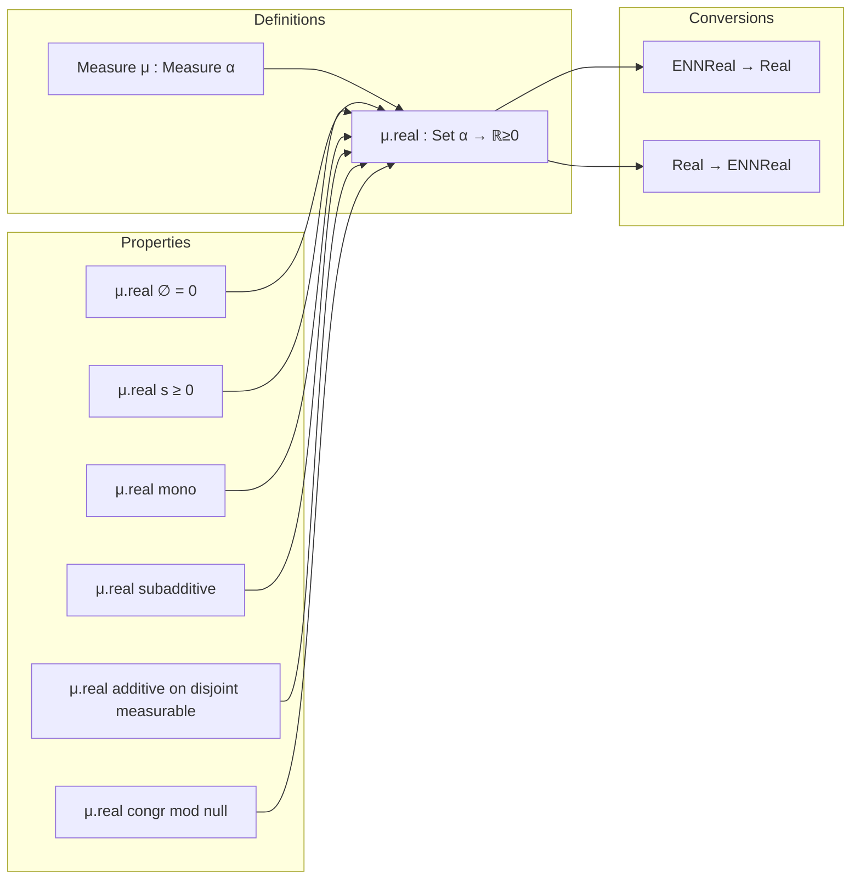

Here is the structured technical brief for the `Real.lean` file:

---

### **1. Key Definitions & Theorems**

| Name | Type / Signature | Purpose |
|------|------------------|---------|
| `μ.real` | `Measure α → Set α → ℝ≥0` | Converts a measure `μ` to a real-valued function via `ENNReal.toReal`. Defined as `μ.real s = (μ s).toReal`. |
| `measureReal_eq_zero_iff` | `μ s ≠ ∞ → (μ.real s = 0 ↔ μ s = 0)` | Relates vanishing of real-valued measure to vanishing of original ENNReal-valued measure. |
| `measureReal_nonneg` | `0 ≤ μ.real s` | Nonnegativity of real-valued measure. |
| `measureReal_empty` | `μ.real ∅ = 0` | Measure of empty set is zero. |
| `measureReal_univ_pos` | `[IsFiniteMeasure μ] → [NeZero μ] → 0 < μ.real univ` | Positive total measure under finite, nonzero probability-like assumptions. |
| `ofReal_measureReal` | `μ s ≠ ∞ → ENNReal.ofReal (μ.real s) = μ s` | Inverse relationship: lifting real measure back to ENNReal recovers original. |
| `measureReal_mono` | `s₁ ⊆ s₂ → μ s₂ ≠ ∞ → μ.real s₁ ≤ μ.real s₂` | Monotonicity of real-valued measure. |
| `measureReal_union_le` | `μ.real (s₁ ∪ s₂) ≤ μ.real s₁ + μ.real s₂` | Subadditivity of real-valued measure. |
| `measureReal_union` | `Disjoint s₁ s₂ → MeasurableSet s₂ → μ s₁ ≠ ∞ → μ s₂ ≠ ∞ → μ.real (s₁ ∪ s₂) = μ.real s₁ + μ.real s₂` | Additivity over disjoint measurable sets. |
| `measureReal_congr` | `s =ᵐ[μ] t → μ.real s = μ.real t` | Equality modulo null sets implies equal real measures. |
| `measureReal_diff` | `s₂ ⊆ s₁ → MeasurableSet s₂ → μ s₁ ≠ ∞ → μ.real (s₁ \ s₂) = μ.real s₁ - μ.real s₂` | Difference formula for real measures. |
| `measureReal_compl` | `[IsFiniteMeasure μ] → MeasurableSet s → μ.real sᶜ = μ.real univ - μ.real s` | Complement formula under finite total measure. |
| `sum_measureReal_singleton` | `[MeasurableSingletonClass α] → [SigmaFinite μ] → ∑ b ∈ s, μ.real {b} = μ.real s` | Summing point masses recovers measure of finite set. |
| `exists_nonempty_inter_of_measureReal_univ_lt_sum_measure` | `[IsFiniteMeasure μ] → μ.real univ < ∑ i ∈ s, μ.real (t i) → ∃ i ≠ j, (t i ∩ t j).Nonempty` | Pigeonhole principle for real-valued measures. |
| `nonempty_inter_of_measureReal_lt_add` | `MeasurableSet t → s ⊆ u → t ⊆ u → μ.real u < μ.real s + μ.real t → μ u ≠ ∞ → (s ∩ t).Nonempty` | Intersection nonemptiness criterion. |

---

### **2. Naming Conventions**

- **Prefixes**:
  - `measureReal_`: Indicates theorems about the real-valued version of measure (`μ.real`).
  - `probReal_`: Special case when `μ` is a probability measure (e.g., `probReal_univ`, `probReal_compl_eq_one_sub`).
- **Suffixes**:
  - `_apply`: Applied version (e.g., `measureReal_zero_apply`).
  - `_iff`: Biconditional equivalence (e.g., `measureReal_eq_zero_iff`).
  - `_null`: Involves null sets or zero measure (e.g., `measureReal_union_null`, `measureReal_diff_null`).
  - `_₀`: Versions for `NullMeasurableSet` instead of `MeasurableSet` (e.g., `measureReal_union₀`, `measureReal_inter_add_diff₀`).
  - `_congr`, `_mono`, `_diff`: Functional properties (congruence, monotonicity, difference).
- **Special**:
  - `ofReal_`, `toReal_`: Explicit use of `ENNReal.ofReal` / `ENNReal.toReal`.

---

### **3. Tactic Stack**

Frequently used tactics in proofs:
- `simp` / `simp_rw`: Simplification using definitions (`measureReal_def`, `restrict_apply`, etc.).
- `rw`: Rewriting with lemmas like `ENNReal.toReal_add`, `measure_union_le`, etc.
- `rcases eq_top_or_lt_top`: Case analysis on whether a measure is finite or infinite.
- `exact`, `apply`, `convert`: Direct proof steps.
- `gcongr`: For monotonicity goals.
- `linarith`, `ring`: Arithmetic reasoning (especially in difference/complement lemmas).
- `finiteness`: Custom tactic used in assumptions like `(h : μ s ≠ ∞ := by finiteness)` to discharge finiteness goals.

---

### **4. Proof Logic**

- **Standard pattern**:
  1. **Case split** on whether `μ s = ∞` or `< ∞` using `eq_top_or_lt_top`.
  2. **Reduce** to ENNReal lemmas via `ENNReal.toReal_*` properties (e.g., `toReal_add`, `toReal_mono`).
  3. **Apply** known measure-theoretic facts (e.g., `measure_union_le`, `measure_mono`).
  4. **Lift back** using `ofReal_measureReal` or `measureReal_def`.
- **Null-measurability handling**:
  - Lemmas with `_₀` suffix use `NullMeasurableSet` and `restrict_apply₀`.
  - Measurable sets are promoted to null-measurable via `.nullMeasurableSet`.
- **Finite total measure** assumptions (`[IsFiniteMeasure μ]`) enable complement/difference formulas.

---

### **5. Imports & Dependencies**

- **Core imports**:
  ```lean
  Mathlib.MeasureTheory.Measure.Typeclasses.Probability
  Mathlib.MeasureTheory.Measure.Typeclasses.SFinite
  ```
- **Implicit dependencies** (via `MeasureTheory` namespace and `Measure` type):
  - `MeasureSpaceDef.lean`, `NullMeasurable.lean`, `MeasureSpace.lean` (as noted in docstring).
  - `ENNReal`, `Real`, `Set`, `Function`, `SymmDiff`, `Finset`, `Fintype`.

---

### **6. Mermaid Diagrams**

#### **Dependency Graph (High-Level)**



#### **Overview of Theory Flow**



---

### **7. Notes & Observations**

- **Design philosophy**: Systematic translation of ENNReal-valued measure theory lemmas to real-valued ones, preserving structure and naming.
- **Assumption discipline**: Explicit finiteness conditions (`μ s ≠ ∞`) are crucial; discharged via `finiteness` tactic.
- **Missing content**: As noted, infinite sums are omitted due to technical complexity with `ℝ≥0` vs `ℝ≥0∞`.
- **Automation support**: Includes `positivity` tactic extension (`evalMeasureReal`) for automated nonnegativity proofs.

--- 

Let me know if you'd like a formal dependency graph (e.g., `.dot` format) or a list of missing lemmas to prioritize.
