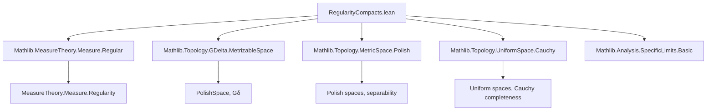

### Technical Brief: `RegularityCompacts.lean`

---

#### **1. Key Definitions & Theorems**

| Name | Type / Signature | Purpose |
|------|------------------|---------|
| `InnerRegularWRT p q` | `(p q : Set α → Prop) → Measure α → Prop` | Defines inner regularity of a measure `μ` with respect to predicates `p` (approximating sets) and `q` (measurable supersets). |
| `innerRegularWRT_isCompact_closure_iff` | `μ.InnerRegularWRT (IsCompact ∘ closure) IsClosed ↔ μ.InnerRegularWRT IsCompact IsClosed` | Equivalence between inner regularity w.r.t. compact closures and compact sets in `R1` spaces. |
| `innerRegularWRT_isCompact_isClosed_iff` | `μ.InnerRegularWRT (IsCompact ∧ IsClosed) IsClosed ↔ μ.InnerRegularWRT IsCompact IsClosed` | Equivalence between inner regularity w.r.t. compact *and* closed sets vs. just compact sets. |
| `innerRegularWRT_of_exists_compl_lt` | `(∀ A B, p A → q B → p (A ∩ B)) → (∀ ε > 0, ∃ K, p K ∧ μ Kᶜ < ε) → μ.InnerRegularWRT p q` | General criterion for inner regularity via approximation by complements of small measure. |
| `exists_isCompact_closure_measure_compl_lt` | Under assumptions: `SecondCountableTopology`, `IsCompletelyPseudoMetrizableSpace`, `[OpensMeasurableSpace]`, `[IsFiniteMeasure]`: `∃ K, IsCompact (closure K) ∧ P Kᶜ < ε` | Key constructive step: existence of compact-closure sets approximating full measure. |
| `innerRegularWRT_isCompact_closure` | `P.InnerRegularWRT (IsCompact ∘ closure) IsClosed` | Main regularity result for finite measures on such spaces. |
| `innerRegularWRT_isCompact_isClosed` | `P.InnerRegularWRT (IsCompact ∧ IsClosed) IsClosed` | Immediate corollary using equivalences above. |
| `innerRegularWRT_isCompact` | `P.InnerRegularWRT IsCompact IsClosed` | Strongest form: inner regularity w.r.t. compact sets. |
| `instInnerRegularOfIsCompletelyPseudoMetrizableSpace` | Instance: `P.InnerRegular` | Finite measures on such spaces are inner regular (tight). |
| `instInnerRegularCompactLTTopOfIsCompletelyPseudoMetrizableSpace` | Instance: `μ.InnerRegularCompactLTTop` | Inner regularity for sets of finite measure (i.e., `μ.restrict A` finite). |
| `innerRegular_isCompact_isClosed_measurableSet_of_finite` | `P.InnerRegularWRT (IsCompact ∧ IsClosed) MeasurableSet` | Inner regularity w.r.t. compact closed sets over *all* measurable sets (not just closed). |
| `PolishSpace.innerRegular_isCompact_isClosed_measurableSet` | *Deprecated alias* of above | Special case for Polish spaces (now subsumed by more general assumptions). |

---

#### **2. Naming Conventions**

- **Predicates**: `IsCompact`, `IsClosed`, `IsOpen`, `MeasurableSet`, `closure`, `interUnionBalls`, etc.
- **Regularities**:
  - `InnerRegularWRT p q`: predicate-based inner regularity.
  - `InnerRegular`: full inner regularity (w.r.t. compact sets over measurable sets).
  - `InnerRegularCompactLTTop`: inner regularity for sets of finite measure.
- **Prefixes**:
  - `innerRegularWRT_`: for lemmas about `InnerRegularWRT`.
  - `exists_`: existential approximation lemmas (e.g., `exists_isCompact_closure_measure_compl_lt`).
  - `inst_`: typeclass instances.
- **Suffixes**:
  - `_iff`: equivalence lemmas.
  - `_of_`: implications from stronger assumptions (e.g., `of_exists_compl_lt`, `of_isClosed_subset`).
  - `_closure`: involving `closure`.
  - `_isCompact_isClosed`: involving conjunction `IsCompact ∧ IsClosed`.

---

#### **3. Tactic Stack**

Frequently used tactics in proofs:

| Tactic | Usage |
|--------|-------|
| `rcases`, `obtain`, `cases` | Decomposing existential/universal hypotheses. |
| `rw`, `simp`, `simp only` | Rewriting definitions, simplifying goals using `simp` lemmas. |
| `convert`, `refine`, `exact` | Goal-directed proof construction. |
| `have`, `suffices` | Introducing intermediate claims or reformulating goals. |
| `apply`, `exact`, `assumption` | Applying lemmas or hypotheses. |
| `ring`, `linarith`, `norm_num` | Arithmetic reasoning (less frequent, but used in ENNReal estimates). |
| `ext` | Extensionality for sets/functions. |
| `convert`, `congr'` | Congruence reasoning. |
| `aesop` | Not used here — proofs are mostly manual and measure-theoretic. |
| `tsub_pos_of_lt`, `tsub_lt_tsub_left` | Tactics for working with subtraction in `ℝ≥0∞`. |

---

#### **4. Proof Logic**

- **Structure**:
  1. **Reduction via equivalences**: Many results are derived by chaining equivalences (e.g., `innerRegularWRT_isCompact_isClosed_iff`).
  2. **General criterion (`innerRegularWRT_of_exists_compl_lt`)**: Used to reduce inner regularity to constructing approximating sets with small complement measure.
  3. **Constructive approximation** (`exists_isCompact_closure_measure_compl_lt`):
     - Uses dense sequence (`denseSeq`) and antitone basis of entourages.
     - Constructs `interUnionBalls seq u t`, a countable intersection of neighborhoods of finite dense subsets.
     - Proves compactness of its closure via `isCompact_closure_interUnionBalls`.
     - Uses countable additivity and ENNReal summability to control measure.
  4. **Inductive/iterative construction**: The choice of `u n := s' n (δ n)` is key — it ensures summable error bounds.
  5. **Instance proofs**: Use `refine` + `exact` + `rw` to discharge typeclass goals.

- **Common pattern**:
  ```lean
  refine innerRegularWRT_of_exists_compl_lt (λ A B hA hB ↦ ?_) hμ
  -- then prove closure under intersection
  ```

---

#### **5. Imports**

| Module | Purpose |
|--------|---------|
| `Mathlib.Analysis.SpecificLimits.Basic` | Basic analysis (e.g., limits, continuity). |
| `Mathlib.MeasureTheory.Measure.Regular` | Definitions of regularity (`InnerRegularWRT`, `InnerRegular`, etc.). |
| `Mathlib.Topology.GDelta.MetrizableSpace` | Gδ spaces, metrizability, Polish spaces. |
| `Mathlib.Topology.MetricSpace.Polish` | Polish spaces, separability, completeness. |
| `Mathlib.Topology.UniformSpace.Cauchy` | Uniform spaces, Cauchy filters, completeness. |

---

#### **6. Mermaid Diagrams**

##### **Dependency Graph (High-Level)**



##### **Overview of Theory Flow**

```mermaid
flowchart LR
  A[Finite measure μ on α] --> B[Assumptions: 
    - SecondCountableTopology
    - IsCompletelyPseudoMetrizableSpace
    - OpensMeasurableSpace]
  
  B --> C[exists_isCompact_closure_measure_compl_lt]
  C --> D[innerRegularWRT_isCompact_closure]
  D --> E[innerRegularWRT_isCompact_isClosed]
  E --> F[innerRegularWRT_isCompact]
  
  F --> G[instInnerRegularOfIsCompletelyPseudoMetrizableSpace]
  F --> H[instInnerRegularCompactLTTopOfIsCompletelyPseudoMetrizableSpace]
  
  F --> I[innerRegular_isCompact_isClosed_measurableSet_of_finite]
  I --> J[PolishSpace.innerRegular_isCompact_isClosed_measurableSet (deprecated alias)]
```

---

#### **7. Summary**

This file establishes **inner regularity** (tightness) of finite measures on **completely pseudo-metrizable, second-countable spaces** — a broad class including all **Polish spaces**. The key technical tool is the construction of compact-closure approximants via dense sequences and uniform entourages. The results are foundational for probability theory on such spaces, especially for disintegration, existence of regular conditional probabilities, and tightness arguments.

The formalization is highly modular: equivalences between different forms of inner regularity simplify proofs, and the general criterion `innerRegularWRT_of_exists_compl_lt` abstracts the core approximation logic. The use of `interUnionBalls` and `denseSeq` reflects a classical constructive approach to tightness in metric settings.

--- 

Let me know if you'd like a **dependency graph of definitions** or a **proof sketch of `exists_isCompact_closure_measure_compl_lt`** in natural language.
