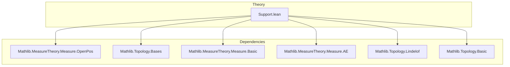

### Technical Brief: `Support.lean`

---

#### **1. Key Definitions & Theorems**

| Name | Type / Signature | Purpose |
|------|------------------|---------|
| `Measure.support` | `μ : Measure X ↦ {x : X | ∃ᶠ u in (𝓝 x).smallSets, 0 < μ u}` | Defines the support of a measure as points where every small neighborhood has positive measure. |
| `mem_support_iff` | `x ∈ μ.support ↔ ∃ᶠ u in (𝓝 x).smallSets, 0 < μ u` | Equivalence between membership in support and frequent positivity on small neighborhoods. |
| `mem_support_iff_forall` | `x ∈ μ.support ↔ ∀ U ∈ 𝓝 x, 0 < μ U` | Equivalent characterization using *all* neighborhoods (not just small sets). |
| `support_eq_univ` | `[μ.IsOpenPosMeasure] ⇒ μ.support = Set.univ` | If all open sets have positive measure, support is the whole space. |
| `AbsolutelyContinuous.support_mono` | `μ ≪ ν ⇒ μ.support ⊆ ν.support` | Monotonicity of support under absolute continuity. |
| `support_mono` | `μ ≤ ν ⇒ μ.support ⊆ ν.support` | Monotonicity of support under domination of measures. |
| `notMem_support_iff` | `x ∉ μ.support ↔ ∀ᶠ u in (𝓝 x).smallSets, μ u = 0` | Complement of support = points where some small neighborhood has zero measure. |
| `notMem_support_iff_exists` | `x ∉ μ.support ↔ ∃ U ∈ 𝓝 x, μ U = 0` | More concrete version: complement = points with *some* neighborhood of measure zero. |
| `support_eq_forall_isOpen` | `μ.support = {x | ∀ u, x ∈ u → IsOpen u → 0 < μ u}` | Support as intersection of closed sets defined by open neighborhoods. |
| `isClosed_support` | `IsClosed μ.support` | Support is always closed. |
| `compl_support_eq_sUnion` | `μ.supportᶜ = ⋃₀ {t | IsOpen t ∧ μ t = 0}` | Complement of support is union of all open null sets. |
| `support_eq_sInter` | `μ.support = ⋂₀ {t | IsClosed t ∧ μ tᶜ = 0}` | Support is intersection of all closed conull sets. |
| `support_mem_ae_of_isLindelof` | `IsLindelof μ.supportᶜ ⇒ μ.support ∈ ae μ` | If complement is Lindelöf, support is conull. |
| `support_mem_ae` | `[HereditarilyLindelofSpace X] ⇒ μ.support ∈ ae μ` | In hereditarily Lindelöf spaces, support is always conull. |
| `measure_compl_support` | `μ μ.supportᶜ = 0` | Complement of support has measure zero (under Lindelöf assumptions). |
| `nonempty_support` | `μ ≠ 0 ⇒ μ.support.Nonempty` | Nonzero measure implies nonempty support. |
| `nonempty_support_iff` | `μ.support.Nonempty ↔ μ ≠ 0` | Full equivalence between nonzero measure and nonempty support. |
| `mem_support_restrict` | `x ∈ (μ.restrict s).support ↔ ∃ᶠ u in (𝓝[s] x).smallSets, 0 < μ u` | Support of restricted measure in terms of relative neighborhoods. |
| `interior_inter_support ⊆ (μ.restrict s).support` | `interior s ∩ μ.support ⊆ (μ.restrict s).support` | Interior points of `s` in support lie in support of restriction. |
| `support_restrict_subset` | `(μ.restrict s).support ⊆ closure s ∩ μ.support` | Support of restriction lies in closure of `s` intersected with original support. |

---

#### **2. Naming Conventions**

- **Prefixes**:
  - `support_`: for properties of the support (e.g., `support_add`, `support_mono`)
  - `mem_support_`: for membership characterizations (e.g., `mem_support_iff`, `mem_support_restrict`)
  - `notMem_support_`: for complement membership (e.g., `notMem_support_iff`)
  - `isClosed_`, `isOpen_`: for topological properties (e.g., `isClosed_support`, `isOpen_compl_support`)
  - `measure_`: for measure-theoretic consequences (e.g., `measure_compl_support`)
  - `nonempty_support_`: for nonemptiness results

- **Suffixes**:
  - `_iff`, `_mono`, `_eq`, `_subset`, `_compl`: standard Lean conventions for logical equivalences, monotonicity, equality, inclusion, and complementarity.

- **Internal lemmas**:
  - `_root_.Filter.HasBasis.*`: lifted from `Filter` theory to support filter-theoretic reasoning.

---

#### **3. Tactic Stack**

| Tactic | Frequency | Role |
|--------|-----------|------|
| `simp` / `simp_rw` | Very High | Simplify definitions (e.g., `mem_support_iff`, `support_eq_sInter`) |
| `rw` | High | Rewrite using equivalences (e.g., `mem_support_restrict`) |
| `grind` | Medium | Automated reasoning over topological/filter bases (e.g., `isClosed_support`, `mem_support_restrict`) |
| `convert` | Medium | Align goals via congruence (e.g., `support_eq_sInter`) |
| `gcongr` | Medium | Handle inequalities under monotonicity (e.g., `interior_inter_support`) |
| `exact`, `refine`, `intro`, `cases` | Medium | Standard proof structure |
| `ext` | Medium | Extensionality for set equalities |
| `contrapose!` | Low | Logical contrapositive reasoning (e.g., `nonempty_support`) |
| `simpa` | Medium | Simplify with assumptions (e.g., `support_eq_univ`) |

---

#### **4. Proof Logic**

- **Structure**:
  - **Definitions**: Filter-theoretic (frequently in small sets) → equivalent pointwise (neighborhoods), then topological (open/closed sets).
  - **Basic properties**: Prove closedness, complement description, monotonicity, additivity.
  - **Lindelöf section**: Use covering properties to deduce conullity of support.
  - **Restriction section**: Relate support of restricted measure to relative topology and closure.

- **Common proof patterns**:
  - **Equivalence chains**: `x ∈ support ↔ ... ↔ ...` using `simp`, `rw`, `ext`.
  - **Topological duality**: Use `isClosed_support ↔ isOpen_compl_support`, `compl_sUnion ↔ sInter`.
  - **Filter lifting**: Lift neighborhood basis facts (e.g., `nhds_basis_opens`) to support membership via `mem_measureSupport`.
  - **Lindelöf argument**: Show complement is union of open null sets → Lindelöf ⇒ countable subcover ⇒ measure zero.

---

#### **5. Imports**

| Module | Role |
|--------|------|
| `Mathlib.MeasureTheory.Measure.OpenPos` | Provides `IsOpenPosMeasure`, used in `support_eq_univ` |
| `Topology` (scoped) | Provides `nhds`, `smallSets`, `HasBasis`, filter-theoretic tools |
| `MeasureTheory` (implicit via `Measure` namespace) | Core measure theory infrastructure |

---

#### **6. Mermaid Diagrams**

##### **Dependency Graph (Top-Level)**



##### **Overview of Theory Flow**

```mermaid
flowchart LR
  A[Measure μ on X] --> B[Define support via filter]
  B --> C[Equivalences: neighborhoods, open/closed sets]
  C --> D[Topological properties: closed, complement = union of open null sets]
  D --> E[Monotonicity & additivity]
  E --> F[Lindelöf ⇒ conull support]
  F --> G[Restriction: support of μ|_s ⊆ cl(s) ∩ support(μ)]
  G --> H[Applications: nonempty support ↔ μ ≠ 0, null measurability]
```

##### **Commutative Diagram (Complement & Support)**

```mermaid
graph LR
  S[μ.support] -->|closed| C[μ.supportᶜ]
  C -->|union of open null sets| U[⋃{t open | μ t = 0}]
  S -->|intersection of closed conull sets| I[⋂{t closed | μ tᶜ = 0}]
  U <->|complement| I
```

---

#### **7. Summary**

This file formalizes the **support of a measure** in a topological measurable space, emphasizing:
- **Filter-theoretic foundations** (via `smallSets` and frequently),
- **Topological characterizations** (closedness, complement as union of open null sets),
- **Measure-theoretic behavior** (monotonicity, additivity, restriction),
- **Lindelöf consequences** (conullity of support in hereditarily Lindelöf spaces),
- **Measurability and nonemptiness** results.

It serves as a foundational module for further work on measures with “full support”, Radon measures, or integration theory where support plays a role (e.g., distributions, Dirac masses).
