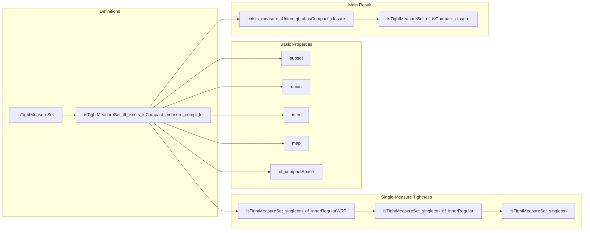

### Technical Brief: `Tight.lean`

---

#### **1. Key Definitions & Theorems**

| Name | Type | Purpose |
|------|------|---------|
| `IsTightMeasureSet` | `Set (Measure 𝓧) → Prop` | Defines tightness of a set of measures via filter convergence: the supremum over the set tends to 0 along the cocompact filter. |
| `isTightMeasureSet_iff_exists_isCompact_measure_compl_le` | `↔` | Equivalence between filter-based definition and classical ε–compact set formulation:  
  $$
  \forall \varepsilon > 0,\ \exists K\ \text{compact},\ \forall \mu \in S,\ \mu(K^c) \le \varepsilon
  $$ |
| `isTightMeasureSet_singleton_of_innerRegularWRT` | `IsTightMeasureSet {μ}` | Shows any finite, inner-regular w.r.t. compact-closed sets measure is tight. |
| `isTightMeasureSet_singleton_of_innerRegular` | `IsTightMeasureSet {μ}` | Specialization: finite inner-regular measures on T₂ spaces are tight. |
| `isTightMeasureSet_singleton` | `IsTightMeasureSet {μ}` | In complete, second-countable Borel spaces, all finite measures are tight. |
| `isTightMeasureSet_of_isCompact_closure` | `IsTightMeasureSet {μ | μ ∈ S}` | Core result: in a complete second-countable metric space, any set of *probability* measures with compact closure is tight. |
| `exists_measure_iUnion_gt_of_isCompact_closure` | `∃ k, ...` | Technical lemma used in proof of `isTightMeasureSet_of_isCompact_closure`; guarantees uniform approximation of probability mass on finite unions of balls. |

---

#### **2. Naming Conventions**

- **Prefixes**:
  - `isTightMeasureSet_`: predicates tightness.
  - `exists_..._of_...`: existence lemmas conditional on structural assumptions (e.g., compact closure).
- **Suffixes**:
  - `_of_innerRegularWRT`, `_of_isCompact_closure`: indicate hypotheses used.
  - `_singleton`: for singleton sets `{μ}`.
- **Other**:
  - `bigK`, `km`, `μlim`: internal construction names (not exported).
  - `hεbound`, `hcomp`, `hμInS`: standard hypothesis naming (`h` + descriptive name).

---

#### **3. Tactic Stack**

Frequently used tactics in this file:

| Tactic | Role |
|--------|------|
| `simp only [...]` | Simplify using precise lemmas (e.g., `ENNReal.tendsto_nhds`, `measure_compl`, `iSup_apply`). |
| `rw [...]` | Rewrite using equivalences (e.g., `isTightMeasureSet_iff_exists_isCompact_measure_compl_le`). |
| `exact`, `refine`, `gcongr` | Construct proofs with control over goals; `gcongr` used for measure monotonicity and set inclusions. |
| `cases lt_or_ge ...` | Case analysis on real/ENNReal comparisons. |
| `choose!` | Dependent choice for constructing sequences/functions. |
| `filter_upwards`, `eventually`, `tendsto` | Filter-based reasoning (especially for limits and accumulation points). |
| `ring_nf`, `tsum_two_zpow_neg_add_one` | Arithmetic simplifications (especially geometric series). |
| `totallyBounded.isCompact_of_isClosed` | Compactness proof via total boundedness + completeness. |

---

#### **4. Proof Logic**

The logical flow follows a **constructive–analytic** pattern:

1. **Equivalence Setup**:  
   Replace filter definition with ε–compact set formulation via `isTightMeasureSet_iff_exists_isCompact_measure_compl_le`.

2. **Trivial Cases**:  
   Handle empty space separately (`isEmpty_or_nonempty`).

3. **Approximation via Dense Sequence**:  
   Use second-countability to get a dense sequence `D : ℕ → 𝓧`, and construct a positive decreasing sequence `u : ℕ → ℝ≥0` tending to 0.

4. **Covering Lemma**:  
   For each scale `m`, use compactness of `closure S` to find a finite union of balls (indexed by `i ≤ k_m`) capturing > $1 - \varepsilon \cdot 2^{-m}$ mass uniformly over $S$ (`exists_measure_iUnion_gt_of_isCompact_closure`).

5. **Construction of Tight Set**:  
   Define  
   $$
   K = \bigcap_{m \in \mathbb{N}} \bigcup_{i \le k_{m+1}} \overline{B(D_i, u_m)}
   $$
   Show:
   - $K$ is compact (totally bounded + closed).
   - For all $\mu \in S$, $\mu(K^c) \le \varepsilon$ via telescoping sum bound using geometric series.

6. **Conclusion**:  
   Apply equivalence to conclude tightness.

---

#### **5. Imports & Dependencies**

| Module | Purpose |
|--------|---------|
| `Mathlib.MeasureTheory.Measure.ProbabilityMeasure` | Core probability measure theory. |
| `Mathlib.Topology.Metrizable.CompletelyMetrizable` | Complete metrizability and Borel structure. |
| `Mathlib.MeasureTheory.Measure.LevyProkhorovMetric` | Context for weak convergence and compactness of measures. |
| `Mathlib.MeasureTheory.Measure.RegularityCompacts` | Regularity (inner/outer) tools, especially inner regularity w.r.t. compact sets. |

**Key auxiliary theories used**:
- Filter convergence (`tendsto`, `cocompact`, `smallSets`)
- Measure regularity (`InnerRegularWRT`, `InnerRegular`)
- Metric topology (`ball`, `closure`, `totallyBounded`, `SecondCountableTopology`)
- ENNReal arithmetic (`zpow`, `tsum`, `sub_lt_iff_lt_right`)

---

#### **6. Mermaid Diagrams**

##### **Dependency Graph (High-Level)**

```mermaid
graph TD
  A[Tight.lean] --> B[Mathlib.MeasureTheory.Measure.ProbabilityMeasure]
  A --> C[Mathlib.Topology.Metrizable.CompletelyMetrizable]
  A --> D[Mathlib.MeasureTheory.Measure.LevyProkhorovMetric]
  A --> E[Mathlib.MeasureTheory.Measure.RegularityCompacts]

  B --> F[Measure Theory Basics]
  C --> G[Metrizable & Borel Spaces]
  D --> H[Weak Convergence & Prokhorov]
  E --> I[Regularity & Compact Approximation]

  A --> J[Filter Theory]
  A --> K[Topology (Compactness, Total Boundedness)]
  A --> L[ENNReal Arithmetic]
```

##### **Overview of File Structure**



---

#### **7. Summary**

This file formalizes the **Prokhorov-type tightness criterion** for sets of probability measures on complete separable metric spaces:  
> *A set of probability measures is tight if its closure is compact in the weak topology.*

The proof leverages:
- Inner regularity of finite measures in such spaces,
- Second-countability to reduce to countable covers,
- Compactness to extract uniform finite approximations,
- ENNReal analysis to control complements of compact sets.

It serves as a foundational step toward the **Prokhorov theorem** (tightness ⇔ relative compactness), and is critical for weak convergence theory in analysis and probability.
