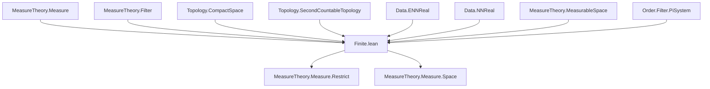
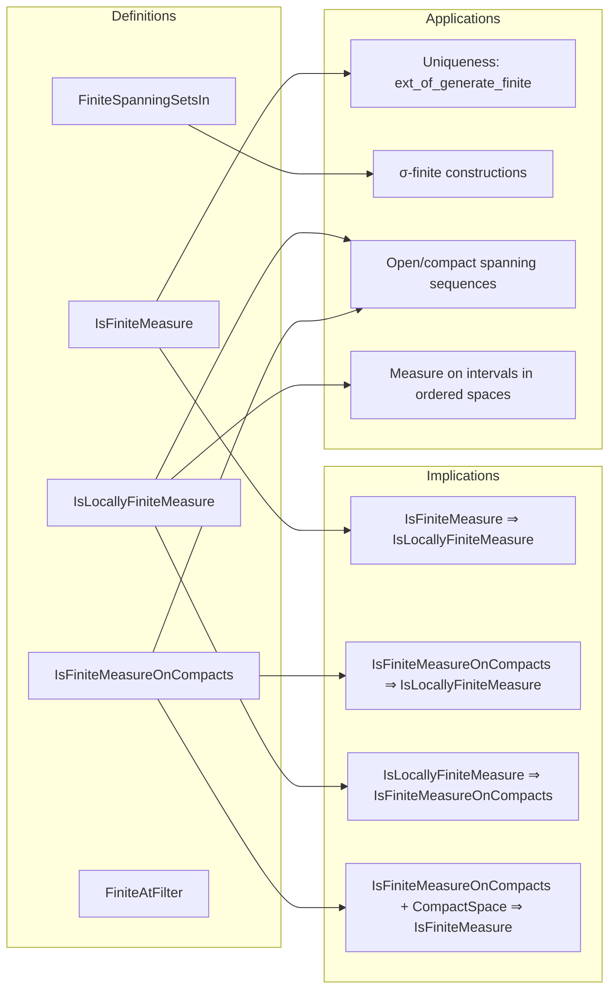

### Technical Brief: `Finite.lean` — Formalization of Finite and Locally Finite Measures in Lean 4

---

#### **1. Key Definitions & Theorems**

| Name | Type / Signature | Purpose |
|------|------------------|---------|
| `IsFiniteMeasure μ` | `class Prop` | `μ univ < ∞` — measure of the whole space is finite. |
| `IsLocallyFiniteMeasure μ` | `class Prop` | `∀ x, μ.FiniteAtFilter (𝓝 x)` — finite in some neighborhood of each point. |
| `IsFiniteMeasureOnCompacts μ` | `class Prop` | `∀ K, IsCompact K → μ K < ∞` — finite on all compact sets. |
| `FiniteSpanningSetsIn μ C` | `structure` | Sequence of sets in `C` with finite measure covering `univ`. Used to define σ-finiteness. |
| `measureUnivNNReal μ` | `μ univ.toNNReal` | Real-valued measure of the whole space when finite. |
| `FiniteAtFilter μ f` | `∃ s ∈ f, μ s < ∞` | Measure is finite on some set in filter `f`. |
| `isFiniteMeasure_iff` | `IsFiniteMeasure μ ↔ μ univ < ∞` | Equivalence definition (via `mk_iff`). |
| `not_isFiniteMeasure_iff` | `¬IsFiniteMeasure μ ↔ μ univ = ∞` | Negation characterization. |
| `measure_lt_top` | `[IsFiniteMeasure μ] → μ s < ∞` | All subsets have finite measure. |
| `measure_ne_top` | `[IsFiniteMeasure μ] → μ s ≠ ∞` | Immediate corollary. |
| `measure_compl_le_add_of_le_add` | `μ s ≤ μ t + ε → μ tᶜ ≤ μ sᶜ + ε` | Complement inequality under finite measure. |
| `cofinite_eq_bot_iff` | `μ.cofinite = ⊥ ↔ IsFiniteMeasure μ` | Characterization of cofinite filter being bottom. |
| `ae_eq_univ_iff_measure_eq` | `[IsFiniteMeasure μ] → s =ᵐ[μ] univ ↔ μ s = μ univ` | Almost-everywhere equality to `univ` iff full measure. |
| `ext_of_generate_finite` | `[IsFiniteMeasure μ] → μ = ν` if equal on π-system generating σ-algebra and `univ`. | Uniqueness of finite measures. |
| `isFiniteMeasure_map_iff` | `[AEMeasurable f μ] → IsFiniteMeasure (μ.map f) ↔ IsFiniteMeasure μ` | Pullback/pushforward finiteness equivalence. |
| `isLocallyFiniteMeasure_of_isFiniteMeasureOnCompacts` | `[LocallyCompactSpace α] → IsFiniteMeasureOnCompacts μ → IsLocallyFiniteMeasure μ` | Finite on compacts ⇒ locally finite in LC spaces. |
| `isFiniteMeasureOnCompacts_of_isLocallyFiniteMeasure` | `[TopologicalSpace α] → IsLocallyFiniteMeasure μ → IsFiniteMeasureOnCompacts μ` | Locally finite ⇒ finite on compacts (in measurable topological spaces). |
| `finiteSpanningSetsInOpen'` | `[SecondCountableTopology α] → μ.FiniteSpanningSetsIn {open}` | Locally finite measure on second-countable space has open finite-spanning sequence. |

---

#### **2. Naming Conventions**

- **Prefixes**:
  - `isFiniteMeasure*`: class and related lemmas (`isFiniteMeasure_iff`, `isFiniteMeasure_restrict`, `isFiniteMeasure_zero`, etc.)
  - `measure_*`: measure-theoretic properties (`measure_lt_top`, `measure_ne_top`, `measure_compl_*`, `measure_univ_*`, `measure_real_*`)
  - `finite*`: filter-based finiteness (`FiniteAtFilter`, `finiteAt_nhds`, `finiteAtFilter_of_finite`, `finiteSpanningSetsIn*`)
  - `ae_*`: almost-everywhere statements (`ae_eq_univ_iff_measure_eq`, `ae_iff_measure_eq`, `ae_mem_iff_measure_eq`)
  - `cofinite_*`: cofinite filter behavior (`cofinite_eq_bot_iff`, `cofinite_eq_bot`)
  - `ext_*`: extension/uniqueness theorems (`ext_on_measurableSpace_of_generate_finite`, `ext_of_generate_finite`)

- **Suffixes**:
  - `_iff`: equivalence characterizations (`isFiniteMeasure_iff`, `cofinite_eq_bot_iff`, `finiteAt_principal`)
  - `_le_add`: inequalities involving `≤ + ε`
  - `_of_*`: implications or derived instances (`isFiniteMeasure_of_le`, `isLocallyFiniteMeasure_of_le`, `isFiniteMeasureOnCompacts.smul`)
  - `_restrict`, `_map`, `_comap`: operations on measures

---

#### **3. Tactic Stack**

Frequent tactics used in proofs:

| Tactic | Usage |
|--------|-------|
| `simp` | Simplifying definitions (`isFiniteMeasure_iff`, `measure_univ`, `measure_empty`, etc.) |
| `rw` | Rewriting using equivalences or lemmas (e.g., `measure_compl`, `measure_diff'`) |
| `exact`, `assumption`, `infer_instance` | Instantiating class instances (`isFiniteMeasureZero`, `isFiniteMeasureAdd`, etc.) |
| `gcongr`, `convert`, `abext` | Handling inequalities and equalities with ENNReal arithmetic |
| `aesop` | Automated reasoning for finiteness (`[aesop (rule_sets := [finiteness])]`) |
| `induction_on` | Structural induction for measurable sets (π-system generation) |
| `filter_upwards`, `eventually` | Filter/a.e. arguments |
| `calc` | Chain of inequalities (e.g., in `measure_compl_le_add_of_le_add`) |
| `ENNReal.*` lemmas | `add_lt_top`, `toReal_sub_of_le`, `div_self_le_one`, etc. |
| `measurability`, `measurable_set'` | Measurability goals (e.g., `biUnion`, `compl`) |
| `contrapose!`, `by_contra!` | Negation-based reasoning (e.g., `measure_univ_eq_zero`) |

---

#### **4. Proof Logic**

- **Inductive structure**:
  - Proofs often proceed by:
    1. Reducing to ENNReal arithmetic (`ENNReal` lemmas like `add_lt_top`, `toReal_sub_of_le`)
    2. Using `measure_mono`, `measure_union`, `measure_diff'`, `measure_compl`
    3. Leveraging finiteness assumptions (`measure_lt_top`, `measure_ne_top`)
    4. Applying filter/a.e. reasoning (`finiteAtFilter`, `ae_iff_measure_eq`)
    5. Using structural induction for extension theorems (`ext_on_measurableSpace_of_generate_finite`)

- **Common patterns**:
  - **Finite measure ⇒ all subsets finite**: via `measure_mono subset_univ`
  - **Complement inequalities**: via `measure_compl` + `tsub_le_iff_right`
  - **Uniqueness**: via π-λ theorem or monotone class theorem (`ext_of_generate_finite`)
  - **Local ⇒ global**: in compact/σ-compact spaces (`compactCovering`, `finiteSpanningSetsIn*`)
  - **ENNReal → ℝ≥0**: via `.toNNReal`, `coe_toNNReal`, `toReal` when finite

---

#### **5. Imports & Dependencies**

- **Core imports**:
  ```lean
  Mathlib.MeasureTheory.Measure.Restrict
  ```
- **Key modules used**:
  - `MeasureTheory.Measure` — basic measure theory
  - `MeasureTheory.Filter` — filters, `ae μ`, `smallSets`
  - `Topology.Basic`, `Topology.Bases`, `Topology.Compactness`, `Topology.MetricSpace` — for local finiteness, compacts, second-countability
  - `Data.ENNReal.Basic`, `Data.NNReal.Basic` — extended nonnegative reals
  - `Data.Set.Basic`, `Data.Set.Function` — set operations, measurable sets
  - `Order.Filter.Basic`, `Order.Filter.PiSystem` — filter theory, π-systems
  - `MeasureTheory.MeasurableSpace.Basic` — measurable spaces, generated σ-algebras

---

#### **6. Mermaid Diagrams**

##### **Dependency Graph (High-Level)**



##### **Overview of Theory Flow**



---

#### **7. Summary**

This file formalizes **finiteness conditions** for measures in Lean 4, with three main classes:
- `IsFiniteMeasure`: global finiteness (`μ univ < ∞`)
- `IsLocallyFiniteMeasure`: local finiteness (`μ` finite near each point)
- `IsFiniteMeasureOnCompacts`: finiteness on compact sets

It establishes:
- Equivalences and negations (`cofinite_eq_bot_iff`, `not_isFiniteMeasure_iff`)
- Closure properties (sums, scalar multiples, restrictions, maps, comaps)
- Measure-theoretic consequences (complement inequalities, uniqueness theorems, a.e. characterizations)
- Constructive spanning sequences (open/compact) under topological assumptions (σ-compact, second-countable)
- Applications to ordered spaces (`Icc`, `Ico`, etc.)

The formalization heavily leverages `ENNReal` arithmetic, filter theory, and topological properties, with a strong emphasis on automation via `aesop` and `finiteness` rule sets.

--- 

Let me know if you'd like a **dependency graph of specific lemmas**, or a **proof sketch of a key theorem** (e.g., `ext_of_generate_finite`).
