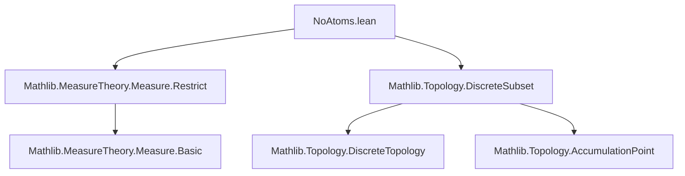

**Technical Brief: `NoAtoms.lean` — Atomless Measures in Measure Theory**

---

### 1. **Key Definitions & Theorems**

| Name | Type / Signature | Purpose |
|------|------------------|---------|
| `NoAtoms` | `class NoAtoms (μ : Measure α) : Prop` | Defines that a measure has no atoms: `∀ x, μ {x} = 0`. |
| `measure_singleton` | `∀ x, μ {x} = 0` | Core property of `NoAtoms`; exposed and marked `@[simp]`. |
| `Subsingleton.measure_zero` | `s.Subsingleton → μ s = 0` | Any subsingleton set (e.g., empty or singleton) has measure zero under atomless `μ`. |
| `Measure.restrict_singleton'` | `μ.restrict {a} = 0` | Restriction of `μ` to a singleton is zero. |
| `Measure.restrict.instNoAtoms` | `NoAtoms (μ.restrict s)` | Atomlessness is preserved under restriction to any measurable set `s`. |
| `Countable.measure_zero` | `s.Countable → μ s = 0` | Any countable set has measure zero under atomless `μ`. |
| `Countable.ae_notMem` | `∀ᵐ x ∂μ, x ∉ s` | Almost everywhere, points avoid countable sets. |
| `ae_ne` | `∀ᵐ x ∂μ, x ≠ a` | Almost surely, a random point differs from any fixed `a`. |
| `measure_restrict_compl` | `s.Countable → μ.restrict sᶜ = μ` | Restricting to the complement of a countable set doesn’t change the measure. |
| `restrict_compl_singleton` | `μ.restrict ({a}ᶜ) = μ` | Special case of above for singletons. |
| `Finite.measure_zero`, `Finset.measure_zero` | `s.Finite → μ s = 0`, `μ s = 0` | Finite sets and finitely supported sets have zero measure. |
| `insert_ae_eq_self` | `insert a s =ᵐ[μ] s` | Adding a single point to a set doesn’t change its equivalence class mod `μ`. |
| `exists_accPt_of_noAtoms` | `0 < μ E → ∃ x, AccPt x (𝓟 E)` | If `E` has positive measure and is separable, then `E` has an accumulation point (key topological consequence). |
| `Iio_ae_eq_Iic`, `Ioi_ae_eq_Ici`, etc. | e.g., `Iio a =ᵐ[μ] Iic a` | Intervals differing by endpoints of measure zero are equal a.e. (e.g., open vs. closed intervals). |
| `restrict_Iio_eq_restrict_Iic`, etc. | `μ.restrict (Iio a) = μ.restrict (Iic a)` | Equality of restricted measures on a.e.-equal sets. |
| `uIoc_ae_eq_interval` | `Ι a b =ᵐ[μ] [[a, b]]` | In a linear order, the interval `Ι a b` (open-closed) is a.e. equal to the closed interval `[[a, b]]`. |

---

### 2. **Naming Conventions**

- **Prefixes**:
  - `measure_`: properties about measures of sets (`measure_singleton`, `measure_zero`, `measure_restrict_compl`).
  - `restrict_`: properties about restricted measures (`restrict_singleton'`, `restrict_Iio_eq_restrict_Iic`, `restrict_compl_singleton`).
  - `ae_`: almost-everywhere statements (`ae_ne`, `ae_notMem`).
  - `insert_`, `uIoc_`: specific constructions (`insert_ae_eq_self`, `uIoc_ae_eq_interval`).
- **Suffixes**:
  - `_eq_`: equality of sets or measures (`Iio_ae_eq_Iic`, `restrict_Ioo_eq_restrict_Ioc`).
  - `_null`: measure-zero consequences (`measure_biUnion_null_iff` used internally).
- **Pattern**: `X_ae_eq_Y` → `X =ᵐ[μ] Y`; `restrict_X_eq_restrict_Y` → `μ.restrict X = μ.restrict Y`.

---

### 3. **Tactic Stack**

Frequently used tactics in proofs:
- `simp` / `simp only` — especially with `measure_singleton` and `ae_iff`.
- `rw` — rewriting using a.e.-equality or restriction lemmas.
- `apply measure_mono_null` — key for reducing to null sets.
- `obtain ⟨t, hxt, ht1, ht2⟩ := exists_measurable_superset_of_null …` — existence of measurable supersets of null sets.
- `by_contra!` — used in `exists_accPt_of_noAtoms` for contradiction.
- `induction_on` — in `Subsingleton.measure_zero`.
- `separability` / `countable` reasoning: `separableSpace_iff_countable`, `countable_coe_iff`.

---

### 4. **Proof Logic**

- **Structure of proofs**:
  - Most proofs reduce to showing a set is countable or subsingleton, then apply `measure_zero`.
  - For a.e.-statements: use `ae_iff` + `Classical.not_not`, or `measure_mono_null`.
  - For restriction equalities: use `restrict_congr_set` with a.e.-equality of sets.
  - For topological consequences (`exists_accPt_of_noAtoms`):
    - Assume no accumulation points ⇒ `E` discrete ⇒ countable (in separable space) ⇒ measure zero ⇒ contradiction.

- **Induction patterns**:
  - `Subsingleton.induction_on` for base cases `∅` and singletons.
  - `countable.induction_on` (implicit via `measure_biUnion_null_iff`) for countable unions.

---

### 5. **Imports & Dependencies**

| Import | Purpose |
|--------|---------|
| `Mathlib.MeasureTheory.Measure.Restrict` | Restriction of measures, null sets, basic properties. |
| `Mathlib.Topology.DiscreteSubset` | Used for `discreteTopology_of_noAccPts`, accumulation points, and discrete topology equivalence. |

**Key external concepts used**:
- Measurable spaces, measures, restrictions.
- Almost-everywhere equivalence (`=ᵐ[μ]`).
- Countable sets, subsingletons, finite sets.
- Topological notions: accumulation points (`AccPt`), discrete topology, separable spaces.
- Interval notation (`Iio`, `Iic`, `Ioi`, `Ici`, `Ioo`, `Ioc`, `Ico`, `Icc`, `Ι`, `[[a, b]]`).

---

### 6. **Mermaid Diagrams**

#### **Dependency Graph (Module-Level)**



#### **Conceptual Overview (Theory Flow)**

```mermaid
flowchart LR
  NoAtoms[NoAtoms μ] -->|definition| Singletons[μ {x} = 0]
  Singletons -->|induction| SubsingletonZero[μ s = 0 for s subsingleton]
  Singletons -->|countable union| CountableZero[μ s = 0 for s countable]
  CountableZero -->|ae reasoning| AENotMem[∀ᵐ x, x ∉ s]
  AENotMem -->|complement| RestrictCompl[μ.restrict sᶜ = μ]
  CountableZero -->|topology| AccPt[Positive measure ⇒ accumulation point]
  Singletons -->|interval endpoints| IntervalAE[Iio a =ᵐ Iic a, etc.]
  IntervalAE -->|restriction| RestrictInterval[μ.restrict Iio a = μ.restrict Iic a]
```

---

### 7. **TODO Note (from source)**

> Should `NoAtoms` be redefined as `∀ s, 0 < μ s → ∃ t ⊆ s, 0 < μ t ∧ μ t < μ s`?

- This is a *stronger* condition (sometimes called *non-atomic* in older literature).
- The current definition (`∀ x, μ {x} = 0`) is strictly weaker: there are measures with all singletons null but which are *not* divisible (e.g., certain finitely additive measures).
- In standard σ-finite Borel measures on Polish spaces, the two definitions coincide.

---

### 8. **Summary**

This module formalizes the foundational theory of **atomless measures** in Lean 4’s `Mathlib`. It establishes that under `NoAtoms μ`, all countable sets are null, singletons are negligible, and intervals are a.e.-independent of endpoint inclusion. It bridges measure theory and topology via the key result: *positive measure + separability ⇒ existence of accumulation points*. The proofs rely heavily on `simp`-friendly `measure_singleton`, null-set reasoning, and restriction congruences.
