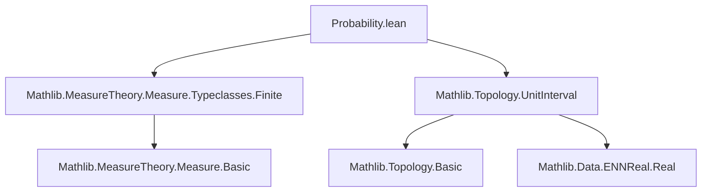

### Technical Brief: `Probability.lean` — Classes for Probability Measures in Lean 4

---

#### **1. Key Definitions & Theorems**

| Name | Type / Signature | Purpose |
|------|------------------|---------|
| `IsZeroOrProbabilityMeasure` | `class IsZeroOrProbabilityMeasure (μ : Measure α) : Prop` | Captures measures with total mass 0 or 1. Used for conditioning and generalizing probability results. |
| `IsProbabilityMeasure` | `class IsProbabilityMeasure (μ : Measure α) : Prop` | Standard probability measures: total mass = 1. |
| `measure_univ` | `μ univ = 0 ∨ μ univ = 1` (for `IsZeroOrProbabilityMeasure`) <br> `μ univ = 1` (for `IsProbabilityMeasure`) | Defining property of each class. |
| `isZeroOrProbabilityMeasure_iff` | `IsZeroOrProbabilityMeasure μ ↔ μ univ = 0 ∨ μ univ = 1` | Equivalence between class and definition. |
| `isProbabilityMeasure_iff` | `IsProbabilityMeasure μ ↔ μ univ = 1` | Same for probability measures. |
| `prob_le_one` | `μ s ≤ 1` | Any measurable set has measure ≤ 1 under a zero-or-probability measure. |
| `measureReal_le_one` | `μ.real s ≤ 1` | Real-valued measure (via `ENNReal.toReal`) is also ≤ 1. |
| `one_le_prob_iff` | `1 ≤ μ s ↔ μ s = 1` | Characterizes when a measure reaches 1. |
| `IsZeroOrProbabilityMeasure.toIsFiniteMeasure` | `IsFiniteMeasure μ` | Every zero-or-probability measure is finite. |
| `nonempty_of_isProbabilityMeasure` | `Nonempty α` | A probability measure implies the space is nonempty. |
| `IsProbabilityMeasure.ne_zero` | `μ ≠ 0` | Probability measures are nonzero. |
| `prob_add_prob_compl` | `μ s + μ sᶜ = 1` | Complementarity for measurable sets under probability measure. |
| `prob_compl_eq_one_sub` | `μ sᶜ = 1 - μ s` | Complement formula (using truncated subtraction in `ℝ≥0∞`). |
| `mem_ae_iff_prob_eq_one` | `s ∈ ae μ ↔ μ s = 1` | Sets in the almost-everywhere filter have full measure. |
| `isProbabilityMeasure_map` | `AEMeasurable f μ ⇒ IsProbabilityMeasure (map f μ)` | Pushforward of a probability measure is probability. |
| `isProbabilityMeasure_map_iff` | `IsProbabilityMeasure (map f μ) ↔ IsProbabilityMeasure μ` | Equivalence under a.e. measurable maps. |
| `isProbabilityMeasure_comap_equiv` | `μ.comap f` is probability if `f` is a measurable equivalence. |
| `eq_of_le_of_isProbabilityMeasure` | `μ ≤ ν ∧ both probability ⇒ μ = ν` | Uniqueness via domination. |
| `eq_zero_or_isProbabilityMeasure` | `μ = 0 ∨ IsProbabilityMeasure μ` | Structural decomposition of zero-or-probability measures. |

---

#### **2. Naming Conventions**

- **Prefixes**:
  - `isZeroOrProbabilityMeasure_`, `isProbabilityMeasure_`: for class instances and lemmas.
  - `prob_`, `probReal_`: for measure-theoretic statements involving probability (real or extended).
  - `mem_ae_iff_`: for characterizations of almost-everywhere sets.
- **Suffixes**:
  - `_iff`: logical equivalence lemmas.
  - `_compl`: for complement-related identities.
  - `_map`, `_comap`: for pushforward/pullback constructions.
  - `_smul`: for scalar multiplication of measures.
  - `_ne_zero`, `_neZero`: for nonzero-ness properties.
- **Special**:
  - `toReal`, `toNNReal`: conversion functions (e.g., `ENNReal.toReal`, `unitInterval.toNNReal`).
  - `nullMeasurableSet`, `MeasurableSet`: distinction in hypotheses for complement formulas.

---

#### **3. Tactic Stack**

Frequently used tactics in proofs:

| Tactic | Usage |
|--------|-------|
| `rcases` / `cases` | Case analysis on `∨`, `Decidable`, or `eq_zero_or_neZero`. |
| `simp` / `simp only` | Simplify using `@[simp]` lemmas (`measure_univ`, `prob_univ`, etc.). |
| `rw` | Rewrite using equalities (e.g., `measure_univ`, `prob_compl_eq_one_sub`). |
| `convert` | Match goals up to definitional equality (e.g., `ENNReal.sub_sub_cancel`). |
| `infer_instance` | Automatically infer typeclass instances (e.g., `IsFiniteMeasure`, `NeZero`). |
| `aesop` / `tauto` | Not explicitly used here, but `by_contra!`, `exact`, `refine` dominate. |
| `apply`, `exact`, `intro` | Basic proof structure. |
| `convert` + `hμs` | Transfer inequalities via `ENNReal` arithmetic. |
| `by_cases` | For decidability assumptions (`Decidable p`). |

---

#### **4. Proof Logic**

- **Induction/Case Analysis**: Most proofs split on:
  - Whether `μ univ = 0` or `1` (`eq_zero_or_isProbabilityMeasure`).
  - Whether a set is measurable or null-measurable.
  - Whether a map is a.e. measurable or an equivalence.
- **ENNReal Arithmetic**: Many proofs rely on properties of truncated subtraction and `toReal`:
  - `ENNReal.sub_lt_of_sub_lt`, `ENNReal.sub_sub_cancel`, `ENNReal.toReal_eq_one_iff`.
- **Filter/Measure Equivalence**: Use `mem_ae_iff` and `ae_of_all` to relate almost-everywhere statements to measure values.
- **Uniqueness via domination**: `eq_of_le_of_isProbabilityMeasure` is a key lemma for equality proofs.
- **Complementarity**: Central to many lemmas: `μ s + μ sᶜ = μ univ = 1`.

---

#### **5. Imports & Dependencies**

| Import | Purpose |
|--------|---------|
| `Mathlib.MeasureTheory.Measure.Typeclasses.Finite` | Defines `IsFiniteMeasure`, `NeZero`, etc. |
| `Mathlib.Topology.UnitInterval` | Provides `unitInterval`, used for convex combinations of probability measures (`toNNReal`). |
| `MeasureTheory` module | Core measure theory infrastructure (`Measure`, `map`, `comap`, `nullMeasurableSet`, etc.). |
| `Set`, `Filter`, `Function`, `ENNReal` | Basic utilities for sets, filters, functions, extended reals. |

---

#### **6. Mermaid Diagrams**

##### **Dependency Graph (Module-Level)**



##### **Conceptual Overview of Theory**

```mermaid
flowchart LR
  subgraph Classes
    ZOPM[IsZeroOrProbabilityMeasure]
    PM[IsProbabilityMeasure]
  end

  subgraph Relationships
    PM -->|subclass| ZOPM
    ZOPM -->|finite| FiniteMeasure
    PM -->|nonzero| NeZero
  end

  subgraph Constructions
    Map[map f μ]
    Comap[comap f μ]
    SMul[(μ univ)⁻¹ • μ]
    Dite[dite p μ ν]
    Ite[ite p μ ν]
    Convex[toNNReal p • μ + toNNReal (σ p) • ν]
  end

  ZOPM --> Map
  ZOPM --> Comap
  ZOPM --> SMul
  ZOPM --> Dite
  ZOPM --> Ite
  ZOPM --> Convex

  PM --> Map
  PM --> Comap
  PM --> SMul
  PM --> Dite
  PM --> Ite
  PM --> Convex

  Map -->|preserves| PM
  Comap -->|equiv| PM
  SMul -->|normalizes| PM
```

---

#### **7. Summary**

This module formalizes foundational classes for probability theory in Lean 4, extending beyond strict probability measures to include zero measures (via `IsZeroOrProbabilityMeasure`). It provides:

- **Equivalence lemmas** (`isProbabilityMeasure_iff`, `isZeroOrProbabilityMeasure_iff`)
- **Closure properties** under pushforward, pullback, scalar multiplication, and conditional constructions (`dite`, `ite`, convex combinations)
- **Complementarity and uniqueness** results critical for probabilistic reasoning
- **Real-valued measure** (`μ.real`) compatibility with `ℝ` arithmetic

The design reflects Lean’s emphasis on typeclass inference and reusable abstractions, enabling modular development of probability theory (e.g., in `Mathlib.MeasureTheory.Probability` and `Mathlib.MeasureTheory.Integration`).
