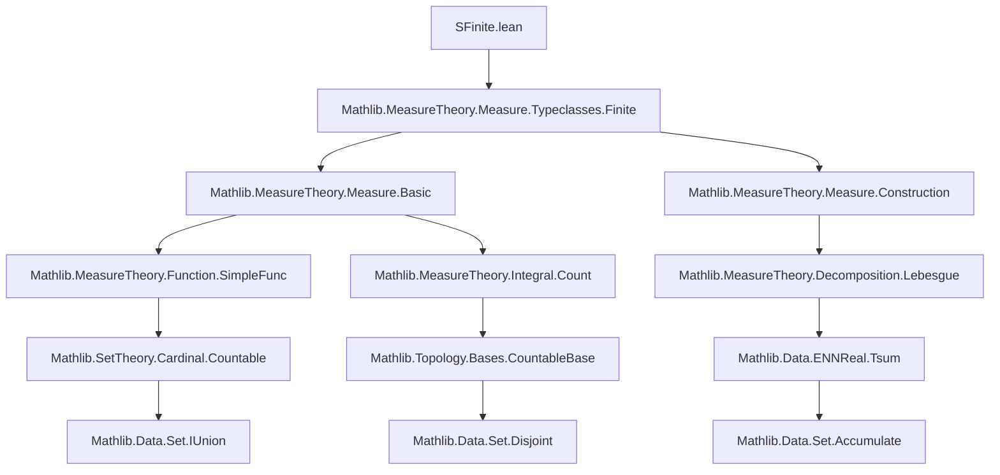
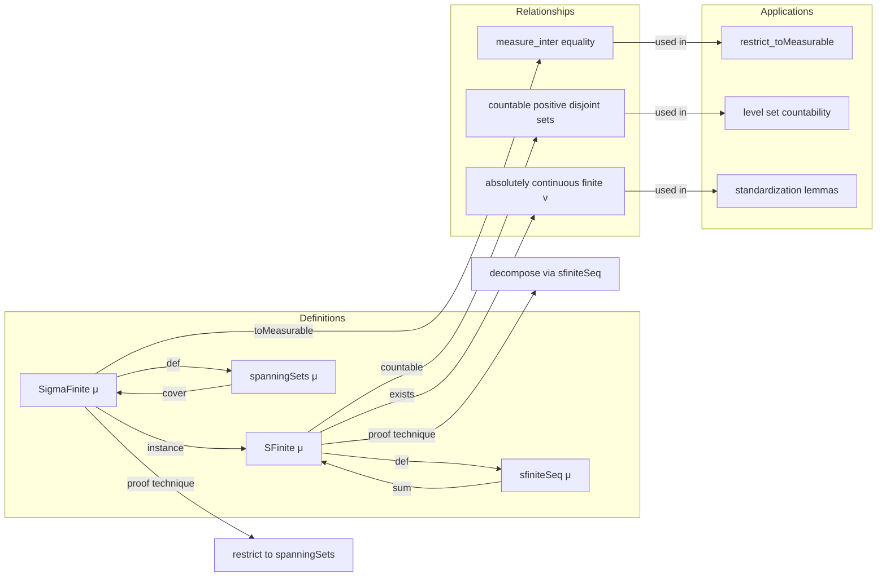

### Technical Brief: `SFinite.lean` — s-finite and σ-finite measures in Lean 4

---

#### **1. Key Definitions & Theorems**

| Name | Type | Purpose |
|------|------|---------|
| `SFinite μ` | `Prop` | `μ` is *s-finite*: can be written as a countable sum of finite measures. |
| `sfiniteSeq μ` | `ℕ → Measure α` | A noncomputable sequence of finite measures whose sum equals `μ`. |
| `sum_sfiniteSeq μ` | `sum (sfiniteSeq μ) = μ` | The defining property of `sfiniteSeq`. |
| `SigmaFinite μ` | `Prop` | `μ` is *σ-finite*: there exists a countable covering of `univ` by sets of finite measure. |
| `spanningSets μ` | `ℕ → Set α` | A monotone sequence of measurable sets covering `univ`, each of finite measure. |
| `spanningSetsIndex μ x` | `ℕ` | Least index `n` such that `x ∈ spanningSets μ n`. |
| `exists_isFiniteMeasure_absolutelyContinuous [SFinite μ]` | `∃ ν, IsFiniteMeasure ν ∧ μ ≪ ν ∧ ν ≪ μ` | For s-finite `μ`, there exists a finite measure mutually absolutely continuous with `μ`. |
| `instance [SigmaFinite μ] : SFinite μ` | `SFinite μ` | Every σ-finite measure is s-finite. |
| `measure_toMeasurable_inter_of_sFinite [SFinite μ]` | `μ (toMeasurable μ t ∩ s) = μ (t ∩ s)` | Key technical lemma: measurable superset behaves like original set under intersection, for s-finite measures. |
| `countable_meas_pos_of_disjoint_iUnion [SFinite μ]` | `Set.Countable { i | 0 < μ (As i) }` | In s-finite spaces, only countably many disjoint measurable sets can have positive measure. |
| `sigmaFinite_iff_measure_singleton_lt_top [Countable α]` | `SigmaFinite μ ↔ ∀ a, μ {a} < ∞` | Characterization of σ-finiteness on countable spaces. |

---

#### **2. Naming Conventions**

- **Prefixes**:
  - `sfinite`: relates to *s-finite* (e.g., `sfiniteSeq`, `SFinite`).
  - `spanning`: relates to σ-finite spanning sets (e.g., `spanningSets`, `spanningSetsIndex`).
  - `toFiniteSpanningSetsIn`: for canonical choice of finite spanning sets.
- **Suffixes**:
  - `_le`, `_lt_top`, `_pos`: indicate inequalities or bounds on measures.
  - `_inter`: indicates interaction with intersections.
  - `_of_`: indicates assumptions or sources (e.g., `of_sFinite`, `of_cover`, `of_disjoint`).
- **Predicates**:
  - `isFiniteMeasure`, `SFinite`, `SigmaFinite`: typeclass predicates.
  - `finite`, `countable`, `monotone`: standard properties.

---

#### **3. Tactic Stack**

Frequently used tactics in proofs:

| Tactic | Role |
|--------|------|
| `simp_rw` | Rewriting with simplification (especially for `sum`, `restrict`, `measure_toMeasurable`). |
| `aesop` / `grind` | Automated reasoning for set-theoretic and measure-theoretic inclusions. |
| `rw [← sum_sfiniteSeq μ]` | Rewriting using the decomposition of `μ`. |
| `apply le_antisymm` | Proving equality of measures/sets via mutual inequality. |
| `congr 1`, `ext`, `ext1` | Extensionality for functions, sets, measures. |
| `gcongr` | Monotonicity/congruence for inequalities. |
| `convert`, `nth_rw` | Flexible rewriting and matching. |
| `rcases em`, `split_ifs`, `cases em` | Classical reasoning and case splits. |
| `tsum_le_tsum`, `tsum_meas_le_meas_iUnion_of_disjoint` | Summation and measure-theoretic inequalities. |
| `measurable_find`, `measurableSet_spanningSets` | Measurability automation. |

---

#### **4. Proof Logic**

- **Induction & Decomposition**:
  - Proofs often decompose `μ` via `sfiniteSeq μ` or `spanningSets μ`.
  - For s-finite: reduce to finite measures via `sfiniteSeq`, apply finite-case lemmas, then reassemble via `sum`.
  - For σ-finite: use `spanningSets` to reduce global statements to finite-measure pieces.

- **Common Flow**:
  1. Use `sfiniteSeq` or `spanningSets` to get countable decomposition.
  2. Prove statement for each finite piece (often using `isFiniteMeasure` instances).
  3. Reassemble using countable additivity/monotone convergence.
  4. Use `ae`-equivalence or `measure_toMeasurable` to handle non-measurable sets.

- **Key Lemmas**:
  - `measure_toMeasurable_inter_of_sFinite`: bridges measurable superset and original set.
  - `countable_meas_pos_of_disjoint_iUnion`: crucial for cardinality arguments.
  - `iSup_restrict_spanningSets`: links sup over restrictions to full measure.

---

#### **5. Imports & Dependencies**

- **Core Imports**:
  ```lean
  Mathlib.MeasureTheory.Measure.Typeclasses.Finite
  ```
- **Key Dependencies**:
  - `Mathlib.MeasureTheory.Measure.Basic`
  - `Mathlib.MeasureTheory.Measure.Construction`
  - `Mathlib.MeasureTheory.Function.SimpleFunc`
  - `Mathlib.MeasureTheory.Integral.Count`
  - `Mathlib.MeasureTheory.Decomposition.Lebesgue`
  - `Mathlib.SetTheory.Cardinal.Countable`
  - `Mathlib.Topology.Bases.CountableBase`
  - `Mathlib.Data.ENNReal.Basic`, `ENNReal.Tsum`
  - `Mathlib.Data.Set.IUnion`, `Disjoint`, `Accumulate`

---

#### **6. Mermaid Diagrams**

##### **Dependency Graph (Module-Level)**



##### **Conceptual Overview of Theory Flow**



---

#### **7. Summary**

This module formalizes two central notions of “countable additivity” for measures:

- **s-finiteness**: `μ = ∑ₙ μₙ` with each `μₙ` finite.
- **σ-finiteness**: `univ = ⋃ₙ Aₙ` with each `μ(Aₙ) < ∞`.

It establishes:
- Equivalence: `σ-finite ⇒ s-finite`.
- Structural tools: canonical sequences (`sfiniteSeq`, `spanningSets`), index functions (`spanningSetsIndex`).
- Technical lemmas for measurable supersets (`toMeasurable`) and intersections.
- Cardinality results: only countably many disjoint positive-measure sets.
- Applications: uniqueness of measures, extension lemmas, level-set countability.

The proofs rely heavily on countable decomposition, monotone convergence, and classical choice (`Classical.find`). The design prioritizes *reusability* via typeclasses (`SFinite`, `SigmaFinite`) and *computational clarity* via noncomputable but definable witnesses (`sfiniteSeq`, `spanningSets`).
