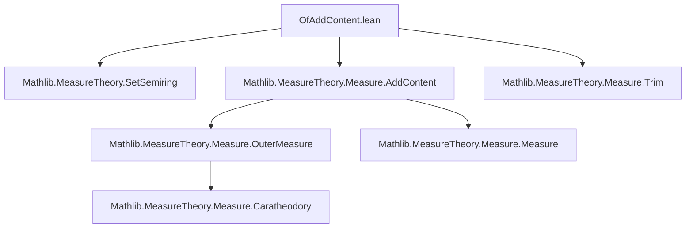
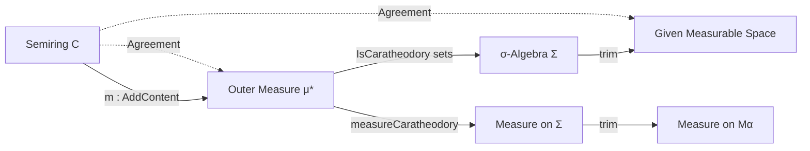

**Technical Brief: `OfAddContent.lean` — Carathéodory Extension Theorem in Lean 4**

---

### 1. **Key Definitions & Theorems**

| Name | Type / Signature | Purpose |
|------|------------------|---------|
| `OuterMeasure.ofFunction` | `∀ {α}, (Set α → ℝ≥0∞) → (empty ∈ C → m ∅ = 0) → Set α → ℝ≥0∞` | Constructs an outer measure from a function on a semiring, using infima over countable coverings. |
| `AddContent.measureCaratheodory` | `AddContent ℝ≥0∞ C → IsSetSemiring C → m.IsSigmaSubadditive → Measure α` | Constructs a measure on the Carathéodory σ-algebra induced by `m`. |
| `AddContent.measure` | `[MeasurableSpace α] → AddContent ℝ≥0∞ C → IsSetSemiring C → mα ≤ generateFrom C → m.IsSigmaSubadditive → Measure α` | Extends `measureCaratheodory` to a given measurable space when the semiring generates it. |
| `inducedOuterMeasure` | `∀ {α} {C : Set (Set α)}, IsSetSemiring C → (∅ ∈ C → m ∅ = 0) → Set α → ℝ≥0∞` | Outer measure induced by `m` on a semiring `C`. |
| `isCaratheodory_inducedOuterMeasure` | `IsSetSemiring C → AddContent ℝ≥0∞ C → MeasurableSet[generateFrom C] s → IsCaratheodory s` | All sets in the σ-algebra generated by `C` are Carathéodory measurable w.r.t. `inducedOuterMeasure`. |
| `isCaratheodory_inducedOuterMeasure_of_mem` | `s ∈ C → IsCaratheodory s` | Sets in `C` themselves are Carathéodory measurable. |
| `inducedOuterMeasure_eq` | `s ∈ C → inducedOuterMeasure m s = m s` | The induced outer measure agrees with `m` on `C`. |
| `measureCaratheodory_eq` | `s ∈ C → measureCaratheodory m s = m s` | The constructed measure extends `m` on `C`. |
| `measure_eq` | `s ∈ C → measure m s = m s` | The `measure` definition (on a given measurable space) extends `m` on `C`. |

---

### 2. **Naming Conventions**

- **Prefixes**:
  - `isCaratheodory_`: predicates Carathéodory measurability.
  - `measureCaratheodory`, `measure`: constructors of measures from contents.
  - `inducedOuterMeasure`, `ofFunction`: outer measure constructors.
- **Suffixes**:
  - `_eq`: theorems stating equality (e.g., with original content `m`).
  - `_of_mem`: results for sets *in* the semiring `C`.
  - `_of_diff`, `_disjointOfDiff`: auxiliary constructions for disjoint decomposition.

---

### 3. **Tactic Stack**

Frequently used tactics in proofs:
- `rw`, `simp_rw`, `congr`, `ext`: for rewriting and extensionality.
- `refine`, `exact`, `apply`: for constructing proofs stepwise.
- `calc`: for chaining inequalities/equalities.
- `induction` (with `| basic`, `| empty`, `| compl`, `| iUnion`): structural induction on `MeasurableSet` generation.
- `apply le_trans`, `apply ENNReal.tsum_le_tsum`, `Finset.sum_le_sum`: for bounding sums and measures.
- `have`, `obtain`, `let`: local lemma introduction.
- `rwa`, `change`, `convert`: for targeted rewriting and conversion.

---

### 4. **Proof Logic**

The logical flow follows the classical Carathéodory extension strategy:

1. **Outer measure construction**: Define `inducedOuterMeasure` via `OuterMeasure.ofFunction`.
2. **Agreement on semiring**: Prove `inducedOuterMeasure_eq` using sigma-subadditivity and monotonicity of `m`.
3. **Carathéodory measurability of `C`**: Show `s ∈ C ⇒ s` is measurable w.r.t. `inducedOuterMeasure`, via inequality manipulation and disjoint decomposition (`disjointOfDiff`, `sUnion_disjointOfDiff`).
4. **Extension to generated σ-algebra**: Use induction on the definition of `MeasurableSet[generateFrom C]` to lift measurability from `C` to the whole σ-algebra.
5. **Measure construction**: Define `measureCaratheodory` as the restriction of the outer measure to its Carathéodory σ-algebra; then `measure` trims it to a given measurable space.
6. **Consistency**: Show the constructed measure agrees with `m` on `C`.

---

### 5. **Imports**

| Import | Role |
|--------|------|
| `Mathlib.MeasureTheory.SetSemiring` | Defines `IsSetSemiring`, basic set-theoretic properties of semirings. |
| `Mathlib.MeasureTheory.Measure.AddContent` | Defines `AddContent`, sigma-subadditivity, extension `m.extend`. |
| `Mathlib.MeasureTheory.Measure.Trim` | Provides `trim`, used to restrict measures to sub-σ-algebras. |

---

### 6. **Mermaid Diagrams**

#### **Dependency Graph (Module-Level)**



#### **Overview of Theory Flow**



#### **Proof Structure (High-Level)**

```mermaid
flowchart TD
  Start[Given: C, m : AddContent, σ-subadditive] --> Def1[Define μ* = inducedOuterMeasure m]
  Def1 --> Thm1[μ* = m on C]
  Thm1 --> Thm2[∀ s ∈ C, s is μ*-measurable]
  Thm2 --> Ind[Induction on MeasurableSet[generateFrom C]]
  Ind --> Thm3[All sets in generateFrom C are μ*-measurable]
  Thm3 --> Def2[Define measureCaratheodory = μ*|_Σ]
  Def2 --> Thm4[measureCaratheodory = m on C]
  Thm4 --> Def3[Define measure = trim measureCaratheodory]
  Def3 --> Thm5[measure = m on C]
```

---

### 7. **Domain-Specific AI Agent Implications**

- **Focus areas for automation**: 
  - Disjoint decomposition (`disjointOfDiff`, `sUnion_disjointOfDiff`) is a recurring pattern.
  - Sigma-subadditivity is the key hypothesis; tools to extract and apply it should be prioritized.
  - The `induction` on `MeasurableSet` is highly structured — pattern-matching on its constructors can be automated.
- **Key lemmas to cache**:
  - `inducedOuterMeasure_eq`, `measureCaratheodory_eq`, `measure_eq`
  - `isCaratheodory_inducedOuterMeasure_of_mem`, `isCaratheodory_inducedOuterMeasure`

--- 

Let me know if you'd like a formalized tactic script template or a proof-checking checklist for this module.
