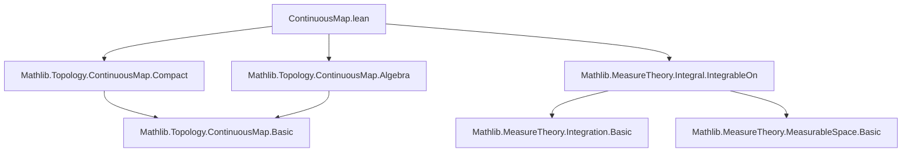

### Technical Brief: `ContinuousMap.lean` — Integration of `C(Y, E)`-valued functions

---

#### **1. Key Definitions & Theorems**

| Name | Type / Signature | Purpose |
|------|------------------|---------|
| `hasFiniteIntegral_of_bound` | `[CompactSpace Y] → (f : X → C(Y, E)) → (bound : X → ℝ) → HasFiniteIntegral bound μ → (∀ᵐ x ∂μ, ∀ y, ‖f x y‖ ≤ bound x) → HasFiniteIntegral f μ` | Gives a sufficient condition for integrability of a *bundled* `C(Y, E)`-valued function via a dominating scalar function. |
| `hasFiniteIntegral_mkD_of_bound` | `[CompactSpace Y] → (f : X → Y → E) → (g : C(Y, E)) → (∀ᵐ x, Continuous (f x)) → (bound : X → ℝ) → HasFiniteIntegral bound μ → (∀ᵐ x, ∀ y, ‖f x y‖ ≤ bound x) → HasFiniteIntegral (fun x ↦ mkD (f x) g) μ` | Same as above, but for *uncurried* families `f : X → Y → E`, using `mkD` to embed pointwise continuous functions into `C(Y, E)`. |
| `hasFiniteIntegral_mkD_restrict_of_bound` | `{s : Set Y} [CompactSpace s] → (f : X → Y → E) → (g : C(s, E)) → (∀ᵐ x, ContinuousOn (f x) s) → (bound : X → ℝ) → HasFiniteIntegral bound μ → (∀ᵐ x, ∀ y ∈ s, ‖f x y‖ ≤ bound x) → HasFiniteIntegral (fun x ↦ mkD (s.restrict (f x)) g) μ` | Variant for functions continuous only on a compact subset `s ⊆ Y`. |
| `aeStronglyMeasurable_mkD_of_uncurry` | `[CompactSpace Y] [TopologicalSpace X] [OpensMeasurableSpace X] [SecondCountableTopologyEither X (C(Y, E))] → (f : X → Y → E) (g : C(Y, E)) → Continuous (uncurry f) → AEStronglyMeasurable (fun x ↦ mkD (f x) g) μ` | Shows that if `f : X × Y → E` is continuous, then `x ↦ mkD (f x) g` is almost everywhere strongly measurable. |
| `aeStronglyMeasurable_restrict_mkD_of_uncurry`, `aeStronglyMeasurable_mkD_restrict_of_uncurry`, `aeStronglyMeasurable_restrict_mkD_restrict_of_uncurry` | Analogous variants for restrictions to measurable subsets `s ⊆ X`, `t ⊆ Y`, or both. | Extend measurability results to restricted domains/codomains. |

> **Note on `mkD`**: `ContinuousMap.mkD (f : Y → E) (g : C(Y, E))` constructs the continuous map equal to `f` where `f` is continuous, and equal to `g` elsewhere (defaulting to `g`). In practice, `g` is often `0`, and `mkD (f x) 0` embeds a pointwise continuous function `f x` into `C(Y, E)`.

---

#### **2. Naming Conventions**

- **Prefixes**:
  - `hasFiniteIntegral_`: indicates a sufficient condition for `HasFiniteIntegral`.
  - `aeStronglyMeasurable_`: indicates a sufficient condition for `AEStronglyMeasurable`.
  - `mkD_`: variants involving `ContinuousMap.mkD`.
  - `restrict_`: variants involving restriction to subsets (`s.restrict`, `μ.restrict s`).
- **Suffixes**:
  - `_of_bound`: uses a dominating function `bound`.
  - `_of_uncurry`: assumes continuity of `uncurry f`.
  - `_restrict`: involves restriction to a subset.

---

#### **3. Tactic Stack**

The proofs rely heavily on:
- `filter_upwards`: to handle almost-everywhere quantifiers.
- `simpa`: to simplify goals using lemmas like `mkD_apply_of_continuous`.
- `refine`: to apply intermediate lemmas (e.g., `hasFiniteIntegral_of_bound`).
- `continuous_mkD_of_uncurry`, `continuousOn_mkD_of_uncurry`, etc.: used to lift continuity of `uncurry f` to continuity (hence measurability) of `x ↦ mkD (f x) g`.
- `aestronglyMeasurable`: constructor for `AEStronglyMeasurable` from continuity.
- `le_trans`, `norm_nonneg`: basic analysis lemmas.

No heavy automation (e.g., `ring`, `linarith`) is used—proofs are mostly structural and rely on topology/measure theory lemmas.

---

#### **4. Proof Logic**

- **Structure**:
  1. **Reduction**: Reduce to known lemmas (e.g., reduce `mkD`-based integrability to `hasFiniteIntegral_of_bound`).
  2. **Almost-everywhere reasoning**: Use `filter_upwards` to handle `∀ᵐ x ∂μ` hypotheses.
  3. **Continuity → Measurability**: Use `continuous_mkD_of_uncurry` + `.aestronglyMeasurable`.
  4. **Case analysis**: In `hasFiniteIntegral_of_bound`, split on `isEmpty_or_nonempty Y` to handle trivial cases.
  5. **Restriction handling**: Use `continuousOn_iff_continuous_restrict` to relate continuity on subsets to global continuity of restrictions.

- **Key Insight**: The proofs avoid dependent-type complications by consistently using `mkD` to embed pointwise functions into `C(Y, E)`, even when continuity holds everywhere.

---

#### **5. Imports & Dependencies**

| Module | Purpose |
|--------|---------|
| `Mathlib.Topology.ContinuousMap.Compact` | Properties of `C(Y, E)` when `Y` is compact (e.g., `mkD`, continuity lemmas). |
| `Mathlib.Topology.ContinuousMap.Algebra` | Algebraic structure on `C(Y, E)` (used implicitly via `NormedAddCommGroup` instance). |
| `Mathlib.MeasureTheory.Integral.IntegrableOn` | Core integration theory: `HasFiniteIntegral`, `AEStronglyMeasurable`, etc. |

---

#### **6. Mermaid Diagrams**

##### **Dependency Graph (Module Level)**



##### **Overview of Theoretical Flow**

```mermaid
graph LR
  A[Uncurried f : X → Y → E] --> B[Continuity of uncurry f]
  B --> C[Continuity of x ↦ mkD (f x) g]
  C --> D[AEStronglyMeasurable]
  
  A --> E[Pointwise bound ‖f x y‖ ≤ bound x]
  E --> F[HasFiniteIntegral bound]
  F --> G[HasFiniteIntegral of x ↦ mkD (f x) g]

  style D fill:#d4f7e2,stroke:#2a9d8f
  style G fill:#e3f2fd,stroke:#1565c0
```

##### **Proof Strategy Flow (for `hasFiniteIntegral_mkD_of_bound`)**

```mermaid
graph TD
  Start[Given f : X → Y → E, g : C(Y, E)] --> CheckAECont[∀ᵐ x, Continuous (f x)]
  CheckAECont --> ApplyHasFiniteIntegral_of_bound[Apply hasFiniteIntegral_of_bound]
  ApplyHasFiniteIntegral_of_bound --> UseBound[Use bound : X → ℝ]
  UseBound --> Simpa[Simpa using mkD_apply_of_continuous]
  Simpa --> Finish[HasFiniteIntegral (fun x ↦ mkD (f x) g)]
```

---

#### **7. Implementation Notes (from docstring)**

- **Design Principle**: Prefer `mkD (f x) 0` over direct use of `f x : C(Y, E)` to unify cases where `f x` is continuous *everywhere* or *almost everywhere*.
- **Avoids Dependent-Type Hell**: By working with bare functions `X → Y → E`, one sidesteps the need to carry proofs of continuity as propositional arguments.
- **No Dominated Convergence**: These results rely only on basic properties of Banach-space-valued integration (e.g., norm comparison), so no topological assumptions (e.g., first-countability) on `Y` are needed.

---

#### **8. Summary**

This file provides a *practical toolkit* for integrating families of continuous functions valued in a normed group `E`, parameterized over a measure space `X`. It bridges the gap between:
- **Bundled** functions `X → C(Y, E)`, and
- **Uncurried** families `X → Y → E` (possibly only continuous a.e.),

by leveraging `ContinuousMap.mkD` and continuity/measurability lemmas for `uncurry f`. The results are elementary in mathematics but carefully formalized for usability in analysis and measure theory.
