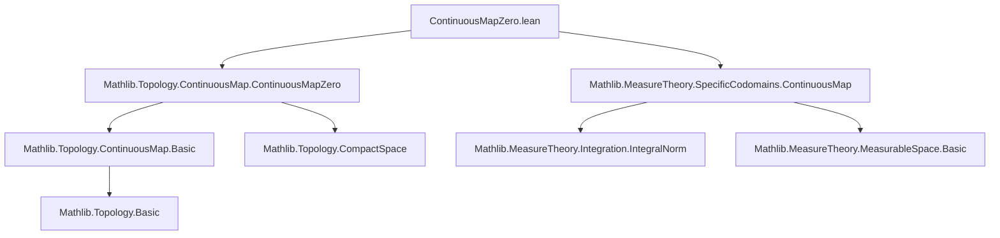

**Technical Brief: `ContinuousMapZero.lean`**

---

### 1. KEY DEFINITIONS & THEOREMS

| Name | Type / Signature | Purpose |
|------|------------------|---------|
| `hasFiniteIntegral_of_bound` | `[CompactSpace Y] [Zero Y] → (f : X → C(Y, E)₀) → (bound : X → ℝ) → HasFiniteIntegral bound μ → (∀ᵐ x ∂μ, ∀ y, ‖f x y‖ ≤ bound x) → HasFiniteIntegral f μ` | Provides a sufficient condition for integrability of `C(Y, E)₀`-valued functions via pointwise norm domination by an integrable scalar function. |
| `hasFiniteIntegral_mkD_of_bound` | Variant of above for functions defined via `mkD`, i.e., `X → Y → E` lifted to `C(Y, E)₀`. Requires a.e. continuity and vanishing at `0`. | Enables integrability checks for functions defined pointwise and then extended to based continuous maps. |
| `hasFiniteIntegral_mkD_restrict_of_bound` | Same as above but for restriction to a compact subset `s : Set Y`. | Handles integrability of functions defined on subspaces. |
| `aeStronglyMeasurable_mkD_of_uncurry` | Under second-countability and opens-measurable-space assumptions, if `uncurry f` is continuous and `f x 0 = 0` a.e., then `x ↦ mkD (f x) g` is a.e. strongly measurable. | Links continuity of the uncurried function to strong measurability in Banach-valued integration. |
| `aeStronglyMeasurable_restrict_mkD_of_uncurry`, `aeStronglyMeasurable_mkD_restrict_of_uncurry`, `aeStronglyMeasurable_restrict_mkD_restrict_of_uncurry` | Analogous variants for restrictions in domain (`s ⊆ X`) and/or codomain (`t ⊆ Y`). | Extend measurability results to localized settings (e.g., integration over measurable subsets). |

**Notation & Helpers**:
- `mkD`: `C(Y, E)₀` constructor from a function `Y → E` continuous and vanishing at `0`, possibly with basepoint adjustment.
- `s.restrict f`: restriction of `f : Y → E` to a subset `s : Set Y`.
- `ContinuousMapZero.isEmbedding_toContinuousMap`: embedding of `C(Y, E)₀` into `C(Y, E)` used to transfer measurability via composition.

---

### 2. NAMING CONVENTIONS

- **Prefixes**:
  - `hasFiniteIntegral_...`: integrability lemmas.
  - `aeStronglyMeasurable_...`: a.e. strong measurability lemmas.
  - `mkD_...`, `mkD_restrict_...`: variants involving `mkD` or restricted domains/codomains.
- **Suffixes**:
  - `_of_bound`: domination by an integrable bound.
  - `_of_uncurry`: based on continuity of `uncurry f`.
  - `_restrict`: involves restriction to subsets.

---

### 3. TACTIC STACK

Frequent tactics used in proofs:
- `filter_upwards`: to handle almost-everywhere quantifiers.
- `simpa`: simplification with target rewriting.
- `rw`: rewriting using equalities (especially `mkD_eq_mkD_of_map_zero`, embeddings).
- `refine`: to construct proofs via intermediate lemmas.
- `exact`, `assumption`: minimal use; mostly `refine` + `simpa`.
- `aesop` not used — relies on manual `filter_upwards` and `simpa`.

---

### 4. PROOF LOGIC

**General proof pattern**:
1. **Reduction via embedding**: Use `← ContinuousMapZero.isEmbedding_toContinuousMap.aestronglyMeasurable_comp_iff` to reduce to known results in `ContinuousMap`.
2. **Equality up to a.e.**: Show that two functions are equal a.e. using `aestronglyMeasurable_congr`.
3. **Apply known lemmas**: Use `ContinuousMap.*` lemmas (e.g., `aeStronglyMeasurable_mkD_of_uncurry`) as black-box.
4. **Handle basepoint condition**: Use `f_zero` and `mkD_eq_mkD_of_map_zero` to adjust for basepoint.
5. For integrability:
   - Prove non-negativity of bound a.e. (`bound_nonneg`).
   - Use `hasFiniteIntegral.mono'` with domination (`norm_le`).
   - Simplify using `ContinuousMap.norm_le`.

**Induction / cases**: Not used — proofs are direct and rely on existing lemmas in `ContinuousMap`.

---

### 5. IMPORTS & DEPENDENCIES

| Import | Role |
|--------|------|
| `Mathlib.Topology.ContinuousMap.ContinuousMapZero` | Core definitions: `C(Y, E)₀`, `mkD`, `isEmbedding_toContinuousMap`. |
| `Mathlib.MeasureTheory.SpecificCodomains.ContinuousMap` | Provides measurable/integrability lemmas for `C(Y, E)`-valued functions; reused and adapted. |
| `Mathlib.MeasureTheory.Integration.IntegralNorm` (via `HasFiniteIntegral`) | Norm-integrability criteria. |
| `Mathlib.Topology.Basic`, `Mathlib.Topology.CompactSpace`, `Mathlib.Topology.ContinuousMap.Basic` | Topological assumptions: compactness, zero, continuity. |
| `Mathlib.MeasureTheory.MeasurableSpace.Basic`, `Mathlib.MeasureTheory.Measure.Space` | Measure-theoretic infrastructure. |

---

### 6. MERMAID DIAGRAMS

#### Dependency Graph (Module-Level)



#### Overview of Theory Flow

```mermaid
flowchart LR
  subgraph Domain
    X[Measure Space X] -->|f: X → C(Y,E)₀| Int[Integrability]
    Y[Compact Y, Zero] -->|norm bound| Int
  end

  subgraph Codomain
    C0[C(Y,E)₀] -->|mkD| C[C(Y,E)]
    C -->|embedding| B[Banach space]
  end

  Int -->|hasFiniteIntegral_of_bound| I[Finite Integral]
  Int -->|aeStronglyMeasurable_*| M[Strong Measurability]

  M -->|Bochner integral| BI[Bochner Integral]
```

---

### 7. DOMAIN & SCOPE

- **Mathematical Domain**: Functional analysis + measure theory, specifically Bochner integration of **based continuous maps** into normed groups.
- **Key Objects**:
  - `C(Y, E)₀`: space of continuous maps `Y → E` vanishing at a distinguished point `0`.
  - `mkD`: canonical map from pointwise functions to `C(Y, E)₀`.
  - Integration over arbitrary measure spaces, not assuming Polish/second-countable structure on `Y`.
- **Applications**: Likely preparation for Fubini/Tonelli theorems for `C(Y, E)₀`-valued functions, or for constructing vector-valued stochastic processes with continuous paths.

--- 

Let me know if you'd like a formalized module dependency graph or a summary of how this file fits into the larger `MeasureTheory.SpecificCodomains` hierarchy.
