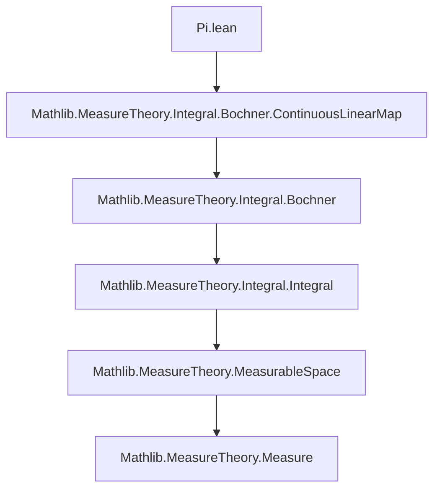
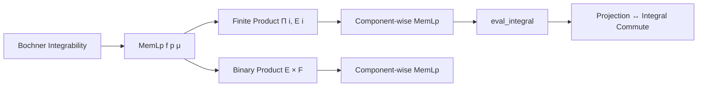

**Technical Brief: `Pi.lean` — Integrability in Product Spaces**

---

### 1. **Key Definitions & Theorems**

| Name | Type / Signature | Purpose |
|------|------------------|---------|
| `MemLp f p μ` | `f : X → E → Prop` | $f$ belongs to $L^p(\mu)$, i.e., $\|f\|_p^p = \int \|f(x)\|^p \, d\mu(x) < \infty$ |
| `Integrable f μ` | `f : X → E → Prop` | $f$ is Bochner integrable (i.e., $L^1$) |
| `memLp_pi_iff` | `MemLp f p μ ↔ ∀ i, MemLp (f · i) p μ` | Characterizes $L^p$-integrability of vector-valued functions on a finite product space $\Pi_i E_i$ |
| `integrable_pi_iff` | `Integrable f μ ↔ ∀ i, Integrable (f · i) μ` | Special case of `memLp_pi_iff` for $p = 1$ |
| `eval_integral` | `∀ i, Integrable (f · i) μ → (∫ x, f x ∂μ) i = ∫ x, f x i ∂μ` | Interchange of integral and evaluation: projection commutes with Bochner integral |
| `memLp_prod_iff` | `MemLp f p μ ↔ MemLp (f.fst) p μ ∧ MemLp (f.snd) p μ` | $L^p$-integrability on a binary product $E \times F$ |
| `MemLp.fst`, `MemLp.snd` | `MemLp f p μ → MemLp (f.fst) p μ`, etc. | Projections preserve $L^p$-integrability |
| `MemLp.of_fst_snd` | `MemLp (f.fst) p μ → MemLp (f.snd) p μ → MemLp f p μ` | Converse: joint integrability from components |

Aliases:
- `⟨MemLp.eval, MemLp.of_eval⟩ := memLp_pi_iff`
- `⟨_, MemLp.of_fst_snd⟩ := memLp_prod_iff`

---

### 2. **Naming Conventions**

- **Predicate prefixes**: `MemLp`, `Integrable`
- **Component projections**:
  - `f · i` for evaluation at index $i$ (dependent product)
  - `(f x).fst`, `(f x).snd` for binary product
- **Canonical embeddings**:
  - `Pi.single i` (for dependent products)
  - `AddMonoidHom.inl E F`, `AddMonoidHom.inr E F` (for binary products)
- **Isometries / Lipschitz maps**:
  - `Isometry.single i`, `Isometry.inl`, `Isometry.inr`
  - `LipschitzWith.prod_fst`, `LipschitzWith.prod_snd`, `LipschitzWith.eval`

---

### 3. **Tactic Stack**

- `simp` / `simp_rw`: Simplify using definitional equalities and lemmas (e.g., `simp_rw [← memLp_one_iff_integrable]`)
- `ext`: Extensionality for functions/dependent products
- `rw [this]`: Rewrite using a constructed equality (e.g., decomposition of $f$)
- `exact`, `refine`: Direct or partially applied proof construction
- `cases` / `all_goals`: Case analysis (used in `memLp_prod_iff.mpr`)
- `classical`: Classical logic assumption (for existence of sums over finite types)
- `lipschitz.comp_memLp`: Leverages Lipschitz/Isometry preservation of $L^p$ membership

---

### 4. **Proof Logic**

- **Forward direction (`mp`)**:
  - Use Lipschitz continuity of projections (`eval`, `prod_fst`, `prod_snd`) to pull back $L^p$-integrability.
- **Reverse direction (`mpr`)**:
  - Decompose $f$ as a finite sum of lifted components (via `Pi.single` or `inl/inr`).
  - Apply `memLp_finset_sum'` + `Isometry.lipschitz.comp_memLp` to each summand.
- **Integral evaluation**:
  - Use `ContinuousLinearMap.integral_comp_comm` with `proj` (the canonical linear map $\Pi_i E_i \to E_i$).
  - Requires completeness of target spaces (to ensure Bochner integral exists).

---

### 5. **Imports**

- `Mathlib.MeasureTheory.Integral.Bochner.ContinuousLinearMap`:  
  Provides tools for Bochner integrals and interaction with continuous linear maps (e.g., `ContinuousLinearMap.integral_comp_comm`, `proj_apply`).

---

### 6. **Mermaid Diagrams**

#### **Dependency Graph (Module-Level)**



#### **Theoretical Overview (Conceptual Flow)**



#### **Proof Structure (for `memLp_pi_iff.mpr`)**

```mermaid
flowchart LR
  A[Assume ∀ i, MemLp (f · i) p μ] --> B[Express f = ∑_i single i ∘ (f · i)]
  B --> C[Apply memLp_finset_sum']
  C --> D[Each term: Isometry.single i ∘ (f · i)]
  D --> E[Isometry ⇒ Lipschitz ⇒ preserves MemLp]
  E --> F[Conclude MemLp f p μ]
```

---

### 7. **Domain-Specific AI Agent Notes**

- **Key reasoning pattern**: Decompose vector-valued functions into components via linear isometries, then apply stability of $L^p$ under Lipschitz maps.
- **Critical assumptions**:
  - Finite index set `ι` (via `[Fintype ι]`)
  - Each `E i` is a `NormedAddCommGroup` and `NormedSpace ℝ`, plus `CompleteSpace` for integral lemmas.
- **Automation opportunities**:
  - `simp`-based automation for component projections.
  - Tactics to auto-generate decomposition lemmas (e.g., `f = ∑ i, single i ∘ f i`).
  - Pattern matching on `MemLp`/`Integrable` goals to split into component goals.

--- 

Let me know if you'd like a formalized tactic or automation script for this theory.
