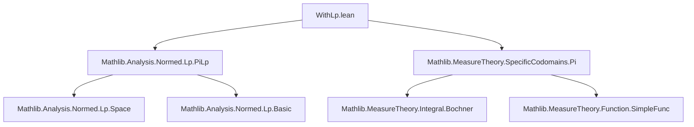

Here is the structured technical brief extracted from `WithLp.lean`:

---

### **1. Key Definitions & Theorems**

| Name | Type | Purpose |
|------|------|---------|
| `memLp_piLp_iff` | `MemLp f p μ ↔ ∀ i, MemLp (f · i) p μ` | Characterizes $L^p$-integrability of functions into `PiLp q E` via pointwise integrability of components. |
| `integrable_piLp_iff` | `Integrable f μ ↔ ∀ i, Integrable (f · i) μ` | Special case of `memLp_piLp_iff` for $p = 1$, i.e., integrability. |
| `eval_integral_piLp` | `∀ i, Integrable (f · i) μ → (∫ x, f x ∂μ) i = ∫ x, f x i ∂μ` | Interchange of integral and projection for `PiLp`-valued functions. |
| `memLp_prodLp_iff` | `MemLp f p μ ↔ MemLp (f.fst) p μ ∧ MemLp (f.snd) p μ` | Characterizes $L^p$-integrability for `WithLp q (E × F)`-valued functions via components. |
| `integrable_prodLp_iff` | `Integrable f μ ↔ Integrable f.fst μ ∧ Integrable f.snd μ` | Integrability criterion for `WithLp`-valued functions. |
| `fst_integral_withLp`, `snd_integral_withLp` | `(∫ f ∂μ).fst = ∫ f.fst ∂μ`, `(∫ f ∂μ).snd = ∫ f.snd ∂μ` | Component-wise computation of the Bochner integral for `WithLp`-valued functions. |

---

### **2. Naming Conventions**

- **Prefixes**:
  - `memLp_`: Relates to membership in $L^p$ (i.e., `MemLp f p μ`).
  - `integrable_`: Relates to integrability (`Integrable f μ`).
  - `eval_`, `prodLp_`, `of_fst_of_snd_`: Denotes projections or component-wise constructions.
- **Suffixes**:
  - `_iff`: Biconditional characterizations.
  - `_fst`, `_snd`: Projection onto first/second component.
  - `_piLp`, `_prodLp`: Context-specific variants for `PiLp` vs `WithLp`.

---

### **3. Tactic Stack**

- `simp_rw`: Used extensively to rewrite using definitional equivalences (e.g., `← memLp_pi_iff`, `← WithLp.ofLp_fst`).
- `exact`: To close goals directly using previously established lemmas or hypotheses.
- `rw`: For applying equivalences and definitions (e.g., integral commutation).
- `conv => enter ...; change ...`: To manipulate convoluted expressions (e.g., unfolding `ContinuousLinearEquiv`).
- `rfl`: For definitional equality (e.g., after unfolding equivalences).
- `simp`: To simplify goals using known facts (e.g., `by simp` in assumptions).

---

### **4. Proof Logic**

- **Structure**: All proofs follow a pattern of:
  1. **Rewriting** using definitional equivalences (e.g., `WithLp.ofLp`, `PiLp.proj`, `memLp_one_iff_integrable`).
  2. **Applying Lipschitz/antilipschitz equivalence criteria** (via `memLp_comp_iff_of_antilipschitz`) to reduce to known integrability criteria (`memLp_pi_iff`, `memLp_prod_iff`).
  3. **Using continuity/linearity of projections** to commute integrals (via `ContinuousLinearMap.integral_comp_comm`, `ContinuousLinearEquiv.integral_comp_comm`).
- **Induction/Case analysis**: Not used directly; relies on structural properties of `PiLp` and `WithLp` as normed spaces with projections.

---

### **5. Imports**

| Import | Role |
|--------|------|
| `Mathlib.Analysis.Normed.Lp.PiLp` | Provides `PiLp`, its normed space structure, projections, Lipschitz/antilipschitz properties of `ofLp`, `proj`. |
| `Mathlib.MeasureTheory.SpecificCodomains.Pi` | Provides measure-theoretic tools for product spaces, especially `memLp_pi_iff`, `integrable_pi_iff`. |

---

### **6. Mermaid Diagrams**

#### **Dependency Graph (Module-Level)**



#### **Overview of Theoretical Flow**

```mermaid
flowchart LR
  A[MemLp f p μ] -->|PiLp case| B[∀ i, MemLp (f · i) p μ]
  A -->|WithLp case| C[MemLp f.fst p μ ∧ MemLp f.snd p μ]
  B --> D[Integrable f μ ↔ ∀ i, Integrable (f · i) μ]
  C --> E[Integrable f μ ↔ Integrable f.fst μ ∧ Integrable f.snd μ]
  D --> F[∫ f = λi. ∫ f i]
  E --> G[(∫ f).fst = ∫ f.fst, (∫ f).snd = ∫ f.snd]
```

---

Let me know if you'd like a formalized dependency graph for the `PiLp`/`WithLp` equivalence chain or a proof sketch in natural language.
