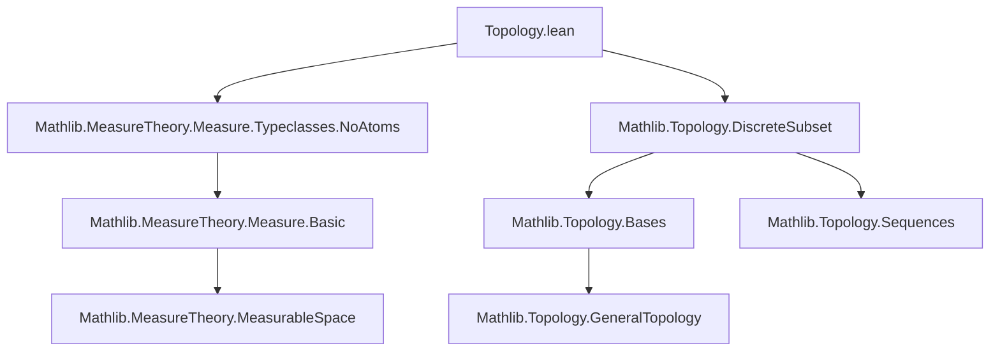
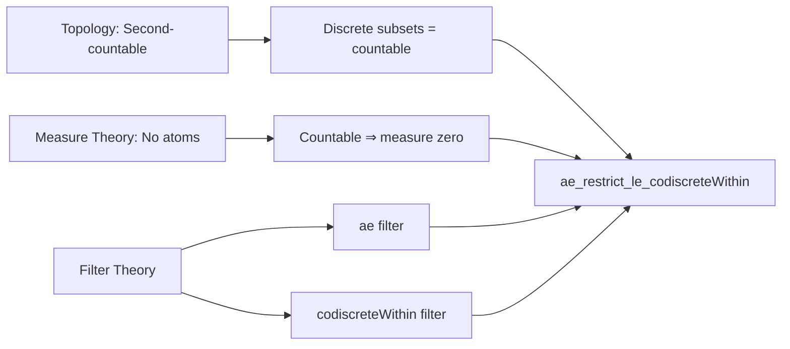

**Technical Brief: `Topology.lean` (Measure Theory + Topology Interplay)**

---

### 1. **Key Definitions & Theorems**

| Name | Type / Signature | Purpose |
|------|------------------|---------|
| `ae_restrict_le_codiscreteWithin` | `{α : Type*} [MeasurableSpace α] [TopologicalSpace α] [SecondCountableTopology α] {μ : Measure α} [NoAtoms μ] {U : Set α} (hU : MeasurableSet U) : ae (μ.restrict U) ≤ codiscreteWithin U` | Shows that under second-countable topology and atomlessness, sets codiscrete within a measurable set `U` are eventually contained in the almost-everywhere filter of the restricted measure `μ.restrict U`. |

- **`ae`**: The *almost everywhere* filter (i.e., the filter of sets whose complement is null).
- **`μ.restrict U`**: The restriction of measure `μ` to measurable subset `U`.
- **`codiscreteWithin U`**: The filter of subsets of `U` whose complement in `U` is *codiscrete* (i.e., its intersection with `U` has discrete subspace topology).
- **`isDiscrete_iff_discreteTopology`**: Equivalence between a set being discrete and its subspace topology being discrete.
- **`isDiscrete_of_codiscreteWithin`**: From `codiscreteWithin`, deduce discreteness of the complement within `U`.
- **`mem_ae_iff`**: Characterization of membership in the `ae` filter.
- **`Measure.restrict_apply'`**: Evaluates the restricted measure on measurable subsets.
- **`Set.Countable.measure_zero`**: A countable set has measure zero under atomless measures (via separability assumption).

---

### 2. **Naming Conventions**

- **Prefixes**:
  - `ae_`: Relating to almost-everywhere filters.
  - `restrict_`: Measure restriction.
  - `codiscreteWithin_`: Topological codiscreteness relative to a subset.
  - `isDiscrete_`: Characterizing discrete subsets.
- **Suffixes**:
  - `_within`: Indicates relative/topical restriction (e.g., `codiscreteWithin`, `ae_restrict`).
- **Functional style**: Theorems named descriptively with underscores separating components (`ae_restrict_le_codiscreteWithin`).

---

### 3. **Tactic Stack**

- `intro s hs`: Standard intro for filter inclusion proof.
- `isDiscrete_iff_discreteTopology.mp`: Use equivalence to extract topology.
- `symm ▸ hs`: Rewrite using equality symmetry to align hypotheses.
- `rw [mem_ae_iff, Measure.restrict_apply']`: Rewrite using definitions of `ae` membership and restricted measure.
- `apply Set.Countable.measure_zero …`: Apply key lemma about countable sets and atomless measures.
- `TopologicalSpace.separableSpace_iff_countable.1 inferInstance`: Extract countable dense subset from separability (enabled by `SecondCountableTopology` ⇒ `SeparableSpace` ⇒ `∃ countable dense`).

No heavy automation (e.g., `aesop`, `ring`, `simp_rw`) — proof is mostly *definition unfolding + classical measure-theoretic reasoning*.

---

### 4. **Proof Logic**

1. **Goal**: Show filter inclusion `ae (μ.restrict U) ≤ codiscreteWithin U`.
2. **Unfold inclusion**: Take arbitrary `s` in `codiscreteWithin U`, show `s ∈ ae (μ.restrict U)`.
3. **Use codiscrete assumption**: From `s ∈ codiscreteWithin U`, deduce `sᶜ ∩ U` is discrete.
4. **Topological lift**: Discreteness of `sᶜ ∩ U` ⇒ discrete topology on it.
5. **Measure-theoretic step**: Under atomlessness + second-countability, discrete subsets of `U` are countable ⇒ measure zero.
6. **Conclude**: Since `sᶜ ∩ U` is null, `s ∈ ae (μ.restrict U)`.

*Structure*:  
`filter_le_iff` → `intro s hs` → `discrete ⇒ countable ⇒ measure_zero` → `mem_ae_iff`.

---

### 5. **Imports & Dependencies**

- **Core imports**:
  - `Mathlib.MeasureTheory.Measure.Typeclasses.NoAtoms`: Ensures no atoms ⇒ countable sets are null.
  - `Mathlib.Topology.DiscreteSubset`: Tools for discrete subsets and codiscrete filters.
- **Implicit assumptions**:
  - `MeasurableSpace α`, `TopologicalSpace α`, `SecondCountableTopology α`: Bridge topology and measurability.
  - `SecondCountableTopology` ⇒ `SeparableSpace` ⇒ `∃ countable dense`, used to bound cardinality of discrete sets.
- **No heavy category-theoretic or homological dependencies** — focused on analysis-topology interface.

---

### 6. **Mermaid Diagrams**

#### **Dependency Graph (File-Level)**

#### **Theoretical Overview (Conceptual Flow)**

---

### 7. **Summary**

This file bridges topology and measure theory by showing that *topologically large* sets (codiscrete within `U`) are *measure-theoretically large* (full measure w.r.t. `μ.restrict U`) under atomlessness and second-countability. The proof leverages:
- separability ⇒ countable dense subset,
- discrete subsets in separable spaces are countable,
- atomless measures vanish on countable sets.

It exemplifies Lean’s ability to unify analysis and topology via typeclass inference and filter-based reasoning.
