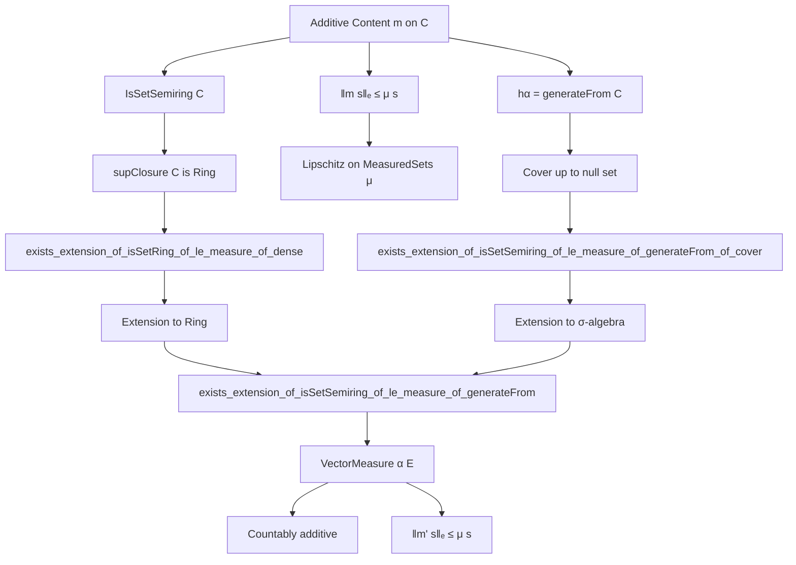

**Technical Brief: `AddContent.lean` — Extension of Additive Content to Vector Measure**

---

### 1. KEY DEFINITIONS & THEOREMS

| Name | Type / Signature | Purpose |
|------|------------------|---------|
| `of_additive_of_le_measure` | `(m : Set α → E) → (∀ s, ‖m s‖ₑ ≤ μ s) → (finitely additive on measurable disjoint sets) → (vanishes on non-measurable sets) → VectorMeasure α E` | Constructs a **countably additive vector measure** from a finitely additive map dominated by a finite measure. |
| `exists_extension_of_isSetRing_of_le_measure_of_dense` | `{C : Set (Set α)} → {m : AddContent E C} → (IsSetRing C) → (C ⊆ measurable sets) → (‖m s‖ₑ ≤ μ s) → (C dense in measurable sets w.r.t. `edist`) → ∃ extension `m'` of `m` to all measurable sets, dominated by `μ` | Extends an additive content on a **dense ring** to a vector measure. Core technical proof via Lipschitz extension on `MeasuredSets μ`. |
| `exists_extension_of_isSetSemiring_of_le_measure_of_dense` | Same as above, but `C` is a **semiring**, and density is w.r.t. `supClosure C` | Extends content from a **semiring** using its sup-closure (a ring). Uses previous lemma on `supClosure C`. |
| `exists_extension_of_isSetSemiring_of_le_measure_of_generateFrom_of_cover` | `{C : Set (Set α)} → {m : AddContent E C} → (hα = generateFrom C) → (C covers space up to null set) → ∃ extension `m'` | Handles case where `C` generates the σ-algebra and covers up to null set. Uses approximation by countable subfamily. |
| `exists_extension_of_isSetSemiring_of_le_measure_of_generateFrom` | `{C : Set (Set α)} → {m : AddContent E C} → (IsSetSemiring C) → (‖m s‖ₑ ≤ μ s) → (hα = generateFrom C) → ∃ extension `m'` | Main theorem: **any additive content on a semiring generating the σ-algebra, dominated by finite `μ`, extends to a vector measure dominated by `μ`**. |

---

### 2. NAMING CONVENTIONS

- **Prefixes**:
  - `of_`: constructing an object from data (e.g., `of_additive_of_le_measure`)
  - `exists_`: existence of an extension/structure (e.g., `exists_extension_of_...`)
  - `h_`, `h'`, `h''`: hypotheses (e.g., `hC`, `h'C`, `h''C`)
  - `lip`, `m₀`, `m₁`, `m'`, `m''`: intermediate constructions (e.g., Lipschitz maps, extensions)

- **Suffixes**:
  - `_of_le_measure`: domination by a finite measure
  - `_of_dense`: density assumption
  - `_of_generateFrom`: σ-algebra generated by `C`
  - `_of_cover`: covering up to null set

- **Other**:
  - `C'`, `C''`: derived collections (e.g., `C' = {s : MeasuredSets μ | ∃ c ∈ C, s = c}`)
  - `s''`, `t'`: refined approximating sets (e.g., `s'' = s' \ t'`)

---

### 3. TACTIC STACK

| Tactic | Frequency / Role |
|--------|------------------|
| `simp` / `simp only` | Very high — simplifies set identities, measurable set properties, `edist`, `symmDiff`, `Finset` sums |
| `gcongr` | High — for bounding sums/integrals using monotonicity of measure and `‖·‖ₑ` |
| `rw` / `nth_rewrite` | High — rewriting definitions, set equalities, `edist`, `supClosure` |
| `apply`, `exact`, `refine` | High — proof construction, especially in `by` blocks |
| `have`, `suffices`, `obtain` | High — intermediate claims, especially in `exists_extension_of_isSetRing_of_le_measure_of_dense` |
| `abel_nf` | Medium — simplifying expressions in normed groups |
| `grind` | Medium — automated set reasoning (e.g., `Set.disjoint_iff_inter_eq_empty`) |
| `convert` | Medium — matching up definitions with small differences |
| `apply ENNReal.summable_toReal`, `tendsto_of_tendsto_of_tendsto_of_le_of_le` | Medium — analysis-level arguments in infinite sum convergence |
| `isClosed_le`, `isClosed.closure_eq`, `Dense.mono` | Medium — topology in `MeasuredSets μ` |

---

### 4. PROOF LOGIC

**General Strategy**:

1. **Approximation by sets in `C`**:
   - Use density of `C` (or `supClosure C`) in measurable sets under `edist(s,t) = μ(s ∆ t)` to approximate any measurable set.
   - Control errors via `μ(s ∆ t) < ε`.

2. **Lipschitz extension**:
   - Show `m` is 1-Lipschitz on `C' ⊆ MeasuredSets μ` using `‖m s - m t‖ₑ ≤ μ(s ∆ t)`.
   - Extend uniquely to all of `MeasuredSets μ` by continuity.

3. **Preservation of finite additivity**:
   - For disjoint `s, t`, approximate by `s', t' ∈ C`, adjust to disjoint `s'', t'` (e.g., `s'' = s' \ t'`) to control measure of intersection.
   - Use triangle inequality and Lipschitz property to bound `‖m₁(s ∪ t) - m₁ s - m₁ t‖`.

4. **Countable additivity**:
   - Apply `of_additive_of_le_measure`: finite additivity + domination ⇒ countable additivity.

5. **Extension to full σ-algebra**:
   - If `C` generates the σ-algebra, reduce to case where `C` covers space up to null set (via `Measure.exists_ae_subset_biUnion_countable`).
   - Use restriction `μ' = μ.restrict (⋃ D)` to reduce to finite measure case.

---

### 5. IMPORTS

| Module | Role |
|--------|------|
| `Mathlib.Analysis.Normed.Group.InfiniteSum` | Infinite sums in Banach spaces, summability, `hasSum_iff_tendsto_nat_of_summable_norm` |
| `Mathlib.MeasureTheory.Measure.AddContent` | Definition of additive content, `supClosure`, `AddContent.supClosure_apply_finpartition` |
| `Mathlib.MeasureTheory.Measure.MeasuredSets` | Subtype of measurable sets modulo null sets, `edist`, Lipschitz continuity on `MeasuredSets μ` |
| `Mathlib.MeasureTheory.VectorMeasure.Basic` | Definition of `VectorMeasure`, `of_additive_of_le_measure`, `empty'`, `not_measurable'`, `m_iUnion'` |

---

### 6. MERMAID DIAGRAMS

#### Dependency Graph (High-Level)



#### Overview of File Structure

```mermaid
flowchart LR
  subgraph Definitions
    D1[of_additive_of_le_measure]
  end

  subgraph Core Extensions
    E1[exists_extension_of_isSetRing_of_le_measure_of_dense]
    E2[exists_extension_of_isSetSemiring_of_le_measure_of_dense]
    E3[exists_extension_of_isSetSemiring_of_le_measure_of_generateFrom_of_cover]
    E4[exists_extension_of_isSetSemiring_of_le_measure_of_generateFrom]
  end

  subgraph Tools
    T1[MeasuredSets μ]
    T2[supClosure C]
    T3[edist = μ(s ∆ t)]
    T4[Lipschitz extension]
  end

  D1 -->|used in| E4
  T1 -->|domain of| T4
  T2 -->|ring approximation| E2
  E2 -->|used in| E4
  E3 -->|used in| E4
  E1 -->|base case| E2
```

---

### 7. SUMMARY

This file establishes a **Riesz representation-type theorem for vector measures**: any additive content on a semiring, dominated by a finite measure and generating the σ-algebra, extends uniquely to a countably additive vector measure dominated by the same measure. The proof is constructive in the sense of Lean’s logic, relying on:
- Lipschitz extension on the metric space of measurable sets modulo null sets,
- careful approximation to preserve finite additivity,
- reduction to finite additivity + domination ⇒ countable additivity.

It is foundational for integration theory with respect to vector measures and prepares the ground for future work on Radon–Nikodym and disintegration in the vector-valued setting.

--- 

*End of Technical Brief.*
