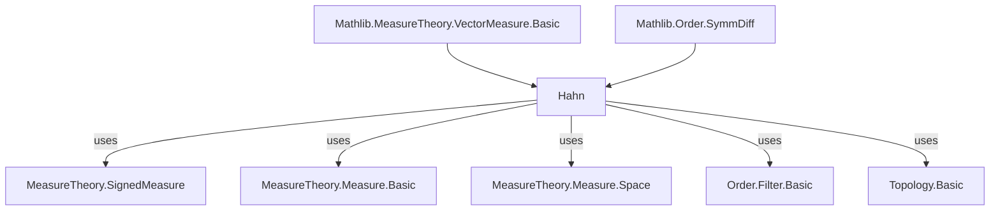

### Technical Brief: Hahn Decomposition in Lean 4 (`Hahn.lean`)

---

#### **1. Key Definitions & Theorems**

| Name | Type / Signature | Purpose |
|------|------------------|---------|
| `ExistsOneDivLT s i n` | `Prop` | Exists a measurable `k ⊆ i` with $ \frac{1}{n+1} < s(k) $. Used to detect “large positive chunks” in $ i $. |
| `findExistsOneDivLT s i` | `ℕ` | Minimal $ n $ such that `ExistsOneDivLT s i n`, else 0. Implements choice of minimal “witness scale”. |
| `someExistsOneDivLT s i` | `Set α` | A measurable subset of $ i $ witnessing `ExistsOneDivLT` at the minimal scale (or $ \emptyset $ if none). |
| `restrictNonposSeq s i : ℕ → Set α` | Function | Inductive sequence approximating maximal positive subsets to remove from $ i $, aiming to isolate a negative remainder. |
| `measureOfNegatives s` | `Set ℝ` | Image of $ s $ on measurable sets $ B $ with $ s \leq [B] 0 $. Used to construct Hahn decomposition via infimum. |
| `exists_subset_restrict_nonpos` | `s i < 0 → ∃ j ⊆ i, MeasurableSet j ∧ s ≤ [j] 0 ∧ s j < 0` | Core lemma: negative-measure set contains a negative *subset* of negative measure. |
| `exists_compl_positive_negative` | `∃ i, MeasurableSet i ∧ 0 ≤ [i] s ∧ s ≤ [iᶜ] 0` | Complement-based Hahn decomposition. |
| `exists_isCompl_positive_negative` | `∃ i j, IsCompl i j ∧ 0 ≤ [i] s ∧ s ≤ [j] 0` | **Main theorem**: Hahn decomposition — complementary measurable sets partition space into positive/negative parts. |
| `of_symmDiff_compl_positive_negative` | Symmetric difference of two Hahn decompositions has measure zero. | Uniqueness up to null sets. |

---

#### **2. Naming Conventions**

- **Prefixes**:
  - `ExistsOneDivLT`, `findExistsOneDivLT`, `someExistsOneDivLT`, `restrictNonposSeq`: descriptive of construction steps.
  - `measureOfNegatives`: encodes set of measures of negative sets.
- **Suffixes**:
  - `LT`: strict inequality (`<`).
  - `measurableSet`, `subset`, `disjoint`, `nonpos`: indicate properties of sets or measures.
- **Notation**:
  - `0 ≤[i] s` and `s ≤[i] 0` denote positivity/negativity of $ s $ on $ i $.
  - `i ∆ j` for symmetric difference (scoped via `symmDiff`).
  - `s ≤[A] 0` abbreviates `∀ (E : Set α), E ⊆ A → MeasurableSet E → s E ≤ 0`.

---

#### **3. Tactic Stack**

Frequent tactics used:
- `by_cases`, `by_contra`, `push_neg`, `contradiction`: classical reasoning and negation handling.
- `rw`, `convert`, `ext`: rewriting and extensionality.
- `simp only`, `simp_rw`: simplification with precise control (e.g., `simp_rw [BddBelow, Set.Nonempty]`).
- `exact`, `refine`, `apply`: proof construction.
- `cases`, `induction`: structural decomposition (especially on `ℕ`).
- `tendsto_atTop_atTop`, `tsum_nonneg`, `le_of_lt`, `lt_trans`: analysis/series reasoning.
- `measurability`: custom tactic (likely from `MeasureTheory` infrastructure) to discharge measurability goals.

---

#### **4. Proof Logic**

**Overall Strategy**:
1. **Step 1**: Prove `exists_subset_restrict_nonpos`:
   - Construct sequence `restrictNonposSeq s i` of “large positive chunks” in $ i $.
   - Two cases:
     - *Termination*: some remainder $ i \setminus \bigcup_{k < n} A_k $ is negative → done.
     - *Non-termination*: remainder $ A = i \setminus \bigcup_n A_n $ is negative (via contradiction + series divergence).
   - Uses:
     - `findExistsOneDivLT` to pick minimal scale.
     - Series comparison to show $ s(A) < 0 $.

2. **Step 2**: Prove Hahn decomposition:
   - Let $ (B_n) $ be a sequence of negative sets with $ s(B_n) \to \inf s(\text{negatives}) $.
   - Let $ A = \bigcup_n B_n $; then $ s(A) = \inf s(\text{negatives}) $.
   - Show $ A^c $ is positive: if not, find negative $ D \subseteq A^c $ with $ s(A \cup D) < \inf $, contradiction.

3. **Step 3**: Uniqueness up to null sets:
   - Use $ i \Delta j \subseteq (i \cap j^c) \cup (i^c \cap j) $, and show both parts have $ s = 0 $ via positivity/negativity constraints.

---

#### **5. Imports & Dependencies**

- **Core imports**:
  ```lean
  Mathlib.MeasureTheory.VectorMeasure.Basic
  Mathlib.Order.SymmDiff
  ```
- **Key underlying theories**:
  - Signed measures (`SignedMeasure`), built on vector measures.
  - Measurability, restrictions, disjoint unions, $ \sigma $-additivity.
  - Order-theoretic tools: infima, boundedness, filters (`tendsto`).
  - Classical choice (`Classical.choose`, `Nat.find`).
  - Series convergence (`tsum`, `Summable`, `tendsto_atTop`).

---

#### **6. Mermaid Diagrams**

##### **Dependency Graph (Top-Level)**



##### **Overview of Theory Flow**

```mermaid
flowchart LR
  A[Signed Measure s] --> B[Define negative sets {B | s ≤[B] 0}]
  B --> C[measureOfNegatives = s '' {negative sets}]
  C --> D[Construct minimizing sequence B_n]
  D --> E[A = ⋃ B_n ⇒ s(A) = inf]
  E --> F[Show A^c is positive]
  F --> G[Hahn decomposition: A^c, A]

  A --> H[If s(i) < 0 ⇒ ∃ j ⊆ i negative]
  H --> I[Construct restrictNonposSeq]
  I --> J[Either remainder negative or tail union negative]
  J --> K[Apply to prove Hahn via complement]
```

---

#### **7. Summary**

This file formalizes the **Hahn decomposition theorem** for signed measures in Lean 4, a cornerstone of measure theory. It proceeds by:
- Constructing a sequence to peel off positive mass from a set of negative measure (`restrictNonposSeq`).
- Using infimal sequences of negative sets to build a maximal negative set $ A $, whose complement is positive.
- Proving uniqueness up to null sets via symmetric differences.

The formalization is highly constructive in spirit (using choice and classical logic), with careful handling of measurability, disjointness, and series convergence. It sets the stage for the Jordan decomposition, Lebesgue decomposition, and Radon–Nikodym theorem.

--- 

Let me know if you'd like a formalized dependency graph (e.g., `lean-deps` output) or a proof-term extraction.
