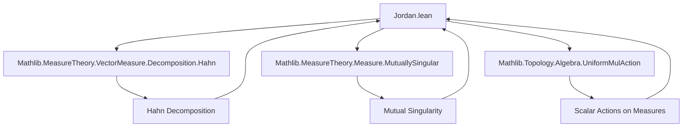
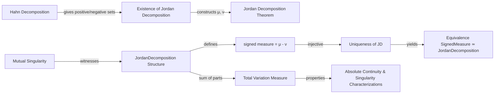

### Technical Brief: Jordan Decomposition in Lean 4 (Source: `Jordan.lean`)

---

#### **1. Key Definitions & Theorems**

| Name | Type / Signature | Purpose |
|------|------------------|---------|
| `JordanDecomposition α` | `Type u → MeasurableSpace α → Type u` | A pair of **finite**, **mutually singular** measures `(μ, ν)` on `α`. |
| `j.posPart`, `j.negPart` | `Measure α` | The two components of a Jordan decomposition. |
| `j.toSignedMeasure` | `SignedMeasure α` | The signed measure defined by `j.posPart - j.negPart`. |
| `s.toJordanDecomposition` | `SignedMeasure α → JordanDecomposition α` | Constructs the Jordan decomposition of a signed measure `s`. |
| `toSignedMeasure_toJordanDecomposition` | `∀ s, s.toJordanDecomposition.toSignedMeasure = s` | **Jordan decomposition theorem**: existence of decomposition. |
| `toSignedMeasure_injective` | `Injective toSignedMeasure` | **Uniqueness**: two Jordan decompositions with same signed measure are equal. |
| `toJordanDecompositionEquiv` | `SignedMeasure α ≃ JordanDecomposition α` | Equivalence between signed measures and Jordan decompositions. |
| `totalVariation s` | `Measure α` | Total variation measure: `posPart + negPart`. |
| `absolutelyContinuous_ennreal_iff` | `s ≪ᵥ μ ↔ s.totalVariation ≪ μ.ennrealToMeasure` | Characterizes absolute continuity via total variation. |
| `mutuallySingular_iff` | `s ⟂ᵥ t ↔ s.totalVariation ⟂ₘ t.totalVariation` | Mutual singularity of signed measures ↔ singularity of total variations. |

---

#### **2. Naming Conventions**

- **Prefixes**:
  - `to_`: conversion *to* a structure (e.g., `toSignedMeasure`, `toJordanDecomposition`)
  - `real_`: for real scalar multiplication (e.g., `real_smul_def`, `real_smul_nonneg`)
  - `subset_`, `of_`, `null_of_`: lemmas about null sets and subsets
  - `symmDiff_`: lemmas involving symmetric difference

- **Suffixes**:
  - `_spec`: specification of a choice (e.g., `toJordanDecomposition_spec`)
  - `_iff`: equivalence statements (e.g., `absolutelyContinuous_ennreal_iff`)
  - `_left`, `_right`: for left/right actions or restrictions (e.g., `disjoint_compl_right`)

- **Structure fields**:
  - `posPart`, `negPart`: standard notation for Jordan components
  - `mutuallySingular`: witness for singularity

---

#### **3. Tactic Stack**

Frequently used tactics in proofs:

| Tactic | Role |
|--------|------|
| `ext1` / `ext` | Extensionality for measures/signed measures |
| `simp_rw`, `simp only` | Simplification with rewrite rules (especially for `toSignedMeasure`, `posPart`, `negPart`) |
| `rw` | Rewriting using definitions and lemmas (e.g., `toSignedMeasure_sub_apply`, `measureReal_def`) |
| `have`, `obtain`, `refine` | Intermediate lemma construction (especially for Hahn/Jordan decompositions) |
| `linarith` | Linear arithmetic for inequalities involving measures |
| `conv_lhs` / `conv rhs` | Convolution-style rewriting (e.g., for measure additivity) |
| `exact`, `assumption` | Finishing goals with known facts |
| `by_cases!` | Case analysis on `0 ≤ r` for real scalars |
| `lift` | Lifting real `r ≥ 0` to `ℝ≥0` |

---

#### **4. Proof Logic**

**General proof strategy**:

1. **Existence (Jordan decomposition theorem)**:
   - Use `s.exists_compl_positive_negative` (from Hahn decomposition) to get a measurable set `i` such that:
     - `0 ≤[i] s` and `s ≤[iᶜ] 0`
   - Define `μ = s.toMeasureOfZeroLE i ...`, `ν = s.toMeasureOfLEZero iᶜ ...`
   - Show `s = μ - ν` using additivity over `i ∪ iᶜ` and nullity on intersections.

2. **Uniqueness**:
   - Suppose `j₁`, `j₂` have same `toSignedMeasure`.
   - Extract Hahn decompositions `S`, `T` from `j₁`, `j₂`.
   - Show symmetric difference `S ∆ T` is `s`-null.
   - Prove `j₁.posPart = j₂.posPart` by restricting `s` to `Sᶜ`, `Tᶜ` and using nullity of symmetric difference.
   - Conclude `j₁ = j₂` via `ext`.

3. **Scalar multiplication & algebraic structure**:
   - Prove compatibility with `ℝ≥0`-scalar multiplication first.
   - Extend to `ℝ` using case analysis on sign of `r`.
   - Use `toSignedMeasure_injective` to reduce equalities of Jordan decompositions to equalities of signed measures.

4. **Total variation & singularity**:
   - Define `totalVariation s = μ + ν`.
   - Prove properties (e.g., `null_of_totalVariation_zero`) using decomposition and additivity.
   - Use `mutuallySingular_iff` and `absolutelyContinuous_ennreal_iff` to lift singularity/absolute continuity to total variation.

---

#### **5. Imports & Dependencies**

| Import | Purpose |
|--------|---------|
| `Mathlib.MeasureTheory.VectorMeasure.Decomposition.Hahn` | Hahn decomposition theorem (used for existence) |
| `Mathlib.MeasureTheory.Measure.MutuallySingular` | Theory of mutually singular measures (`⟂ₘ`) |
| `Mathlib.Topology.Algebra.UniformMulAction` | For scalar multiplication structure on measures (e.g., `SMul ℝ`, `SMul ℝ≥0`) |

---

#### **8. Mermaid Diagrams**

##### **Dependency Graph (Top-Level)**

##### **Overview of Theory Flow**

---

#### **Summary**

This file formalizes the **Jordan decomposition theorem** for signed measures: every signed measure `s` uniquely decomposes as `s = μ - ν` where `μ`, `ν` are finite, mutually singular measures. The proof relies on the **Hahn decomposition**, and the formalization includes:
- A structured `JordanDecomposition` type,
- An equivalence `SignedMeasure α ≃ JordanDecomposition α`,
- Properties of total variation and its interaction with absolute continuity and singularity.

The code is highly structured, leveraging Lean’s typeclass inference (`IsFiniteMeasure`, `MutuallySingular`) and extensive use of `ext` and `simp` for measure-theoretic reasoning.
