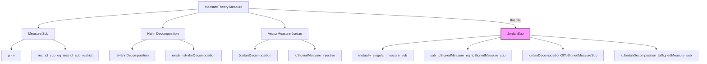
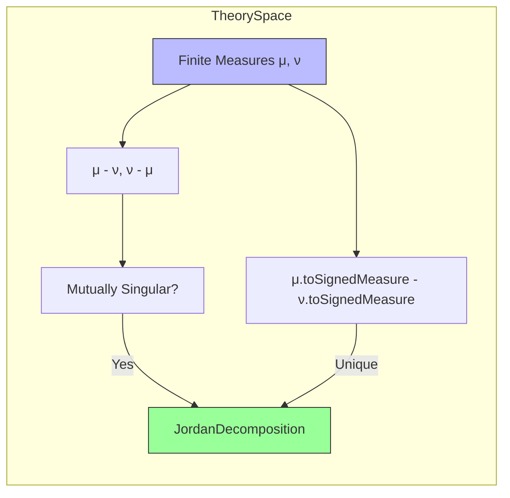

**Technical Brief: `JordanSub.lean`**

---

### 1. KEY DEFINITIONS & THEOREMS

| Name | Type / Signature | Purpose |
|------|------------------|---------|
| `sub_apply_eq_zero_of_isHahnDecomposition` | `(hs : IsHahnDecomposition μ ν s) → (μ - ν) s = 0` | Shows that the difference measure vanishes on Hahn decomposition sets. |
| `mutually_singular_measure_sub` | `(μ - ν).MutuallySingular (ν - μ)` | Proves mutual singularity of the two signed-difference measures using Hahn decomposition. |
| `toSignedMeasure_restrict_sub` | `((ν - μ).restrict s).toSignedMeasure = ν.toSignedMeasure.restrict s - μ.toSignedMeasure.restrict s` | Relates restriction of signed measures to restrictions of underlying finite measures. |
| `sub_toSignedMeasure_eq_toSignedMeasure_sub` | `μ.toSignedMeasure - ν.toSignedMeasure = (μ - ν).toSignedMeasure - (ν - μ).toSignedMeasure` | Key identity linking subtraction of signed measures to signed measures of finite-difference measures. |
| `jordanDecompositionOfToSignedMeasureSub` | `JordanDecomposition X` | Constructs the Jordan decomposition of `μ.toSignedMeasure - ν.toSignedMeasure` as `(μ - ν, ν - μ)`. |
| `toJordanDecomposition_toSignedMeasure_sub` | `(μ.toSignedMeasure - ν.toSignedMeasure).toJordanDecomposition = jordanDecompositionOfToSignedMeasureSub μ ν` | Main theorem: identifies the Jordan decomposition of the signed measure difference. |

---

### 2. NAMING CONVENTIONS

- **Prefixes**:
  - `sub_`: for lemmas involving subtraction of measures or signed measures.
  - `toSignedMeasure_`: for constructions/lemmas involving `toSignedMeasure`.
  - `jordanDecompositionOf_`: for constructions tied to Jordan decompositions derived from specific constructions.
- **Suffixes**:
  - `_eq_zero`: for results concluding a measure evaluates to zero.
  - `_restrict`: for results involving restriction of measures.
  - `_compl`: for results involving complements of Hahn decomposition sets.

---

### 3. TACTIC STACK

Frequently used tactics in proofs:
- `obtain ⟨s, hs⟩ := exists_isHahnDecomposition μ ν`: existential elimination.
- `rw [...] at ...`: rewriting using lemmas and equations.
- `simp only [...]`: simplification with specific lemmas (e.g., `zero_add`, `toSignedMeasure_zero`).
- `abel`: for abelian group simplifications (especially for additive group of measures).
- `repeat rw [...]`: repeated rewriting.
- `apply JordanDecomposition.toSignedMeasure_injective`: injectivity-based equality proofs.
- `exact ...`, `rw ...`, `simp`, `aesop`: standard automation.

---

### 4. PROOF LOGIC

The logical flow follows a structured pattern:

1. **Hahn Decomposition Extraction**  
   Use `exists_isHahnDecomposition` to get a measurable set `s` partitioning the space where `μ ≤ ν` on `s` and `ν ≤ μ` on `sᶜ`.

2. **Vanishing on Parts**  
   Show `(μ - ν) s = 0` and `(ν - μ) sᶜ = 0` via `sub_apply_eq_zero_of_isHahnDecomposition`, establishing mutual singularity.

3. **Restriction Identities**  
   Prove how `toSignedMeasure` interacts with restriction over Hahn decomposition parts, using `toSignedMeasure_restrict_eq_restrict_toSignedMeasure` and algebraic simplifications.

4. **Global Decomposition via Partitioning**  
   Use additivity of vector measures over partitions (`restrict_add_restrict_compl`) to decompose signed measures over `s` and `sᶜ`, then combine using the earlier vanishing lemmas.

5. **Uniqueness of Jordan Decomposition**  
   Conclude by injectivity of `toSignedMeasure` on Jordan decompositions.

---

### 5. IMPORTS

- `Mathlib.MeasureTheory.Measure.Decomposition.Hahn`: Hahn decomposition theorem and related lemmas.
- `Mathlib.MeasureTheory.Measure.Sub`: subtraction of finite measures and basic properties.
- `Mathlib.MeasureTheory.VectorMeasure.Decomposition.Jordan`: Jordan decomposition theory for vector measures (used for uniqueness and structure).

---

### 6. DEPENDENCY & OVERVIEW DIAGRAM

---

### 7. SUMMARY

This file formalizes the classical result that the Jordan decomposition of the signed measure `μ.toSignedMeasure - ν.toSignedMeasure`, for finite measures `μ`, `ν`, is given explicitly by the pair of finite measures `(μ - ν, ν - μ)`. It leverages the Hahn decomposition to establish mutual singularity and uses structural properties of `toSignedMeasure` and vector measure restriction to prove the decomposition identity. The key insight is that the Hahn decomposition provides a natural partition where the signed measure difference splits cleanly into positive and negative parts.
