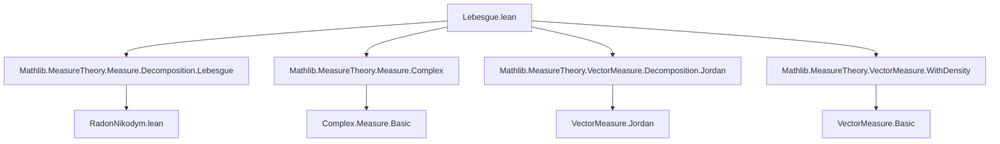

### Technical Brief: Lebesgue Decomposition for Signed and Complex Measures in Lean 4

---

#### **1. Key Definitions & Theorems**

| Name | Type / Signature | Purpose |
|------|------------------|---------|
| `HaveLebesgueDecomposition` | `class HaveLebesgueDecomposition (s : SignedMeasure α) (μ : Measure α) : Prop` | Defines when a signed measure $ s $ admits a Lebesgue decomposition w.r.t. $ \mu $: both its positive and negative Jordan parts do. |
| `singularPart` | `def singularPart (s : SignedMeasure α) (μ : Measure α) : SignedMeasure α` | The singular component $ \xi $ in $ s = \xi + f \cdot \mu $, defined via Jordan decomposition: $ \xi = \xi^+ - \xi^- $. |
| `rnDeriv` | `def rnDeriv (s : SignedMeasure α) (μ : Measure α) : α → ℝ` | Radon–Nikodym derivative $ f = \frac{d s}{d \mu} $, defined as $ f = f^+ - f^- $, where $ f^\pm = \frac{d s^\pm}{d \mu} $. |
| `singularPart_add_withDensity_rnDeriv_eq` | `theorem` | **Main theorem**: For $ s $ a signed measure and $ \mu $ a $ \sigma $-finite measure, $ s = s.\text{singularPart}\ \mu + \mu.\text{withDensity}_v\ (s.\text{rnDeriv}\ \mu) $. |
| `eq_singularPart` | `theorem` | Characterizes uniqueness: if $ s = t + \mu.\text{withDensity}_v\ f $ and $ t \perp \mu $, then $ t = s.\text{singularPart}\ \mu $. |
| `eq_rnDeriv` | `theorem` | Characterizes uniqueness of RN derivative: under same assumptions, $ f = s.\text{rnDeriv}\ \mu $ $ \mu $-a.e. |
| `HaveLebesgueDecomposition` (for complex measures) | `class` | Extends definition to complex measures: both real and imaginary parts must have Lebesgue decomposition. |
| `singularPart`, `rnDeriv` (complex) | `def` | Extend definitions componentwise: $ c.\text{singularPart} = (c.\text{re}.\text{singularPart}, c.\text{im}.\text{singularPart}) $, $ c.\text{rnDeriv} = (c.\text{re}.\text{rnDeriv}, c.\text{im}.\text{rnDeriv}) $. |
| `singularPart_add_withDensity_rnDeriv_eq` (complex) | `theorem` | Complex version of Lebesgue decomposition: $ c = c.\text{singularPart}\ \mu + \mu.\text{withDensity}_v\ (c.\text{rnDeriv}\ \mu) $. |

---

#### **2. Naming Conventions**

- **Prefixes**:
  - `haveLebesgueDecomposition_`: for instances proving existence of decomposition.
  - `singularPart_`: properties of singular part (e.g., `singularPart_zero`, `singularPart_neg`, `singularPart_smul`).
  - `rnDeriv_`: properties of Radon–Nikodym derivative (e.g., `rnDeriv_neg`, `rnDeriv_add`, `rnDeriv_smul`).
  - `eq_`: uniqueness characterizations (`eq_singularPart`, `eq_rnDeriv`).
- **Suffixes**:
  - `_nnreal`: for scalar multiplication by $ \mathbb{R}_{\ge 0} $.
  - `_real`: for scalar multiplication by $ \mathbb{R} $.
  - `_mk`, `_mk'`: internal lemmas used to construct decomposition from a decomposition ansatz.
- **Pattern**:
  - `withDensity_v` (vector measure density), `withDensity` (scalar density).
  - `ennreal_ofReal`, `ofReal`: embedding $ \mathbb{R}_{\ge 0} \to \overline{\mathbb{R}}_{\ge 0} $.

---

#### **3. Tactic Stack**

| Tactic | Frequency | Role |
|--------|-----------|------|
| `rw` | Very high | Rewriting definitions (e.g., `singularPart`, `rnDeriv`, Jordan decomposition). |
| `conv_lhs` / `conv_rhs` | High | Structural manipulation of LHS/RHS in equalities. |
| `congr` / `convert rfl` | Medium | Simplifying equalities by congruence or matching structure. |
| `ext` + `funext`-style reasoning | High | Proving equality of measures/functions by extensionality. |
| `simp_rw` | Medium | Simplification with rewrite rules (e.g., `simp_rw [JordanDecomposition.toSignedMeasure]`). |
| `first | exact ... | measurability` | Medium | Case-based tactic selection; `measurability` handles measurable goals. |
| `fun_prop` | High | Proving measurability of functions (e.g., `rnDeriv`, `ennreal_ofReal`). |
| `integrability` / `lintegral_rnDeriv_lt_top` | High | Proving integrability via standard lemmas. |
| `by_cases` | Medium | Splitting on $ 0 \le r $, integrability, etc. |
| `lift ... to ℝ≥0 using ...` | Medium | Lifting real scalars to nonnegative reals when nonnegative. |
| `aesop` / `ring` | Low | Not used heavily; algebraic simplifications done manually via `rw`. |

---

#### **4. Proof Logic**

- **Structure of main proof** (`singularPart_add_withDensity_rnDeriv_eq`):
  1. Reduce to Jordan decomposition: rewrite $ s $ as $ s^+ - s^- $.
  2. Expand definitions of `singularPart` and `rnDeriv`.
  3. Use linearity of `withDensityᵥ` over subtraction.
  4. Apply scalar Lebesgue decomposition theorem for positive measures to $ s^+ $ and $ s^- $ separately.
  5. Reassemble using algebraic identities and properties of `toSignedMeasure`.
  6. Verify integrability and finiteness conditions via `lintegral_rnDeriv_lt_top`.

- **Uniqueness arguments** (`eq_singularPart`, `eq_rnDeriv`):
  - Assume $ s = t + \mu.\text{withDensity}_v\ f $ with $ t \perp \mu $.
  - Show $ t $ must equal $ s.\text{singularPart}\ \mu $ by matching Jordan components.
  - Show $ f = s.\text{rnDeriv}\ \mu $ a.e. via injectivity of `withDensityᵥ`.

- **Induction / recursion**: Not used. Relies on structural decomposition (Jordan, real/imaginary parts) and case analysis.

- **Key logical flow**:
  > *Decompose → Apply known positive-case theorem → Reassemble → Verify conditions → Conclude uniqueness.*

---

#### **5. Imports & Dependencies**

| Module | Purpose |
|--------|---------|
| `Mathlib.MeasureTheory.Measure.Decomposition.Lebesgue` | Scalar Lebesgue decomposition for positive measures (used internally). |
| `Mathlib.MeasureTheory.Measure.Complex` | Complex measures and their relation to signed measures. |
| `Mathlib.MeasureTheory.VectorMeasure.Decomposition.Jordan` | Jordan decomposition for vector measures (used to lift to signed measures). |
| `Mathlib.MeasureTheory.VectorMeasure.WithDensity` | Theory of vector measure density (`withDensityᵥ`). |

**Core dependencies**:
- Jordan decomposition theory.
- Radon–Nikodym theorem for positive measures.
- Vector measure calculus (especially `withDensityᵥ`, `mutuallySingular`, `totalVariation`).
- Complex measure embedding into $ \mathbb{R}^2 $-valued signed measures.

---

#### **6. Mermaid Diagrams**

##### **Dependency Graph (Module-Level)**



##### **Overview of Theoretical Flow**

```mermaid
flowchart LR
  subgraph PositiveCase
    B[Lebesgue Decomposition for μ, ν ≥ 0]
  end

  subgraph SignedCase
    J[Jordan Decomposition s = s⁺ − s⁻]
    L[Apply PositiveCase to s⁺, s⁻]
    S[s.singularPart = s⁺.sing − s⁻.sing]
    R[s.rnDeriv = s⁺.rnDeriv − s⁻.rnDeriv]
    M[Lebesgue Decomposition: s = S + μ.withDensityᵥ R]
  end

  subgraph ComplexCase
    K[Complex Measure c = c.re + i c.im]
    N[Apply SignedCase to c.re, c.im]
    O[c.singularPart = (c.re.sing, c.im.sing)]
    P[c.rnDeriv = (c.re.rnDeriv, c.im.rnDeriv)]
    Q[c = O + μ.withDensityᵥ P]
  end

  B --> L
  J --> L
  L --> M
  K --> N
  N --> Q
```

---

#### **7. Summary**

This file formalizes the **Lebesgue decomposition theorem for signed and complex measures**, building on the scalar case. It defines:
- `HaveLebesgueDecomposition` (existence condition),
- `singularPart` and `rnDeriv` (canonical decomposition components),
- Proves key properties (linearity, behavior under negation/scalar mult),
- Establishes uniqueness (any decomposition must match these definitions).

The proofs rely heavily on:
- Jordan decomposition to reduce signed/complex measures to positive ones,
- Vector measure calculus (`withDensityᵥ`, mutual singularity),
- Measurability and integrability lemmas (via `fun_prop`, `lintegral_rnDeriv_lt_top`).

The formalization is **noncomputable**, uses `ENNReal`/`NNReal` embeddings, and carefully handles measure-theoretic subtleties (e.g., a.e. equality, σ-finiteness).
