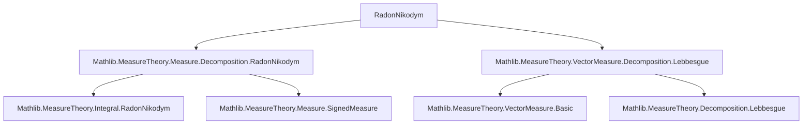
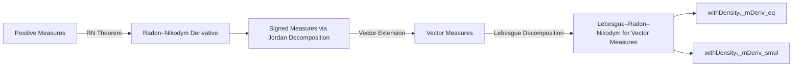

**Technical Brief: Radon–Nikodym Derivatives for Vector Measures (Lean 4)**  
*Source: `RadonNikodym.lean` (Mathlib)*

---

### 1. Key Definitions & Theorems

| Name | Type / Signature | Purpose |
|------|------------------|---------|
| `withDensityᵥ_rnDeriv_eq` | `s : SignedMeasure α → μ : Measure α → [SigmaFinite μ] → s ≪ᵥ μ.toENNRealVectorMeasure → μ.withDensityᵥ (s.rnDeriv μ) = s` | Proves that a signed measure equals its vector-valued density w.r.t. the Radon–Nikodym derivative of its Jordan decomposition against the reference measure. |
| `absolutelyContinuous_iff_withDensityᵥ_rnDeriv_eq` | `s ≪ᵥ μ.toENNRealVectorMeasure ↔ μ.withDensityᵥ (s.rnDeriv μ) = s` | Formalizes the Radon–Nikodym theorem for signed measures: absolute continuity is equivalent to representation via the vector-valued density. |
| `withDensityᵥ_rnDeriv_smul` | `μ, ν : Measure α → [μ.HaveLebesgueDecomposition ν] → [SigmaFinite μ] → μ ≪ ν → f : α → E → Integrable f μ → ν.withDensityᵥ (fun x ↦ (μ.rnDeriv ν x).toReal • f x) = μ.withDensityᵥ f` | Shows compatibility of vector-valued densities with scalar multiplication via the Radon–Nikodym derivative (real-valued), crucial for extending to $L^1$-type vector measures. |

**Notation & auxiliary terms used:**
- `s.rnDeriv μ`: Radon–Nikodym derivative of signed measure $s$ w.r.t. $\mu$, defined via Jordan decomposition.
- `μ.withDensityᵥ f`: vector measure defined by $A \mapsto \int_A f \, d\mu$ for measurable $f$.
- `≪ᵥ`: vector absolute continuity: $s \llᵥ \nu$ means $|\nu|(A) = 0 \Rightarrow |s|(A) = 0$, or equivalently $s$ factors through the null sets of $\nu$.
- `toReal`: coercion from `ENNReal` to `ℝ` on finite values.
- `haveLebesgueDecomposition`: assumption ensuring Lebesgue decomposition holds (e.g., $\sigma$-finiteness suffices).

---

### 2. Naming Conventions

- **Prefixes:**
  - `withDensityᵥ_`: denotes vector measure construction via density.
  - `rnDeriv_`: Radon–Nikodym derivative–related definitions/lemmas.
  - `absolutelyContinuous_`: absolute continuity predicates (e.g., `absolutelyContinuous_ennreal_iff`).
- **Suffixes:**
  - `_eq`: equality lemmas (e.g., `withDensityᵥ_rnDeriv_eq`).
  - `_iff`: biconditional characterizations (e.g., `absolutelyContinuous_iff_withDensityᵥ_rnDeriv_eq`).
  - `_smul`: scalar multiplication compatibility lemmas.

---

### 3. Tactic Stack

The proofs rely heavily on:
- `rw` / `erw`: rewriting using definitions and equivalences.
- `ext1`: extensionality for measures (one-set equality implies full equality).
- `simp_rw`: simplification + rewriting.
- `conv_rhs`: right-hand side rewriting in congruence contexts.
- `refine`: constructing proofs stepwise.
- `all_goals`: applying tactics uniformly across all subgoals.
- `fun_prop`: propositional reasoning for measurable functions.
- `lintegral_rnDeriv_lt_top`, `integral_sub`, `setIntegral_toReal_rnDeriv`: specialized lemmas for integrals and RN-derivatives.

---

### 4. Proof Logic

**Structure of `withDensityᵥ_rnDeriv_eq`:**
1. **Preprocessing**: Unfold `absolutelyContinuous_ennreal_iff`, `totalVariation_absolutelyContinuous_iff`, and identify $\mu$ with its associated ENN-real vector measure.
2. **Extensionality**: Reduce to proving equality on measurable sets $i$ with $\mu(i) < \infty$.
3. **Integral expansion**: Rewrite using `withDensityᵥ_apply`, `rnDeriv_def`, and integral properties (`integral_sub`, `setIntegral_toReal_rnDeriv`).
4. **Jordan decomposition**: Replace $s$ by its signed measure representation via Jordan decomposition.
5. **Integrability checks**: Prove integrability of the RN-derivative using:
   - `aestronglyMeasurable` (via `Measurable.aestronglyMeasurable`).
   - `lintegral_rnDeriv_lt_top` to ensure finite integral.
6. **Final step**: Use `equivMeasure.right_inv` to justify identification of $\mu$ with its ENN-real lift.

**Structure of `withDensityᵥ_rnDeriv_smul`:**
1. Apply `withDensityᵥ_smul_eq_withDensityᵥ_withDensity'` to decompose the density.
2. Use `measurable_rnDeriv`, `rnDeriv_lt_top`, and `integrable_rnDeriv_smul_iff` to verify hypotheses.
3. Apply `withDensity_rnDeriv_eq` to simplify back to $\mu$.

---

### 5. Imports & Dependencies

**Primary imports:**
- `Mathlib.MeasureTheory.Measure.Decomposition.RadonNikodym`: classical RN-theory for positive measures.
- `Mathlib.MeasureTheory.VectorMeasure.Decomposition.Lebbesgue`: Lebesgue decomposition for vector measures.

**Key underlying theories:**
- Measure theory (measurable spaces, measures, integrals).
- Signed measures and Jordan decomposition.
- Vector measures and total variation.
- $\sigma$-finiteness and Lebesgue decomposition assumptions.

---

### 6. Mermaid Diagrams

#### Dependency Graph (Module Level)

#### Overview of Theoretical Flow

---

### 7. Summary

This file extends the classical Radon–Nikodym theorem from positive measures to **signed** and **vector-valued** measures. It leverages:
- The Jordan decomposition of signed measures,
- The identification of signed measures with $\mathbb{R}$-valued vector measures,
- The Lebesgue decomposition framework for vector measures.

The key results are:
- A characterization of signed measures via their RN-derivative (`withDensityᵥ_rnDeriv_eq`),
- A compatibility lemma for scalar multiplication (`withDensityᵥ_rnDeriv_smul`), enabling future development of $L^p$-type vector measure theory.

These results are foundational for further work on disintegration, conditional expectation for vector measures, and stochastic integration in infinite dimensions.
