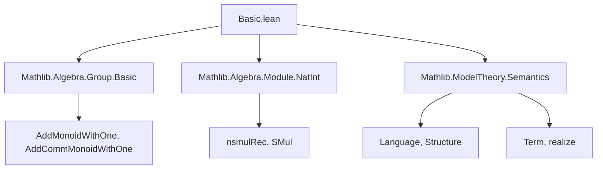
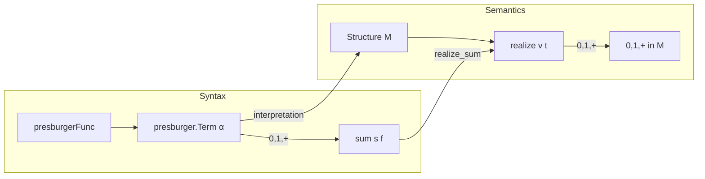

**Technical Brief: `Basic.lean` — Presburger Arithmetic in Lean 4**

---

### 1. **Key Definitions & Theorems**

| Name | Type / Signature | Purpose |
|------|------------------|---------|
| `presburgerFunc` | `ℕ → Type` | Inductive type encoding function symbols of Presburger arithmetic: `zero : presburgerFunc 0`, `one : presburgerFunc 0`, `add : presburgerFunc 2`. |
| `Language.presburger` | `Language` | Defines the first-order language of Presburger arithmetic as `(0, 1, +)` with no relations. |
| `presburger.Term α` | `Type` | Terms in the language `presburger` over variables of type `α`. |
| `sum` | `{β : Type*} → Finset β → (β → presburger.Term α) → presburger.Term α` | Noncomputable finite sum over terms; defined via list conversion and `List.sum`. |
| `realize_zero`, `realize_one`, `realize_add` | `Term.realize v (0) = 0`, etc. | Interpretation of constant and function symbols in a structure `M`. |
| `realize_natCast` | `[AddMonoidWithOne M] → Term.realize v (n : presburger.Term α) = n` | Natural numbers embed as iterated `1 + ... + 1`. |
| `realize_nsmul` | `[AddMonoidWithOne M] → Term.realize v (n • t) = n • Term.realize v t` | Compatibility of scalar multiplication with realization. |
| `realize_sum` | `[AddCommMonoidWithOne M] → Term.realize v (sum s f) = ∑ i ∈ s, Term.realize v (f i)` | Realization commutes with finite sums (requires commutativity). |

---

### 2. **Naming Conventions**

- **Prefixes**:
  - `presburgerFunc`: internal function symbol type.
  - `presburger.Term`: terms in the Presburger language.
  - `realize_`: interpretation of syntactic objects in a structure.
  - `funMap_`: interpretation of function symbols in a structure.
- **Suffixes**:
  - `_zero`, `_one`, `_add`, `_natCast`, `_nsmul`, `_sum`: correspond to syntactic constructors or derived operations.
- **Notation**:
  - `0`, `1`, `+`, `n : ℕ`, `n • t` are overloaded via typeclass instances (`Zero`, `One`, `Add`, `NatCast`, `SMul`).
  - `[norm_cast]` and `[simp]` attributes indicate normalization and simplification behavior.

---

### 3. **Tactic Stack**

Frequent tactics used in proofs:
- `rfl`: for definitional equalities (e.g., `realize_zero`).
- `induction n with simp [*]`: structural induction on `ℕ`, with automatic simplification.
- `simp only [sum]`: to unfold `sum` definition.
- `conv => rhs; rw [...]`: for equational reasoning on the right-hand side.
- `generalize s.toList = l`: to abstract over list representation for induction.
- `List.sum_toFinset`, `s.toList_toFinset`: lemmas for converting between lists and finite sets.

No heavy automation (e.g., `aesop`, `linarith`) is used—proofs are mostly by structural induction and simplification.

---

### 4. **Proof Logic**

- **Inductive structure**: Proofs over `presburger.Term` or `ℕ` use induction on natural numbers or terms.
- **Case analysis**: Minimal—mainly on function symbols (e.g., `funMap_zero`, `funMap_one`, `funMap_add`).
- **Semantic lifting**: Syntactic operations (`+`, `n • t`, `sum`) are shown to commute with realization via:
  - Definitional equalities for basic constructors.
  - Inductive lemmas for derived operations (`natCast`, `nsmul`, `sum`).
- **Classical assumptions**: `sum` uses `classical` to handle finite sets via choice (list conversion), but correctness (`realize_sum`) requires `AddCommMonoidWithOne` to ensure independence of list ordering.

---

### 5. **Imports & Dependencies**

| Import | Role |
|--------|------|
| `Mathlib.Algebra.Group.Basic` | Provides group-theoretic background (e.g., `AddMonoidWithOne`, `AddCommMonoidWithOne`). |
| `Mathlib.Algebra.Module.NatInt` | Supplies `nsmulRec`, scalar multiplication by `ℕ`. |
| `Mathlib.ModelTheory.Semantics` | Core model-theoretic infrastructure: `Structure`, `Term.realize`, `Language`. |

---

### 6. **Mermaid Diagrams**

#### **Dependency Graph (Module-Level)**

#### **Overview of File Structure**

---

### 7. **Theoretical Scope & Future Work**

- **Current scope**: Syntactic and semantic foundations of Presburger arithmetic as a first-order language.
- **Planned extensions** (per `TODO`):
  - Generalize `sum`, `natCast`, `smul` to ordered structures (e.g., `FirstOrder.Language.IsOrdered`).
  - Define the *theory* of Presburger arithmetic and prove:
    - Quantifier elimination.
    - Completeness.
    - Decidability of truth in `ℕ` or `ℤ`.

---

**Summary**: This file formalizes the *language* of Presburger arithmetic in Lean 4, embedding `0, 1, +` into the model-theoretic framework of `FirstOrder`. It establishes the bridge between syntax (`Term`, `sum`) and semantics (`realize`, `Structure`) with minimal automation, laying groundwork for future logical metatheory.
