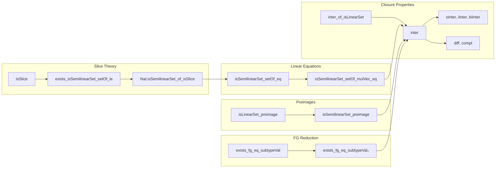

### Technical Brief: Semilinear Sets in Lean 4 (`Basic.lean`)

---

#### **1. Key Definitions & Theorems**

| Name | Type / Signature | Purpose |
|------|------------------|---------|
| `IsSlice {M} s` | `∀ a ∈ s, ∀ b c, a + b ∈ s → a + c ∈ s → a + b + c ∈ s` | Defines *slice property* — a structural condition implying semilinearity in $ \mathbb{N}^k $. |
| `IsProperLinearSet` | Implicit via `hs : IsProperLinearSet s` | Represents proper linear sets (i.e., $ a + \text{closure}(P) $ with linearly independent periods). Used in complement construction. |
| `base`, `periods`, `basisSet`, `basis`, `fundamentalDomain`, `floor`, `fract` | Various | Components of the decomposition of $ \mathbb{N}^k $ relative to a proper linear set; used to express complement as finite union of semilinear sets. |
| `toRatVec` | `(ι → ℕ) →+ (ι → ℚ)` | Canonical embedding of natural-valued functions into rational-valued ones; used to lift linear independence over $ \mathbb{N} $ to $ \mathbb{Q} $. |
| `isSemilinearSet_setOf_eq` | `IsSemilinearSet { x | a + f x = b + g x }` | Core lemma: solution set of a linear equation over homomorphisms is semilinear. |
| `isSemilinearSet_setOf_mulVec_eq` | Matrix version of above | Generalizes linear equation solutions to matrix-vector form. |
| `isLinearSet_iff_exists_fin_addMonoidHom` | Characterization of linear sets | Links linear sets to images of finitely generated free additive monoids. |
| `isLinearSet_iff_exists_matrix` | Matrix parametrization of linear sets over $ \mathbb{N}^k $ | Enables concrete representation for proofs in $ \mathbb{N}^k $. |
| `isSemilinearSet_preimage` | `IsSemilinearSet s → IsSemilinearSet (f ⁻¹' s)` | Preimage of semilinear set under homomorphism is semilinear (in FG monoids). |
| `IsSemilinearSet.inter` | `IsSemilinearSet s₁ → IsSemilinearSet s₂ → IsSemilinearSet (s₁ ∩ s₂)` | Closure under intersection. |
| `IsSemilinearSet.diff` | `IsSemilinearSet s₁ → IsSemilinearSet s₂ → IsSemilinearSet (s₁ \ s₂)` | Closure under set difference (not shown in excerpt but implied by complement + intersection). |
| `IsSemilinearSet.compl` | `IsSemilinearSet s → IsSemilinearSet sᶜ` | Closure under complement (requires FG monoid). |
| `IsSemilinearSet.sInter`, `iInter`, `biInter`, `biInter_finset` | Finite/dependent intersections | Generalizations of closure under finite intersections. |
| `IsSemilinearSet.exists_fg_eq_subtypeVal` | `IsSemilinearSet s → ∃ P, s' , P.FG ∧ IsSemilinearSet s' ∧ s = val '' s'` | Reduction to submonoids of finite type — key for generalization from $ \mathbb{N}^k $. |

---

#### **2. Naming Conventions**

- **Prefixes**:
  - `isSemilinearSet_...`: properties of semilinear sets (e.g., `isSemilinearSet_setOf_eq`, `isSemilinearSet_preimage`).
  - `isLinearSet_...`: linear sets (e.g., `isLinearSet_iff_exists_matrix`).
  - `Nat.is...`: results specific to $ \mathbb{N}^k $ (e.g., `Nat.isSemilinearSet_of_isSlice`, `Nat.isSemilinearSet_inter`).
  - `Is...`: typeclass-like predicates (e.g., `IsSlice`, `IsProperLinearSet`).
- **Suffixes**:
  - `_iff_...`: characterizations (e.g., `isLinearSet_iff_exists_matrix`).
  - `_of_...`: implications from structural assumptions (e.g., `isSemilinearSet_preimage_of_isLinearSet`).
  - `_preimage`, `_image`: operations on sets under maps.
  - `_finset`, `_finite`: variants for finite index sets.

---

#### **3. Tactic Stack**

- **Core tactics**:
  - `simp`, `simp_rw`, `congr`, `ext`, `grind`, `intro`, `rcases`, `induction`, `convert_to`, `refine`, `rw`, `apply`, `exact`.
- **Domain-specific**:
  - `grind`: custom automation for simplifying equalities in $ \mathbb{N} $, $ \mathbb{Q} $, and matrix/vector expressions.
  - `interval_cases`, `linarith`, `ring`, `norm_num`: for arithmetic reasoning.
  - `apply_fun`, `congr_arg`, `congr_fun`: for functional extensionality and injectivity.
  - `convert ... using n`: for controlled unification with error tolerance.
  - `choose!`, `haveI`, `classical`: for choice and classical reasoning.
  - `finite_fundamentalDomain.fintype`, `Fintype.ofFinite`: for finite type instances.

---

#### **4. Proof Logic**

- **Structure**:
  1. **Slice property ⇒ semilinearity** in $ \mathbb{N}^k $:  
     - Prove slice property implies existence of maximal element $ x \in s $ such that $ \{ y \in s \mid x \le y \} $ is semilinear.
     - Use well-quasi-ordering and induction on finite sets to cover remaining elements via finite unions.
  2. **Linear equation solutions**:  
     - Show solution set has slice property ⇒ semilinear (via above).
     - Generalize to FG monoids using finite presentation and preimage closure.
  3. **Intersection & difference**:  
     - Reduce to $ \mathbb{N}^k $ via `exists_fg_eq_subtypeVal₂`.
     - Use matrix parametrization of linear sets and `proj'` to reduce to `isSemilinearSet_setOf_mulVec_eq`.
  4. **Complement**:  
     - For proper linear sets in $ \mathbb{N}^k $, decompose complement into:
       - `setOfFractNe`: vectors whose fractional part ≠ base.
       - `setOfFloorNeg`: vectors with negative floor coordinate.
       - `setOfFloorPos`: (implied) vectors with floor > 0 outside periods.
     - Each piece is shown semilinear via matrix representations and preimages of linear sets.
     - Extend to general semilinear sets via finite unions and `exists_fg_eq_subtypeVal`.

- **Induction patterns**:
  - Strong induction on finite sets (`Finset.strongInductionOn`).
  - Well-quasi-ordered induction (`WellQuasiOrderedLE.to_wellFoundedLT.induction`) for maximal element arguments.
  - Structural induction on `AddSubmonoid.closure`.

---

#### **5. Imports & Dependencies**

| Module | Role |
|--------|------|
| `Mathlib.Data.Matrix.ColumnRowPartitioned` | Matrix block constructions (`fromBlocks`, `fromCols`) and multiplication with vectors. |
| `Mathlib.ModelTheory.Arithmetic.Presburger.Semilinear.Defs` | Definitions of semilinear sets and related concepts. |
| `Mathlib.Algebra.Group.Submonoid.Finsupp` | Finitely supported functions, closures, and additive submonoids. |
| `Mathlib.Algebra.Order.Group.Ideal` | Ordered monoids, ideals, and additive submonoid structure. |
| `Mathlib.Algebra.Order.Pi`, `Pi.Interval` | Product orders, interval arithmetic, and coordinate-wise reasoning. |
| `Mathlib.Algebra.Order.Sub.Prod`, `Sub.Unbundled.Hom` | Subtraction, order-preserving homs, and product structures. |
| `Mathlib.Data.Pi.Interval`, `Rat.Floor` | Rational floor, intervals, and real/integer arithmetic. |
| `Mathlib.LinearAlgebra.Matrix.ToLin` | Equivalence between matrices and linear maps (`mulVecLin`). |
| `Mathlib.RingTheory.Finiteness.Cardinality`, `Localization.Module` | Finite generation, FG monoids, and module-theoretic tools. |

---

#### **6. Mermaid Diagrams**

##### **Dependency Graph (High-Level)**

```mermaid
graph TD
  A[Semilinear Sets] --> B[Slice Property ⇒ Semilinearity]
  A --> C[Linear Equation Solutions]
  A --> D[Intersection & Difference]
  A --> E[Complement (FG case)]

  B --> B1[Nat.isSemilinearSet_of_isSlice]
  B --> B2[exists_isSemilinearSet_setOf_le]

  C --> C1[Nat.isSemilinearSet_setOf_eq]
  C --> C2[isSemilinearSet_setOf_eq (FG)]

  D --> D1[Nat.isSemilinearSet_inter_of_isLinearSet]
  D --> D2[Nat.isSemilinearSet_inter]
  D --> D3[IsSemilinearSet.inter]

  E --> E1[IsProperLinearSet decomposition]
  E --> E2[setOfFractNe, setOfFloorNeg, ...]
  E --> E3[IsSemilinearSet.compl]

  C2 --> D3
  C2 --> E3
```

##### **Overview of File Structure**



---

#### **7. Theory Context**

- **Goal**: Establish closure properties of semilinear sets — foundational for Presburger arithmetic, automata theory, and formal verification.
- **Scope**: 
  - Proves closure under intersection, difference, and complement (in FG monoids).
  - Builds on classical results (Ginsburg–Spanier, Eilenberg–Schützenberger).
- **Novelty**:
  - Uses *slice property* as a unifying structural condition.
  - Leverages *rational embedding* and *basis extension* for complement decomposition.
  - Systematically reduces general monoids to $ \mathbb{N}^k $ via finite generation.

--- 

Let me know if you'd like a formalized summary in Lean syntax or a proof sketch of a specific theorem.
