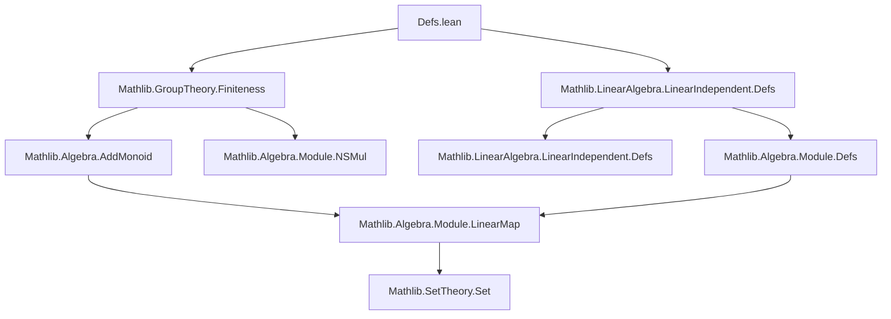
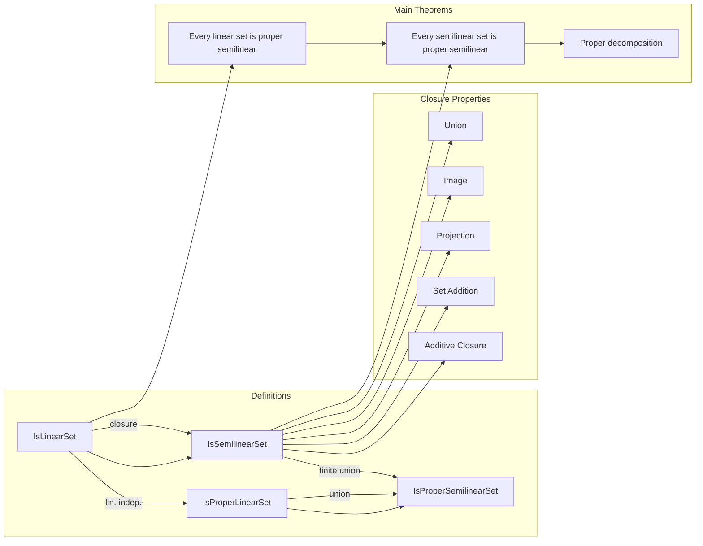

### Technical Brief: Linear and Semilinear Sets in Lean 4

---

#### **1. Key Definitions & Theorems**

| Name | Type / Signature | Purpose |
|------|------------------|---------|
| `IsLinearSet` | `Set M → Prop` | A set is linear if it is a coset $a +_v \overline{t}$ of a finitely generated additive submonoid (closure of finite set $t$). |
| `IsSemilinearSet` | `Set M → Prop` | A set is semilinear if it is a finite union of linear sets. |
| `IsProperLinearSet` | `Set M → Prop` | A linear set is *proper* if its period generators (the finite set $t$) are linearly independent over $\mathbb{N}$. |
| `IsProperSemilinearSet` | `Set M → Prop` | A semilinear set is *proper* if it is a finite union of proper linear sets. |
| `isLinearSet_iff` | `↔ ∃ a : M, t : Finset M, s = a +ᵥ closure t` | Equivalence using `Finset` instead of `Set.Finite`. |
| `isLinearSet_iff_exists_fg_eq_vadd` | `↔ ∃ a, P : AddSubmonoid M, P.FG ∧ s = a +ᵥ P` | Reformulation in terms of finitely generated additive submonoids. |
| `IsSemilinearSet.union` | `IsSemilinearSet s₁ → IsSemilinearSet s₂ → IsSemilinearSet (s₁ ∪ s₂)` | Closure under binary union. |
| `IsSemilinearSet.image` | `IsSemilinearSet s → (f : F) → IsSemilinearSet (f '' s)` | Closure under homomorphic image. |
| `IsSemilinearSet.proj` | `IsSemilinearSet s → IsSemilinearSet {x | ∃ y, Sum.elim x y ∈ s}` | Closure under existential projection (used for quantifier elimination). |
| `IsSemilinearSet.closure` | `IsSemilinearSet s → IsSemilinearSet (closure s)` | Closure under additive monoid closure. |
| `IsLinearSet.isProperSemilinearSet` | `[IsCancelAdd M] → IsLinearSet s → IsProperSemilinearSet s` | Every linear set is a proper semilinear set (nontrivial proof via induction on generator size). |
| `IsSemilinearSet.isProperSemilinearSet` | `[IsCancelAdd M] → IsSemilinearSet s → IsProperSemilinearSet s` | **Main structural theorem**: every semilinear set decomposes into a finite union of proper linear sets. |

---

#### **2. Naming Conventions**

- **Predicates**: `Is*Set` (e.g., `IsLinearSet`, `IsSemilinearSet`, `IsProperLinearSet`, `IsProperSemilinearSet`)
- **Equivalences**: `is*_iff` (e.g., `isLinearSet_iff`, `isProperLinearSet_iff`)
- **Closure properties**: `Is*Set.{union, image, vadd, add, closure, proj, proj'}`
- **Embeddings / inclusions**: `.is*` (e.g., `IsLinearSet.isSemilinearSet`, `IsProperLinearSet.isLinearSet`)
- **Special cases**: `.singleton`, `.empty`, `.univ`, `.closure_finset`, `.of_fg`
- **Helper lemmas**: `.image`, `.vadd`, `.add`, `.proj`, `.proj'`, `.biUnion`, `.sUnion`, `.of_finite`

Prefixes/suffixes:
- `is*` for propositional equivalences
- `*Set` for predicate definitions
- `.is*` for inclusion/embedding lemmas
- `.proj`, `.proj'` for projection variants
- `.biUnion`, `.sUnion`, `.iUnion` for indexed unions

---

#### **3. Tactic Stack**

Frequently used tactics:
- `rcases` / `rintro` / `cases` — for destructuring existential/universal hypotheses
- `simp` / `simp_rw` — simplification with definitional lemmas and rewrite rules
- `exact`, `refine`, `convert_to` — for constructing proofs with minimal backtracking
- `induction ... using ...` — especially `Finite.induction_on` for finite sets
- `rw`, `congr!`, `nth_rw` — for rewriting and congruence reasoning
- `by_cases`, `by_contra` — for case analysis and contradiction
- `ext` — extensionality for set equality
- `aesop` (implicit via `by aesop` in some proofs, though not explicit here)
- `ring`, `abel` — not used (additive monoid structure avoids ring reasoning)
- `linarith` — not used (no linear arithmetic needed)

---

#### **4. Proof Logic**

- **Inductive structure on finite sets**: Many proofs (e.g., `IsLinearSet.isProperSemilinearSet`) use strong induction on the cardinality of the generating set $t$.
- **Case analysis on linear independence**: When generators are not linearly independent, decompose using the **Seymour decomposition** (via `not_linearIndepOn_finset_iffₒₛ`), expressing the set as a finite union of simpler sets with fewer generators.
- **Set-theoretic manipulations**: Heavy use of:
  - `sUnion`, `biUnion`, `image_iUnion`, `vadd_set_sUnion`, `add_sUnion`
  - `closure_union`, `closure_mono`, `mem_closure_finset`
- **Homomorphism compatibility**: Proofs for `image`, `proj`, `vadd`, `add` follow a uniform pattern:
  1. Unfold `IsSemilinearSet` as union of linear sets.
  2. Push operation inside union (via `image_iUnion`, `vadd_set_sUnion`, etc.)
  3. Apply closure property for each linear component.
  4. Reassemble via `biUnion`.

---

#### **5. Imports & Dependencies**

- `Mathlib.GroupTheory.Finiteness`: for `AddSubmonoid.FG`, finite set reasoning
- `Mathlib.LinearAlgebra.LinearIndependent.Defs`: for `LinearIndepOn`, `LinearIndependent` over $\mathbb{N}$
- Standard imports implied:
  - `Mathlib.Algebra.AddMonoid`
  - `Mathlib.Algebra.Module.NSMul`
  - `Mathlib.SetTheory.Set`
  - `Mathlib.Algebra.Module.Defs` (via `FunLike`, `AddMonoidHomClass`)
  - `Mathlib.Algebra.Module.LinearMap` (for `LinearMap.funLeft` in `proj`)

---

#### **6. Mermaid Diagrams**

##### **Dependency Graph (Module-Level)**



##### **Conceptual Overview of Theory**



##### **Proof Strategy for `IsLinearSet.isProperSemilinearSet`**

```mermaid
flowchart TD
  A[IsLinearSet s] --> B[∃ a, t, s = a +ᵥ closure t]
  B --> C{Linearly independent?}
  C -->|Yes| D[IsProperLinearSet s]
  C -->|No| E[Apply not_linearIndepOn_finset_iffₒₛ]
  E --> F[Decompose s into ⋃_{j ∈ t'} ⋃_{k < f(j)} (a + k•j) + closure(t \ {j})]
  F --> G[Each component has smaller generator set]
  G --> H[Apply strong induction]
  H --> I[Result: IsProperSemilinearSet s]
```

---

#### **7. Summary**

This module formalizes the classical theory of **linear and semilinear sets** over additive commutative monoids, with emphasis on **closure properties** and the **proper decomposition theorem**. It leverages Lean’s `Finset`, `closure`, and `LinearIndepOn` machinery to reason about monoid-generated sets. The key result — that *every semilinear set is a finite union of proper linear sets* — is nontrivial and requires careful induction on generator size, leveraging cancellation in the monoid (`[IsCancelAdd M]`). The formalization aligns with classical literature (Ginsburg–Spanier, Eilenberg–Schützenberger) and is designed for use in formalizations of decidability (e.g., Presburger arithmetic, rational series).
