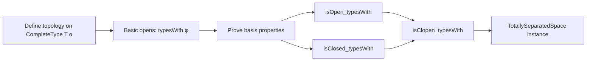
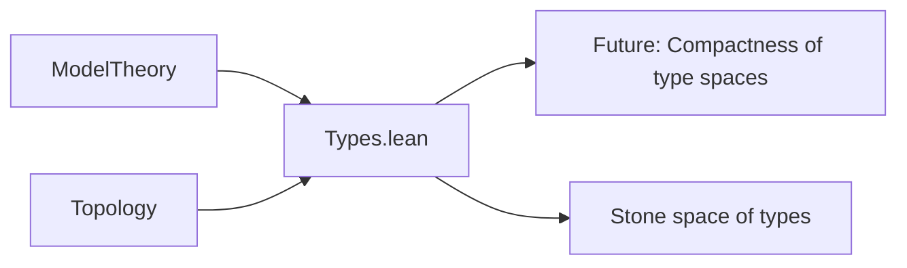

### Technical Brief: Topology on the Space of Complete Types (`Types.lean`)

---

#### **1. Key Definitions & Theorems**

| Name | Type / Signature | Purpose |
|------|------------------|---------|
| `TopologicalSpace (CompleteType T α)` | `instance` | Defines the topology on the space of complete $L$-types over $\alpha$ for theory $T$. Generated by sets of the form $\{p \mid \exists \varphi,\ \varphi \in p\}$. |
| `typesWith (T := T) φ` | `CompleteType T α → Prop` (as a set) | Basic open/closed set: $\{p \mid \varphi \in p\}$. Defined via `range typesWith`. |
| `isTopologicalBasis_range_typesWith` | `IsTopologicalBasis (range (typesWith ...))` | Proves that the collection $\{ \text{typesWith}\ \varphi \mid \varphi \in L[[\alpha]].\text{Sentence} \}$ forms a topological basis. |
| `isOpen_typesWith` | `IsOpen (typesWith φ)` | Shows each basic set is open. |
| `isClosed_typesWith` | `IsClosed (typesWith φ)` | Shows each basic set is closed (via complement: `typesWith ¬φ`). |
| `isClopen_typesWith` | `IsClopen (typesWith φ)` | Combines above: basic sets are both open and closed. |
| `TotallySeparatedSpace (CompleteType T α)` | `instance` | Proves the space is *totally separated*: any two distinct types can be separated by a clopen set. |

---

#### **2. Naming Conventions**

- **Prefixes**:
  - `typesWith_`: for lemmas about the basic sets $\text{typesWith}\ \varphi$.
  - `is_`/`isOpen_`/`isClosed_`/`isClopen_`: standard topology naming for properties.
- **Suffixes**:
  - `_typesWith`: indicates dependence on a formula $\varphi$.
  - `_iff`: used in `mem_typesWith_iff` (not shown here but implied by usage).
- **Notation**:
  - `L[[α]].Sentence`: denotes $L$-sentences with free variables in $\alpha$.
  - `φ ⊓ ψ`, `∼φ`, `top`, `not`: lattice and negation operations on formulas.

---

#### **3. Tactic Stack**

- `rw`: rewriting using definitions (`typesWith_not`, `typesWith_inf`, etc.).
- `exact`: closing goals with direct evidence.
- `intro`, `cases`, `obtain`: standard intro/case analysis.
- `simp only [...] at hpq`: simplification with specific lemmas to extract witness.
- `rwa`: rewrite + assumption (used for rewriting in goals after `refine`).
- `refine`: constructing proofs with holes (`?_`) to be filled later.
- `set_tac` (via `Set.` namespace): e.g., `Set.subset_sUnion_of_mem`, `Set.univ_subset_iff`.

No heavy automation like `aesop`, `linarith`, or `norm_cast` — proofs are mostly structural and definitional.

---

#### **4. Proof Logic**

- **Topology construction**: Defined via `generateFrom (range typesWith)`, i.e., coarsest topology making all `typesWith φ` open.
- **Basis proof**:
  - *Intersection*: For $p \in \text{typesWith}\ \varphi \cap \text{typesWith}\ \psi$, use $\text{typesWith}(\varphi \sqcap \psi)$, leveraging `typesWith_inf`.
  - *Union*: Uses `typesWith_top` (since $\top$ is always in a type), covering the whole space.
- **Clopenness**:
  - Uses `typesWith_not` to show complement of $\text{typesWith}\ \varphi$ is $\text{typesWith}\ \neg\varphi$, hence closed.
- **Totally separated**:
  - For distinct types $p \ne q$, find $\varphi$ s.t. $\varphi \in p \setminus q$ or vice versa.
  - Use clopen set $\text{typesWith}\ \varphi$ or $\text{typesWith}\ \neg\varphi$ to separate.

---

#### **5. Imports**

| Module | Role |
|--------|------|
| `Mathlib.ModelTheory.Types` | Core model theory: `CompleteType`, `typesWith`, syntax for formulas. |
| `Mathlib.Topology.Bases` | `IsTopologicalBasis`, `generateFrom`, basis criteria. |
| `Mathlib.Topology.Connected.TotallyDisconnected` | `totallySeparatedSpace_iff_exists_isClopen`. |
| `Mathlib.Topology.Compactness.Compact` | Possibly for future use (not used in this file). |

> Note: The file deliberately avoids importing `Mathlib.ModelTheory.Types` from the Topology folder to prevent circular dependencies.

---

#### **8. Mermaid Diagrams**

##### **Dependency Graph**

```mermaid
graph TD
  A[Types.lean] --> B[Mathlib.ModelTheory.Types]
  A --> C[Mathlib.Topology.Bases]
  A --> D[Mathlib.Topology.Connected.TotallyDisconnected]
  A --> E[Mathlib.Topology.Compactness.Compact]

  B --> F[CompleteType]
  B --> G[typesWith]
  B --> H[L[[α]].Sentence]

  C --> I[IsTopologicalBasis]
  C --> J[generateFrom]

  D --> K[TotallySeparatedSpace]
```

##### **Overview of File Structure**



##### **Top-Level Theory Context**



---

This file establishes the foundational topological structure on type spaces in model theory — a prerequisite for Stone spaces, definable topologies, and topological dynamics in model theory.
