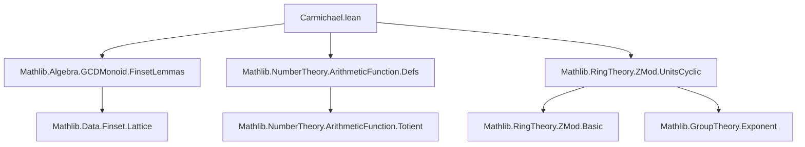

### Technical Brief: `Carmichael.lean`

---

#### **1. Key Definitions & Theorems**

| Name | Type / Signature | Purpose |
|------|------------------|---------|
| `Carmichael : ArithmeticFunction ℕ` | `ℕ → ℕ` | Defines the Carmichael function `λ(n)` as the exponent of the unit group `(ZMod n)ˣ`. For `n = 0`, it is defined as `0`. |
| `λ` (scoped notation) | `ArithmeticFunction.Carmichael` | Standard notation for the Carmichael function in the `Carmichael` scope. |
| `carmichael_eq_exponent` | `n ≠ 0 → λ n = exponent (ZMod n)ˣ` | Relates `λ n` to the group-theoretic exponent of the unit group. |
| `carmichael_eq_exponent'` | `[NeZero n] → λ n = exponent (ZMod n)ˣ` | Variant using `NeZero` for cleaner dependent typing. |
| `pow_carmichael` | `a ^ λ n = 1` for `a ∈ (ZMod n)ˣ` | Generalizes Euler’s theorem: units raised to `λ n` give `1`. |
| `carmichael_dvd_totient` | `λ n ∣ n.totient` | Shows `λ n` divides Euler’s totient function `φ(n)`. |
| `carmichael_dvd` | `a ∣ b → λ a ∣ λ b` | Monotonicity of `λ` w.r.t. divisibility. |
| `carmichael_lcm` | `λ(lcm a b) = lcm(λ a, λ b)` | `λ` preserves least common multiples. |
| `carmichael_mul` | `Coprime a b → λ(a * b) = λ a * λ b` | Multiplicativity of `λ` on coprime arguments. |
| `carmichael_finset_lcm` | `λ(s.lcm f) = s.lcm (λ ∘ f)` | Generalization of `carmichael_lcm` to finite sets. |
| `carmichael_finset_prod` | `Pairwise (Coprime.onFun f) → λ(s.prod f) = s.lcm (λ ∘ f)` | Extends to products over pairwise-coprime families. |
| `carmichael_factorization` | `[NeZero n] → λ n = lcm_{p ∣ n} λ(p^{v_p(n)})` | Prime factorization formula for `λ n`. |
| `carmichael_two_pow_of_le_two` | `n ≤ 2 → λ(2ⁿ) = 2^{n−1}` | Explicit values for small powers of 2. |
| `carmichael_two_pow_of_ne_two` | `n ≠ 2 → λ(2ⁿ) = 2^{n−2}` | Explicit value for powers of 2 except `n = 2`. |
| `two_mul_carmichael_two_pow_of_three_le_eq_totient` | `3 ≤ n → 2·λ(2ⁿ) = φ(2ⁿ)` | Relates `λ(2ⁿ)` and `φ(2ⁿ)` for `n ≥ 3`. |
| `carmichael_pow_of_prime_ne_two` | `p prime, p ≠ 2 ⇒ λ(pⁿ) = φ(pⁿ)` | For odd primes, `λ` coincides with `φ`. |

---

#### **2. Naming Conventions**

- **Prefixes**:
  - `carmichael_`: All theorems about `λ`.
  - `pow_`, `two_`, `prime_`, `lcm_`, `mul_`, `factorization_`, `finset_`: Reflect structural decomposition (powers, primes, lcm, products, finite sets).
- **Suffixes**:
  - `_eq_totient`: When `λ` equals `φ`.
  - `_of_le_two`, `_of_ne_two`, `_of_three_le`: Conditional cases on exponent or prime.
  - `_dvd`: Divisibility statements.
  - `_eq_exponent`: Equating `λ` to group exponent.

---

#### **3. Tactic Stack**

Frequently used tactics in proofs:
- `cases`: Structural induction on `n`, `a`, `b`, or `Finset`.
- `rw`: Rewriting using definitions (`carmichael_eq_exponent'`, `totient_prime_pow`, etc.).
- `simp` / `simp_rw`: Simplification with lemmas like `map_zero`, `lcm_eq_nat_lcm`, `exponent_prod`.
- `grind`: Custom tactic (likely from `Mathlib.Tactic`) for automated simplification + rewriting.
- `interval_cases`: For small integer cases (e.g., `n = 0, 1, 2`).
- `decide`: For decidable propositions (e.g., arithmetic inequalities).
- `apply dvd_antisymm`: Proving equality via mutual divisibility.
- `exact`, `exact'`, `refine`: For constructing proofs stepwise.
- `have`, `let`: Local assumptions and definitions (e.g., constructing unit `5` mod `2ⁿ`).
- `nth_rw`: For targeted rewriting in complex expressions.

---

#### **4. Proof Logic**

- **Structure**:
  - Most proofs follow a **case analysis** on `n` (especially `n = 0`, `n ≤ 2`, `n ≥ 3`).
  - For prime powers, proofs distinguish between `p = 2` and `p ≠ 2`, using:
    - `ZMod.isCyclic_units_two_pow_iff` (non-cyclic for `n ≥ 3`),
    - `ZMod.isCyclic_units_of_prime_pow` (cyclic for odd primes).
  - For general `n`, proofs reduce to prime factorization via:
    - `carmichael_factorization`,
    - `carmichael_finset_prod` + `pairwise_coprime_pow_primeFactors_factorization`.
  - Divisibility arguments use:
    - `Group.exponent_dvd_card`,
    - `MonoidHom.exponent_dvd`,
    - `order_dvd_exponent`.
  - For `λ(2ⁿ)`, explicit unit constructions (e.g., `5`) are used to bound the exponent from below.

---

#### **5. Imports & Dependencies**

| Module | Role |
|--------|------|
| `Mathlib.Algebra.GCDMonoid.FinsetLemmas` | LCM/Prod over finite sets, pairwise coprimality. |
| `Mathlib.NumberTheory.ArithmeticFunction.Defs` | Base definitions of arithmetic functions, `totient`, `factorization`. |
| `Mathlib.RingTheory.ZMod.UnitsCyclic` | Structure of `(ZMod n)ˣ`: cyclic for odd primes, classification for `2ⁿ`. |

---

#### **6. Mermaid Diagrams**

##### **Dependency Graph (Module-Level)**



##### **Overview of Theory Flow**

```mermaid
flowchart LR
  A[Arithmetic Functions] --> B[λ(n) := exp((ZMod n)ˣ)]
  B --> C[Basic Properties]
  C --> D[Divisibility: λ n ∣ φ(n)]
  C --> E[Multiplicativity: λ(ab) = lcm(λa, λb) if (a,b)=1]
  B --> F[Prime Power Cases]
  F --> G1[p=2, n≤2: λ=2^{n−1}]
  F --> G2[p=2, n≠2: λ=2^{n−2}]
  F --> G3[p odd: λ=φ]
  B --> H[General n via factorization]
  H --> I[λ(n) = lcm_{p^k || n} λ(p^k)]
  I --> J[Implementation: carmichael_factorization]
```

---

#### **7. Summary**

This module formalizes the **Carmichael function** `λ(n)` in Lean 4, defining it as the exponent of the multiplicative group of units modulo `n`. It establishes:
- A group-theoretic foundation (`carmichael_eq_exponent`),
- Key algebraic properties (divisibility, multiplicativity, lcm behavior),
- Explicit formulas for prime powers (especially subtle behavior for powers of 2),
- A full factorization formula for arbitrary `n`.

The proofs rely heavily on:
- Structure theorems for `(ZMod n)ˣ` (cyclic vs. non-cyclic),
- Properties of exponents and orders in finite groups,
- Finite set calculus (lcm over prime factors).

It serves as a foundational component for deeper number-theoretic developments involving universal exponents, primitive roots, and generalizations of Euler’s theorem.

--- 

Let me know if you'd like a formalized dependency graph for theorems or a proof outline for a specific theorem (e.g., `carmichael_two_pow_of_ne_two`).
