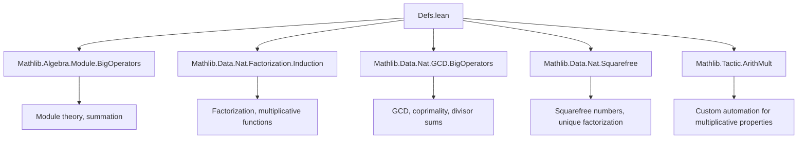
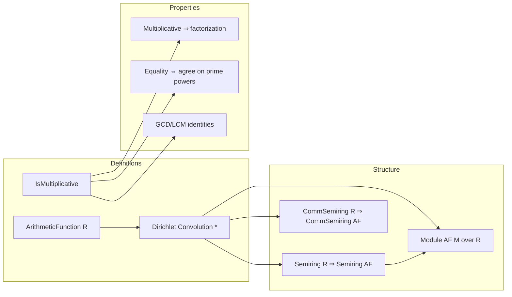

### Technical Metadata Brief: `Defs.lean` (Mathlib — Arithmetic Functions & Dirichlet Convolution)

---

#### **1. Key Definitions & Theorems**

| Name | Type / Signature | Purpose |
|------|------------------|---------|
| `ArithmeticFunction R` | `[Zero R] → Type*` | Type of functions `f : ℕ → R` with `f 0 = 0`, modeled as `ZeroHom ℕ R`. |
| `IsMultiplicative f` | `[MonoidWithZero R] → ArithmeticFunction R → Prop` | `f` is multiplicative iff `f 1 = 1` and `f(m*n) = f m * f n` for coprime `m, n`. |
| `mul` (Dirichlet convolution) | `[Semiring R] → Mul (ArithmeticFunction R)` | `(f * g) n = ∑_{x*y=n} f x * g y`. |
| `one` | `[One R] → One (ArithmeticFunction R)` | Identity for Dirichlet convolution: `1(n) = 1` if `n = 1`, else `0`. |
| `natCoe`, `intCoe` | Coercions `ArithmeticFunction ℕ → ArithmeticFunction R`, `ArithmeticFunction ℤ → ArithmeticFunction R` | Embed natural/integer-valued arithmetic functions into `R`-valued ones. |
| `IsMultiplicative.map_prod` | `[CommMonoidWithZero R]` | Extends multiplicativity to finite products over pairwise-coprime families. |
| `IsMultiplicative.multiplicative_factorization` | `[CommMonoidWithZero R]` | Evaluates `f n` via prime power factorization: `f n = ∏_{p^k ∥ n} f(p^k)`. |
| `IsMultiplicative.eq_iff_eq_on_prime_powers` | `[CommMonoidWithZero R]` | Two multiplicative functions are equal iff they agree on all prime powers. |
| `IsMultiplicative.lcm_apply_mul_gcd_apply` | `[CommMonoidWithZero R]` | `f(lcm x y) * f(gcd x y) = f x * f y` for multiplicative `f`. |
| `IsMultiplicative.mul` | `[CommSemiring R]` | Pointwise Dirichlet product of multiplicative functions is multiplicative. |

---

#### **2. Naming Conventions**

- **Prefixes**:
  - `is_`: for properties (e.g., `IsMultiplicative`).
  - `map_`: for behavior under function application (e.g., `map_zero`, `map_mul_of_coprime`).
  - `natCoe_`, `intCoe_`, `coe_`: for coercion lemmas.
  - `mul_`, `add_`, `one_`, `zero_`: for operations and their interactions.

- **Suffixes**:
  - `_apply`: for evaluation at a point (e.g., `mul_apply`, `add_apply`).
  - `_of_coprime`, `_of_prime`, `_of_squarefree`: for conditional properties.
  - `_left`, `_right`: for left/right distributivity or action (e.g., `left_distrib`, `one_smul'`).
  - `_mem`, `_notMem`: for membership conditions in sums/sets.

- **Special**:
  - `'` suffix (e.g., `mul_smul'`) often denotes a variant with stronger assumptions or refined structure.
  - `arith_mult`: custom tactic tag for arithmetic multiplication reasoning.

---

#### **3. Tactic Stack**

Frequently used tactics in proofs:

| Tactic | Role |
|--------|------|
| `ext` | Extensionality for functions/arithmetic functions. |
| `simp` / `simp only` | Simplification using `@[simp]` lemmas (e.g., `mul_apply`, `map_zero`). |
| `rw` | Rewriting using equalities (especially `mul_apply`, `sum_*`, `factorization_*`). |
| `by_cases` | Splitting on `x = 0`, `x = 1`, or membership conditions. |
| `aesop` | Automated reasoning for simple goals (especially in `isMultiplicative_one`, `mul` proofs). |
| `sum_nbij'`, `sum_nbij` | Bijective summation变换 (key for Dirichlet convolution associativity/multiplicativity). |
| `ring` | For commutative semiring arithmetic (e.g., in `mul` proof). |
| `apply sum_subset` | Restricting sums to subsets (e.g., when only `(1, n)` contributes). |
| `induction ... using Finset.induction_on` | Structural induction over finite sets (e.g., `map_prod`). |
| `exact`, `intro`, `rcases`, `cases'` | Standard proof scripting. |

---

#### **4. Proof Logic Flow**

Typical proof structure for multiplicative function properties:

1. **Base case**: Show `f 1 = 1` (often `simp` or `hf.1`).
2. **Coprime case**: Use `hf.map_mul_of_coprime` or `hf.2`.
3. **Factorization reduction**: Apply `multiplicative_factorization` to reduce to prime powers.
4. **Prime power analysis**: Use `primeFactors`, `factorization`, `squarefree` properties.
5. **Summation tricks**:
   - Use `sum_subset` to restrict to relevant divisors.
   - Use `sum_nbij'` to reindex Dirichlet sums (e.g., for `mul_assoc`, `mul_comm`, `mul` of multiplicative functions).
6. **Cancellation**: Use division lemmas like `div_eq_of_eq_mul` or `mul_div_cancel_left₀`.
7. **Coercion handling**: Use `natCoe_apply`, `intCoe_apply`, `coe_coe` to simplify embeddings.

---

#### **5. Imports**

Core dependencies defining the module’s scope:

```lean
Mathlib.Algebra.Module.BigOperators
Mathlib.Data.Nat.Factorization.Induction
Mathlib.Data.Nat.GCD.BigOperators
Mathlib.Data.Nat.Squarefree
Mathlib.Tactic.ArithMult
```

These provide:
- Summation over finite sets (`BigOperators`).
- Induction on factorization, GCD/GCD lemmas, squarefree reasoning.
- Custom `arith_mult` tactic for multiplicative reasoning.

---

#### **8. Mermaid Diagrams**

##### **Dependency Graph (Module-Level)**



##### **Overview of Theory Flow**



##### **Proof Strategy for `IsMultiplicative.mul`**

```mermaid
flowchart TD
  Start[Prove f * g multiplicative] --> Step1[Show (f*g) 1 = f 1 * g 1]
  Step1 --> Step2[Use hf.1, hg.1]
  Step2 --> Step3[For coprime m,n: expand (f*g)(m*n)]
  Step3 --> Step4[Apply sum_mul_sum]
  Step4 --> Step5[Reindex via sum_nbij']
  Step5 --> Step6[Use hf.2, hg.2 on coprime components]
  Step6 --> Step7[Conclude equality]
```

---

This file forms the foundational algebraic and combinatorial framework for arithmetic functions in Mathlib, enabling rich number-theoretic reasoning (e.g., Möbius inversion, Dirichlet series) in a structured, type-theoretic setting.
