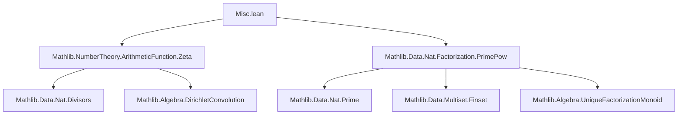
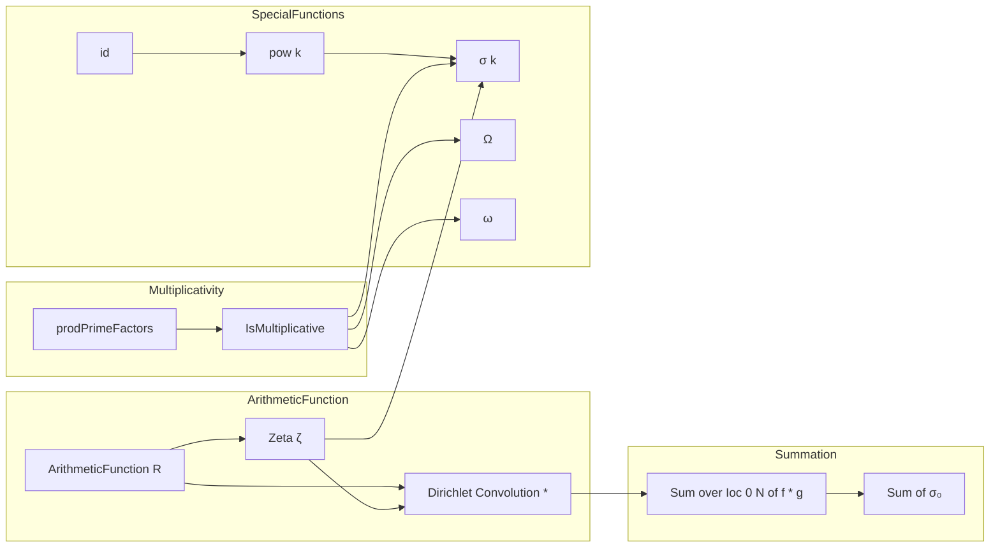

### Technical Brief: `Misc.lean` — Arithmetic Functions in Lean 4 (Mathlib)

---

#### **1. Key Definitions & Theorems**

| Name | Type / Signature | Purpose |
|------|------------------|---------|
| `prodPrimeFactors f` | `[CommMonoidWithZero R] → (ℕ → R) → ArithmeticFunction R` | Defines arithmetic function $n \mapsto \prod_{p \mid n} f(p)$; used to build multiplicative functions from pointwise data on primes. |
| `id` | `ArithmeticFunction ℕ` | Identity function $n \mapsto n$, as an arithmetic function. |
| `pow k` | `ℕ → ArithmeticFunction ℕ` | $n \mapsto n^k$ (with $0^0 := 0$). |
| `σ k` (notation `σ k`) | `ArithmeticFunction ℕ` | Sum-of-$k$th-powers-of-divisors: $\sigma_k(n) = \sum_{d \mid n} d^k$. |
| `Ω n` (notation `Ω n`) | `ArithmeticFunction ℕ` | Total number of prime factors of $n$, counted with multiplicity. |
| `ω n` (notation `ω n`) | `ArithmeticFunction ℕ` | Number of *distinct* prime factors of $n$. |
| `zeta_mul_pow_eq_sigma` | `ζ * pow k = σ k` | Key identity: Dirichlet convolution of zeta function with $n^k$ gives $\sigma_k$. |
| `isMultiplicative_sigma` | `IsMultiplicative (σ k)` | $\sigma_k$ is multiplicative. |
| `cardFactors_mul` | `Ω(mn) = Ωm + Ωn` for $m,n ≠ 0$ | Additivity of $\Omega$ over coprime multiplication (actually over all multiplication when nonzero). |
| `cardDistinctFactors_mul` | `ω(mn) = ωm + ωn` for `Coprime m n` | Additivity of $\omega$ over coprime multiplication. |
| `sigma_eq_prod_primeFactors_sum_range_factorization_pow_mul` | $\sigma_k(n) = \prod_{p \mid n} \sum_{i=0}^{v_p(n)} p^{ik}$ | Factorization of $\sigma_k$ over prime powers. |
| `sum_Ioc_sigma0_eq_sum_div` | $\sum_{n < N} \sigma_0(n) = \sum_{n < N} \lfloor N/n \rfloor$ | $O(N)$ formula for sum of divisor-counting function. |

---

#### **2. Naming Conventions**

- **Prefixes**:
  - `prodPrimeFactors`, `cardFactors`, `cardDistinctFactors`: indicate construction from prime factor data.
  - `isMultiplicative_…`: properties of multiplicative functions.
- **Suffixes**:
  - `_apply`: evaluation at a natural number.
  - `_eq_zero`, `_pos_iff`, `_iff`: characterizations of when value is zero/positive/equal to 1.
  - `_mul`, `_pow`: behavior under multiplication / exponentiation.
- **Notation scopes**:
  - `ArithmeticFunction.sigma`, `ArithmeticFunction.omega`, `ArithmeticFunction.Omega` — scoped Greek-letter notations.
  - `bigproddvd`: custom binder `∏ᵖ p ∣ n, f p`.

---

#### **3. Tactic Stack**

Frequently used tactics in proofs:
- `simp` / `simp_rw`: simplification with lemmas like `sigma_apply`, `prodPrimeFactors_apply`, `cardFactors_apply`.
- `aesop`: for automated reasoning about arithmetic and inequalities (e.g., `sigma_pos`, `sigma_mono`).
- `gcongr`: for monotonicity in sums (e.g., `sigma_mono`).
- `rw [← …]`: rewriting using key identities like `zeta_mul_pow_eq_sigma`.
- `induction` (on `Multiset`, `ℕ`, `k`): especially for multiplicative properties and factorization lemmas.
- `exact`, `apply`, `convert`: for structured proof steps.
- `grw`: guarded rewriting (used in `sum_Ioc_mul_eq_sum_sum`).
- `congr`, `ext`: extensionality for function equality.

---

#### **4. Proof Logic**

- **Multiplicativity proofs**:
  - Use `isMultiplicative` definition: verify $f(1)=1$ and $f(mn)=f(m)f(n)$ for coprime $m,n$.
  - Often reduce to prime factorization via `multiplicative_factorization`.
  - Use `prod_union`, `prod_primeFactors_mul`, `disjoint_primeFactors` for product splitting.

- **Summation identities**:
  - Convert Dirichlet convolutions to finite sums over divisors or antidiagonals.
  - Use `sum_divisorsAntidiagonal`, `divisors_filter_squarefree`, `sum_product`, `sum_filter`.
  - For $\sum_{n < N} \sigma_0(n)$, apply `sum_Ioc_mul_zeta_eq_sum` and simplify using `zeta_mul_pow_eq_sigma`.

- **Factorization-based reasoning**:
  - Leverage `primeFactorsList`, `primeFactors`, `factorization`, `Multiset.normalizedFactors`.
  - Use `UniqueFactorizationMonoid` properties (e.g., `normalizedFactors_mul`).
  - Squarefreeness ↔ `nodup primeFactorsList`, used in `cardDistinctFactors_eq_cardFactors_iff_squarefree`.

- **Induction patterns**:
  - On `k` for `pow`, `Ω`, `σ`.
  - On `Multiset` for `cardFactors_multiset_prod`.
  - On `Finset` for `cardDistinctFactors_prod`.

---

#### **5. Imports & Dependencies**

```lean
public import Mathlib.NumberTheory.ArithmeticFunction.Zeta
public import Mathlib.Data.Nat.Factorization.PrimePow
```

- **Core dependencies**:
  - `Mathlib.NumberTheory.ArithmeticFunction.Zeta`: defines zeta function `ζ`, Dirichlet convolution `*`, `ArithmeticFunction` typeclass.
  - `Mathlib.Data.Nat.Factorization.PrimePow`: prime factorization, `primeFactors`, `factorization`, `isPrimePow`, `Squarefree`.

- **Implicit dependencies** (via `Mathlib`):
  - `Mathlib.Data.Nat.Divisors`: divisor lattice, `divisors`, `divisors_antidiagonal`.
  - `Mathlib.Data.Multiset.Finset`: multiset/finsset operations (`prod`, `sum`, `card`, `map`, `filter`).
  - `Mathlib.Algebra.Multiplicative`: `CommMonoidWithZero`, `CommSemiring`, `IsMultiplicative`.
  - `Mathlib.Data.Nat.Prime`: primality, `primeFactorsList`, `factors`, `Multiset.normalizedFactors`.

---

#### **6. Mermaid Diagrams**

##### **Dependency Graph (Module-Level)**



##### **Overview of Theory Flow**



---

#### **7. Theory Scope Summary**

This module serves as a **miscellaneous but foundational** repository for concrete arithmetic functions and their properties, especially those that are *multiplicative*. It:

- Constructs and verifies basic arithmetic functions (`id`, `pow`, `σ`, `Ω`, `ω`).
- Proves key algebraic properties: multiplicativity, behavior under convolution, factorization formulas.
- Provides tools for summing arithmetic functions over intervals (e.g., $\sum_{n < N} \sigma_0(n)$).
- Supports automation via scoped notations and positivity tactics.

It complements dedicated files like `VonMangoldt.lean` and `Mobius.lean`, focusing on *elementary* but widely used examples.

--- 

Let me know if you'd like a formalized dependency graph (e.g., `.lean`-level imports), or a breakdown of how `σ`, `Ω`, `ω` relate to Dirichlet series.
