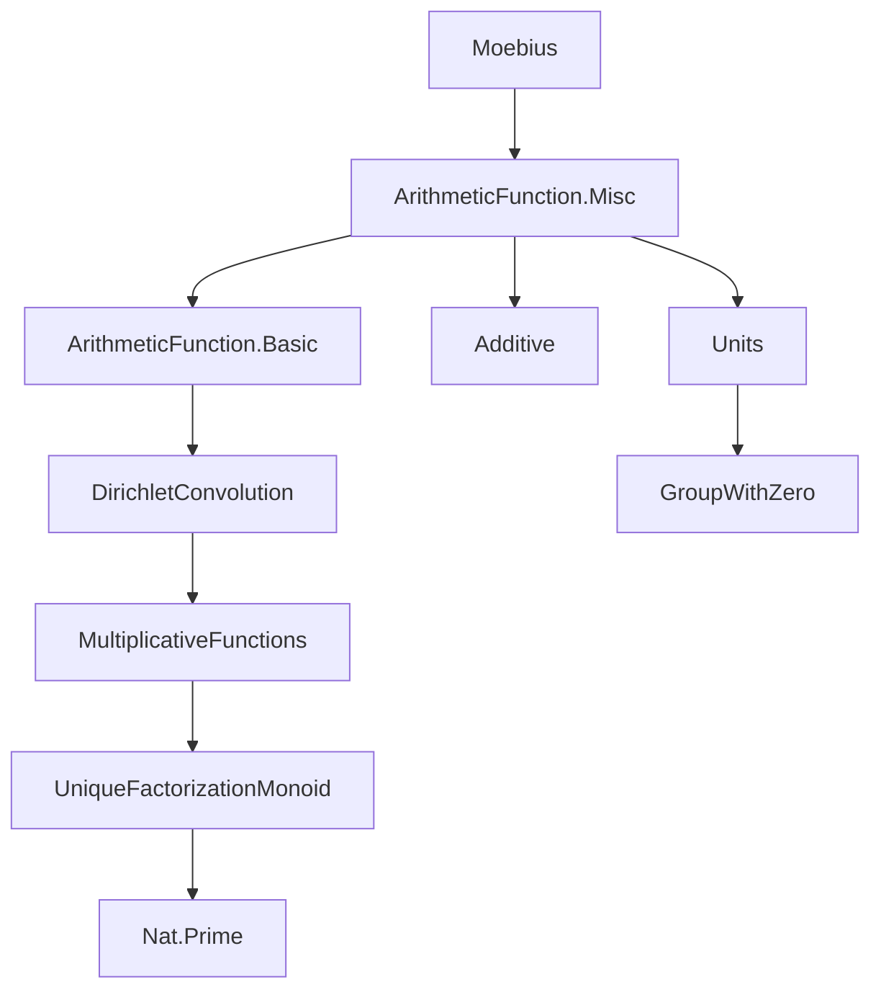

### Technical Brief: `Moebius.lean`

---

#### **1. Key Definitions & Theorems**

| Name | Type / Signature | Purpose |
|------|------------------|---------|
| `moebius : ArithmeticFunction ℤ` | `μ : ℕ → ℤ` | Defines the Möbius function: `μ n = (-1)^k` if `n` is squarefree with `k` prime factors; `0` otherwise. |
| `moebius_apply_of_squarefree` | `Squarefree n → μ n = (-1)^cardFactors n` | Evaluates `μ` on squarefree numbers. |
| `moebius_eq_zero_of_not_squarefree` | `¬Squarefree n → μ n = 0` | Evaluates `μ` on non-squarefree numbers. |
| `moebius_mul_coe_zeta` | `(μ * ζ : ArithmeticFunction ℤ) = 1` | States that `μ` is the Dirichlet inverse of the constant-1 function `ζ`. |
| `isMultiplicative_moebius` | `IsMultiplicative μ` | Proves `μ` is multiplicative (i.e., `μ(mn) = μ m * μ n` for coprime `m,n`). |
| `sum_eq_iff_sum_smul_moebius_eq` | `∀ n>0, ∑_{d|n} f d = g n ↔ ∀ n>0, ∑_{(d,e): d*e=n} μ d • g e = f n` | Möbius inversion for additive targets (`AddCommGroup`). |
| `sum_eq_iff_sum_mul_moebius_eq` | Same as above, but for multiplicative targets (`NonAssocRing`). | |
| `prod_eq_iff_prod_pow_moebius_eq` | `∀ n>0, ∏_{d|n} f d = g n ↔ ∀ n>0, ∏_{(d,e): d*e=n} g e ^ μ d = f n` | Multiplicative Möbius inversion for groups (`CommGroup`). |
| `prod_eq_iff_prod_pow_moebius_eq_of_nonzero` | Same as above, but for `CommGroupWithZero`, requiring nonzero values. | |
| `zetaUnit` | `(ArithmeticFunction R)ˣ` | Unit in the ring of arithmetic functions with inverse `μ`. |
| `moebius_sq` | `μ n ^ 2 = if Squarefree n then 1 else 0` | Square of Möbius function. |
| `moebius_ne_zero_iff_squarefree` | `μ n ≠ 0 ↔ Squarefree n` | Characterization of when `μ n ≠ 0`. |

---

#### **2. Naming Conventions**

- **Prefixes**:
  - `moebius_`: for lemmas about the Möbius function itself.
  - `sum_eq_iff_sum_..._eq`: for inversion theorems (↔ characterizations).
  - `prod_eq_iff_prod_..._eq`: multiplicative analogues.
  - `..._on`: for restricted versions over sets `s ⊆ ℕ` closed under divisors.
  - `..._of_nonzero`: for targets with zero (e.g., `CommGroupWithZero`), requiring nonzero values.

- **Suffixes**:
  - `_of_squarefree`: applies when input is squarefree.
  - `_sq`, `_abs`: for squared/absolute value variants.
  - `_prime`, `_prime_pow`, `_isPrimePow_not_prime`: for special cases of `n`.

- **Notation**:
  - `μ` is scoped under `ArithmeticFunction.Moebius`.
  - `•` for scalar multiplication (smul), `*` for multiplication in rings.

---

#### **3. Tactic Stack**

Frequently used tactics:
- `simp` / `simp_rw`: simplification with definitional lemmas (`moebius_apply_of_squarefree`, etc.).
- `rw`: rewriting using key lemmas like `moebius_mul_coe_zeta`, `isMultiplicative_moebius`.
- `induction ... using recOnPosPrimePosCoprime`: structural induction on natural numbers via prime power and coprime decomposition.
- `apply_congr`, `congr_left`, `prod_congr`, `sum_congr`: for manipulating sums/products.
- `split_ifs`: for case analysis on `if ... then ... else ...`.
- `ring`, `linarith`, `lia`: algebraic simplification and linear reasoning.
- `exact`, `refine`, `trans`: proof construction.
- `dsimp`, `rw [Units.val_inj]`, `Units.val_mk0`: for unit coercion reasoning.

---

#### **4. Proof Logic**

- **Inductive structure**: Proofs often use `recOnPosPrimePosCoprime` induction on `n`, splitting into:
  - `zero`: trivial (e.g., `μ 0 = 0`).
  - `one`: base case (`μ 1 = 1`).
  - `prime_pow`: handle prime powers using `moebius_apply_prime_pow`.
  - `coprime`: use multiplicativity for coprime arguments.

- **Dirichlet convolution logic**:
  - Key identity: `μ * ζ = 1` (Dirichlet convolution inverse).
  - Inversion theorems reduce to:
    - `ζ • f = g ↔ μ • g = f` (additive case),
    - `ζ * f = g ↔ μ * f = g` (ring case),
    - `∏_{d|n} f(d) = g(n) ↔ ∏_{d|n} g(n/d)^{μ(d)} = f(n)` (multiplicative case).

- **Set-restricted inversion**:
  - Use divisor-closedness of `s` to restrict domain of quantifiers.
  - Translate between `∀ n ∈ s` and `∀ n > 0, n ∈ s` using `hs₀ : 0 ∉ s`.

- **Unit-based proofs**:
  - For `CommGroupWithZero`, lift functions to units (`Units.mk0`) to apply group inversion theorems.

---

#### **5. Imports**

- `Mathlib.NumberTheory.ArithmeticFunction.Misc`: foundational arithmetic function theory (Dirichlet convolution, `ζ`, `IsMultiplicative`, etc.).
- Implicit dependencies:
  - `Mathlib.Algebra.Group.Defs` (for `AddCommGroup`, `CommGroup`, etc.)
  - `Mathlib.Data.Nat.Prime.Defs` (`prime`, `squarefree`, `cardFactors`, `primeFactors`)
  - `Mathlib.Data.Int.Basic` (`int`, `cast`, `Units`)
  - `Mathlib.Data.Finset.Basic` (`divisors`, `divisorsAntidiagonal`)
  - `Mathlib.Data.Nat.Divisors.Basic`
  - `Mathlib.Algebra.Ring.Defs` (`NonAssocRing`, `Ring`, `CommRing`)
  - `Mathlib.Data.Nat.UniqueFactorizationMonoid` (used in `prodPrimeFactors_one_add_of_squarefree`)

---

#### **6. Mermaid Diagrams**

##### **Dependency Graph (Module-Level)**



##### **Overview of Theoretical Flow**

```mermaid
flowchart LR
  A[Arithmetic Functions] --> B[Dirichlet Convolution *]
  B --> C[ζ: constant-1 function]
  C --> D[μ: Dirichlet inverse of ζ]
  D --> E[IsMultiplicative μ]
  E --> F[Invertibility of ζ in (AF R)ˣ]
  F --> G[Möbius Inversion: additive]
  F --> H[Möbius Inversion: multiplicative]
  G --> I[Restricted inversion on divisor-closed sets]
  H --> I
  I --> J[Applications: number theory, combinatorics]
```

##### **Proof Structure for `sum_eq_iff_sum_smul_moebius_eq`**

```mermaid
flowchart LR
  A[Goal: ∑_{d|n} f d = g n ↔ ∑_{d*e=n} μ d • g e = f n] --> B[Define f', g' : ArithmeticFunction R]
  B --> C[Show ζ • f' = g' ↔ μ • g' = f']
  C --> D[Use moebius_mul_coe_zeta: μ * ζ = 1]
  D --> E[Apply smul_assoc & one_smul]
  E --> F[Expand definitions & simplify using divisors/antidiagonal]
```

---

#### **7. Summary**

This file formalizes the Möbius function and its central role in Möbius inversion across multiple algebraic structures (additive groups, rings, multiplicative groups, and group-with-zero). It leverages:
- **Dirichlet convolution** to encode divisor sums,
- **Multiplicativity** to reduce proofs to prime powers,
- **Unit theory** to handle multiplicative inversion in rings with zero,
- **Set-theoretic closure** (under divisors) to generalize inversion to restricted domains.

The formalization is highly structured, with a clear separation between:
- *basic properties* of `μ`,
- *inversion theorems* for various algebraic targets,
- *restricted versions* for applications on subsets of `ℕ`.

It serves as a foundational module for analytic number theory in Lean, especially for Dirichlet series, divisor sums, and combinatorial identities involving arithmetic functions.

--- 

Let me know if you'd like a dependency graph for specific theorems (e.g., `prod_eq_iff_prod_pow_moebius_eq_of_nonzero`) or a tactic trace for a key proof.
