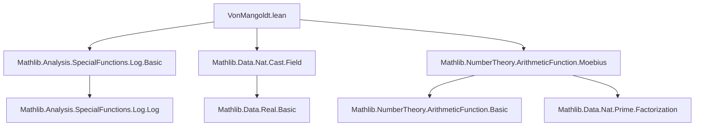

### Technical Brief: `VonMangoldt.lean`

---

#### **1. Key Definitions & Theorems**

| Name | Type / Signature | Purpose |
|------|------------------|---------|
| `log : ArithmeticFunction ℝ` | `ArithmeticFunction ℝ` | Bundled real logarithm as an arithmetic function: `n ↦ Real.log n`. |
| `vonMangoldt : ArithmeticFunction ℝ` | `ArithmeticFunction ℝ` | The von Mangoldt function $ \Lambda(n) = \begin{cases} \log p & \text{if } n = p^k \text{ for prime } p \\ 0 & \text{otherwise} \end{cases} $. |
| `notation Λ` | — | Standard notation for `vonMangoldt`, scoped in `ArithmeticFunction` and `ArithmeticFunction.vonMangoldt`. |
| `vonMangoldt_sum` | `∑ i ∈ n.divisors, Λ i = Real.log n` | Classical identity: sum of $ \Lambda $ over divisors equals $ \log n $. |
| `vonMangoldt_mul_zeta` | `Λ * ζ = log` | Convolution identity: $ \Lambda * \zeta = \log $, where $ \zeta $ is the constant-1 arithmetic function. |
| `log_mul_moebius_eq_vonMangoldt` | `log * μ = Λ` | Möbius inversion of the above: $ \Lambda = \log * \mu $. |
| `sum_moebius_mul_log_eq` | `∑ d ∈ n.divisors, μ d * log d = -Λ n` | Explicit Möbius inversion formula for $ \Lambda $, derived from previous identity. |
| `vonMangoldt_le_log` | `Λ n ≤ Real.log n` | Pointwise bound: $ \Lambda(n) \le \log n $ for all $ n \in \mathbb{N} $. |

---

#### **2. Naming Conventions**

- **Prefixes / Suffixes**:
  - `vonMangoldt_`: for definitions and lemmas about $ \Lambda $.
  - `log_`: for lemmas about the bundled `log` arithmetic function.
  - `mul_`, `zeta_`, `moebius_`: for convolution identities involving $ \zeta $ (zeta function) and $ \mu $ (Moebius function).
  - `apply`: for evaluation lemmas (e.g., `vonMangoldt_apply`, `log_apply`).
  - `ne_zero`, `pos_iff`, `eq_zero_iff`: for characterizations of when $ \Lambda(n) $ is nonzero, positive, or zero.
  - `sum_`, `divisors`: for summation over divisors or divisor-related sets.

- **Notation**:
  - `Λ` for `vonMangoldt`, scoped in `ArithmeticFunction` and `ArithmeticFunction.vonMangoldt`.
  - `ζ`, `μ` for zeta and Moebius functions, scoped in `zeta` and `Moebius`.

---

#### **3. Tactic Stack**

- **Core tactics**:
  - `rw`, `simp`, `simp only`, `split_ifs`, `rcases`, `exact`, `apply`, `refine`, `ext`, `congr`, `cases`, `induction`.
- **Domain-specific tactics**:
  - `Finset.sum_congr`, `Finset.sum_union`, `Finset.sum_filter`, `Finset.single_le_sum`: for manipulating finite sums over divisors.
  - `cast_ne_zero`, `cast_pow`, `cast_mul`, `cast_le`: for reasoning about natural-to-real coercion.
  - `Real.log_mul`, `Real.log_div`, `Real.log_pow`, `Real.log_nonneg`, `Real.log_pos`: for real logarithm properties.
  - `Nat.minFac_pos`, `Nat.minFac_prime`, `Nat.pow_minFac`, `Nat.divisors_prime_pow`: for prime factor and divisor structure.
  - `isPrimePow_pow_iff`, `Prime.minFac_eq`, `not_isPrimePow_one`, `not_isPrimePow_zero`: for prime power reasoning.

---

#### **4. Proof Logic**

- **Inductive structure**:
  - Proofs often use `recOnPrimeCoprime`, a recursion principle over natural numbers based on prime power decomposition and coprime factorization.
  - For `vonMangoldt_sum`, the proof proceeds by:
    1. Base case $ n = 1 $: trivial.
    2. Prime power case $ n = p^k $: direct computation using `sum_divisors_prime_pow` and `vonMangoldt_apply_pow`.
    3. Coprime multiplication case $ n = ab $ with $ \gcd(a,b)=1 $: factorization of divisors, disjoint union, and additivity of $ \log $.

- **Möbius inversion**:
  - Uses convolution algebra: $ \Lambda * \zeta = \log $ implies $ \Lambda = \log * \mu $, since $ \mu $ is the inverse of $ \zeta $ under Dirichlet convolution.
  - `sum_moebius_mul_log_eq` is derived by expanding the convolution and simplifying using properties of $ \mu $ and $ \log $.

- **Bounding arguments**:
  - `vonMangoldt_le_log` uses `single_le_sum` over divisors, leveraging non-negativity of $ \Lambda $ and the fact that $ n \in n.divisors $.

---

#### **5. Imports**

| Import | Purpose |
|--------|---------|
| `Mathlib.Analysis.SpecialFunctions.Log.Basic` | Real logarithm properties (`Real.log_mul`, `Real.log_div`, etc.). |
| `Mathlib.Data.Nat.Cast.Field` | Coercion from $ \mathbb{N} $ to $ \mathbb{R} $, field properties, `cast_ne_zero`, `cast_pow`, etc. |
| `Mathlib.NumberTheory.ArithmeticFunction.Moebius` | Moebius function $ \mu $, zeta function $ \zeta $, Dirichlet convolution, Möbius inversion. |

---

#### **6. Mermaid Diagrams**

##### **Dependency Graph (File-Level)**



##### **Conceptual Overview (Theory Flow)**

```mermaid
graph LR
  subgraph Definitions
    A[log : ℕ → ℝ]
    B[vonMangoldt Λ]
    C[ζ (zeta)]
    D[μ (Moebius)]
  end

  subgraph Identities
    E[Λ * ζ = log]
    F[log * μ = Λ]
    G[∑_{d|n} Λ(d) = log n]
    H[∑_{d|n} μ(d) log d = -Λ(n)]
  end

  subgraph Applications
    I[vonMangoldt_le_log]
    J[vonMangoldt_pos_iff / ne_zero_iff]
  end

  A --> E
  C --> E
  B --> G
  E --> F
  G --> H
  B --> I
  B --> J
```

---

#### **7. Theory Scope**

- **Domain**: Analytic number theory over $ \mathbb{N} $, with emphasis on:
  - Prime power structure (`IsPrimePow`, `minFac`).
  - Arithmetic functions and Dirichlet convolution.
  - Logarithmic identities and Möbius inversion.
- **Goal**: Formalize foundational properties of $ \Lambda $, especially its summatory behavior and inversion formulas.

---

#### **8. Notable Lemmas & Their Roles**

| Lemma | Role |
|-------|------|
| `vonMangoldt_apply` | Core definition evaluation. |
| `vonMangoldt_sum` | Central theorem: connects $ \Lambda $ to $ \log $ via summation. |
| `vonMangoldt_mul_zeta` | Convolutional reformulation of `vonMangoldt_sum`. |
| `log_mul_moebius_eq_vonMangoldt` | Enables Möbius inversion to recover $ \Lambda $ from $ \log $. |
| `sum_moebius_mul_log_eq` | Explicit formula for $ \Lambda $ in terms of $ \mu $ and $ \log $, useful for explicit computation or estimation. |
| `vonMangoldt_le_log` | Provides upper bound, used in analytic estimates. |

--- 

Let me know if you'd like a formalized dependency graph (e.g., for `leanproject`), or a summary of how this file fits into the broader `Mathlib` number theory hierarchy.
