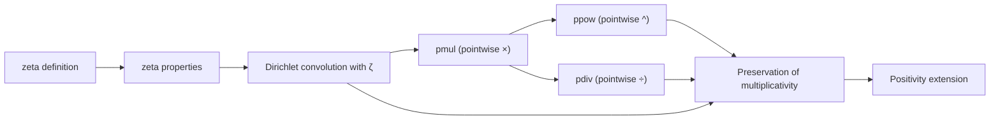

### Technical Brief: `Zeta.lean` Module

---

#### **1. Key Definitions & Theorems**

| Name | Type / Signature | Purpose |
|------|------------------|---------|
| `zeta` | `ArithmeticFunction ℕ` | The arithmetic function defined by `ζ 0 = 0`, `ζ x = 1` for `x > 0`. Its Dirichlet series is the Riemann zeta function. |
| `pmul` | `[MulZeroClass R] → ArithmeticFunction R → ArithmeticFunction R → ArithmeticFunction R` | Pointwise multiplication of arithmetic functions: $(f \cdot_{\text{pw}} g)(n) = f(n) \cdot g(n)$. |
| `pdiv` | `[GroupWithZero R] → ArithmeticFunction R → ArithmeticFunction R → ArithmeticFunction R` | Pointwise division: $(f /_{\text{pw}} g)(n) = f(n) / g(n)$. |
| `ppow` | `ArithmeticFunction R → ℕ → ArithmeticFunction R` | Pointwise exponentiation: $f^{\odot k}(n) = f(n)^k$, with $f^{\odot 0} = ζ$. |
| `coe_zeta_smul_apply` | `[Semiring R] [AddCommMonoid M] [MulAction R M] → (↑ζ • f) x = ∑_{i ∈ divisors x} f i` | Relates scalar multiplication by `ζ` (coerced to `R`) to summation over divisors. |
| `coe_zeta_mul_apply`, `coe_mul_zeta_apply` | `[Semiring R] → (ζ * f) x = (f * ζ) x = ∑_{i ∈ divisors x} f i` | Shows that Dirichlet convolution with `ζ` on either side yields the divisor sum. |
| `zeta_mul_comm` | `[Semiring R] → ζ * f = f * ζ` | Commutativity of Dirichlet convolution with `ζ`. |
| `isMultiplicative_zeta` | `IsMultiplicative ζ` | `ζ` is a multiplicative arithmetic function. |
| `pmul`, `pdiv`, `ppow` preserve multiplicativity | Under appropriate assumptions, `pmul`, `pdiv`, `ppow` preserve `IsMultiplicative`. | Enables algebraic manipulation of multiplicative functions. |

---

#### **2. Naming Conventions**

- **Prefixes**:
  - `zeta_`: for lemmas about `ζ`, e.g., `zeta_apply`, `zeta_pos`.
  - `pmul_`, `pdiv_`, `ppow_`: for pointwise operations.
  - `coe_`: for coercions (e.g., `↑ζ` to `R`).
- **Suffixes**:
  - `_apply`: for lemmas about application at a point.
  - `_comm`: for commutativity results.
  - `_pos`, `_ne`: for positivity or non-zero conditions.
- **Notation**:
  - `ζ` is scoped under `ArithmeticFunction.zeta`, available via `open scoped zeta`.

---

#### **3. Tactic Stack**

Frequently used tactics in proofs:
- `simp` / `simp_rw`: Simplification using `@[simp]` lemmas and definitional equalities.
- `ext`: Extensionality for function equality.
- `rw`: Rewriting using known equalities.
- `induction`: Structural induction on natural numbers.
- `cases`: Case analysis on natural numbers (especially `x = 0` vs `x > 0`).
- `ring`: For commutative semiring arithmetic.
- `apply`, `refine`, `trans`: Proof construction and intermediate steps.
- `sum_congr`, `sum_map`: Manipulation of finite sums over divisors.

---

#### **4. Proof Logic**

- **Structure**: Proofs often proceed by:
  1. **Extensionality** (`ext x`) to reduce to pointwise equality.
  2. **Case analysis** on `x = 0` or `x ≠ 0`, using `zeta_apply` and `zeta_apply_ne`.
  3. **Rewriting** using definitions of `pmul`, `pdiv`, `ppow`, and Dirichlet convolution.
  4. **Summation manipulation** via `sum_congr`, `sum_map`, and divisor identities (`map_div_left_divisors`, etc.).
- **Multiplicativity proofs**:
  - Use `IsMultiplicative.iff_ne_zero` to reduce to coprime arguments.
  - Apply `hf.map_mul_of_coprime`, `hg.map_mul_of_coprime`, then simplify with `ring` or `mul_mul_mul_comm`.

---

#### **5. Imports & Dependencies**

- **Core dependency**:
  ```lean
  import Mathlib.NumberTheory.ArithmeticFunction.Defs
  ```
- **Implicit dependencies** (via `Mathlib`):
  - `Mathlib.Data.Finset.Basic` (`Finset`)
  - `Mathlib.Data.Nat.Basic` (`Nat`)
  - `Mathlib.Algebra.Semiring` (for `Semiring`, `AddCommMonoid`, `MulAction`)
  - `Mathlib.Algebra.GroupWithZero` (for `pdiv`)
  - `Mathlib.NumberTheory.ArithmeticFunction.Multiplicative` (for `IsMultiplicative`)

---

#### **6. Mermaid Diagrams**

##### **Dependency Graph (Module-Level)**

```mermaid
graph TD
  Zeta["Zeta.lean"] --> ArithFuncDefs["ArithmeticFunction.Defs"]
  ArithFuncDefs --> Finset
  ArithFuncDefs --> Nat
  ArithFuncDefs --> Semiring
  ArithFuncDefs --> GroupWithZero
  ArithFuncDefs --> Multiplicative["Multiplicative.lean"]

  Zeta --> Positivity["Positivity.lean"]  %% via `Mathlib.Meta.Positivity`
```

##### **Overview of File Structure**



##### **Theory Context**

- `ζ` serves as the **multiplicative identity** for pointwise operations (`pmul`, `ppow`).
- Under **Dirichlet convolution**, `ζ` acts as the **unit for divisor summation**:  
  $$
  (\zeta * f)(n) = \sum_{d \mid n} f(d)
  $$
- `ζ` is **multiplicative**, and pointwise operations preserve multiplicativity under suitable ring assumptions.
- The module supports both **coercion-based** (`↑ζ`) and **native** (`ζ`) reasoning.

---

#### **7. Notable Technical Notes**

- `pdiv_zeta` requires `DivisionSemiring R`, not just `GroupWithZero`, due to coercion constraints from `ℕ` → `R`.
- `ppow 0 = ζ` is a design choice: ensures `f^{\odot 0}` behaves like a multiplicative identity in pointwise algebra.
- `zeta_pos` and `zeta_eq_zero` encode the support of `ζ` as $\mathbb{N}_{>0}$.
- The positivity extension `evalArithmeticFunctionZeta` enables automated positivity reasoning for `ζ`.

--- 

Let me know if you'd like a formalized dependency graph or a summary of how this module fits into the broader Dirichlet series / analytic number theory pipeline in Mathlib.
