### Technical Metadata Brief: `Chebyshev.lean`

---

#### **1. Key Definitions & Theorems**

| Name | Type / Signature | Purpose |
|------|------------------|---------|
| `psi` | `ψ : ℝ → ℝ` | Sum of von Mangoldt function Λ over $ n \le x $: $ \psi(x) = \sum_{n \le \lfloor x \rfloor} \Lambda(n) $ |
| `theta` | `θ : ℝ → ℝ` | Sum of $ \log p $ over primes $ p \le x $: $ \theta(x) = \sum_{p \le \lfloor x \rfloor} \log p $ |
| `theta_eq_log_primorial` | `θ x = log (primorial ⌊x⌋₊)` | Relates θ to primorial: $ \theta(x) = \log(\prod_{p \le x} p) $ |
| `theta_le_log4_mul_x` | `θ x ≤ log 4 * x` | Chebyshev’s upper bound on θ |
| `psi_eq_sum_theta` | `ψ x = ∑_{n=1}^{⌊\log x / \log 2⌋} θ(x^{1/n})` | Expresses ψ as sum over scaled θ values (prime power decomposition) |
| `psi_eq_theta_add_sum_theta` | `ψ x = θ x + ∑_{n=2}^{⌊\log x / \log 2⌋} θ(x^{1/n})` | Decomposes ψ into θ + higher prime powers |
| `theta_le_psi` | `θ x ≤ ψ x` | θ is dominated by ψ |
| `abs_psi_sub_theta_le_sqrt_mul_log` | `|ψ x - θ x| ≤ 2 √x log x` | Quantifies how close ψ and θ are |
| `psi_le` | `ψ x ≤ log 4 * x + 2 √x log x` | Explicit upper bound on ψ |
| `psi_le_const_mul_self` | `ψ x ≤ (log 4 + 4) * x` | Simpler linear upper bound on ψ |
| `primeCounting_eq_theta_div_log_add_integral` | `π ⌊x⌋₊ = θ x / log x + ∫₂ˣ θ t / (t log² t) dt` | Abel summation formula linking π and θ |
| `eventually_primeCounting_le` | `∀ᶠ x, π ⌊x⌋₊ ≤ (log 4 + ε) x / log x` | Chebyshev’s upper bound on prime counting function π |

---

#### **2. Naming Conventions**

- **Prefixes**:
  - `theta_`, `psi_`: for lemmas about θ and ψ respectively.
  - `isPrimePow`, `PrimePow`: for prime power-related constructions.
  - `eventually_`, `integral_`, `primeCounting_`: for asymptotic/integral/π-related results.
- **Suffixes**:
  - `_eq_`: definitions or equalities.
  - `_le_`, `_ge_`, `_lt_`, `_gt_`: inequality lemmas.
  - `_mono`: monotonicity lemmas.
  - `_nonneg`, `_pos`: sign properties.
  - `_eq_zero_of_lt_two`: special-case simplifications for small arguments.
  - `_isBigO`, `_isLittleO`: asymptotic big-O/little-o lemmas.
- **Notation**:
  - Scoped notations `θ` and `ψ` introduced in `Chebyshev` namespace.

---

#### **3. Tactic Stack**

Frequently used tactics:
- `simp`, `simp_rw`, `congr`, `ext`, `apply`, `refine`, `trans`
- `gcongr`, `linarith`, `bound`, `norm_num`, `grw`
- `rw`, `field`, `ring`, `calc`
- `filter_upwards`, `eventually_gt_atTop`, `isBigO.*`, `isLittleO.*`
- `intervalIntegral.*`, `integrableOn_*`, `ContinuousOn.integrableOn_Icc`
- `sum_congr`, `sum_le_sum_of_subset_of_nonneg`, `sum_pos`, `sum_nonneg`
- `mod_cast`, `norm_cast`, `floor_le`, `le_floor_iff`, `rpow_*`, `sqrt_*`

---

#### **4. Proof Logic**

- **Inductive/structural decomposition**:
  - Prime powers via `IsPrimePow` and `sum_PrimePow_eq_sum_sum`.
  - Splitting sums over $ n \in Icc $ or $ Ioc $ using `add_sum_Ioc_eq_sum_Icc`.
- **Case analysis**:
  - Small $ x < 2 $ vs $ x \ge 2 $ (e.g., `theta_pos`, `psi_eq_theta_add_sum_theta`).
  - $ x < 1 $, $ 1 \le x < 2 $, $ x \ge 2 $ in bounds.
- **Abel summation**:
  - Used in `primeCounting_eq_theta_div_log_add_integral` via `sum_mul_eq_sub_integral_mul₁`.
- **Asymptotic reasoning**:
  - `isBigO`, `isLittleO`, `bound`, `eventually_*` for large-$x$ behavior.
- **Integral estimation**:
  - Monotonicity + integral comparison (`integral_1_div_log_sq_le`), splitting intervals at $ \sqrt{x} $.

---

#### **5. Imports & Dependencies**

**Core Dependencies**:
- `Mathlib.Algebra.Order.Floor.Semifield`: floor, `⌊x⌋₊`, `natCast`, `floor_le`.
- `Mathlib.Analysis.SpecialFunctions.Pow.Real`: real powers, `rpow`, `sqrt`.
- `Mathlib.MeasureTheory.Integral.IntervalIntegral.Basic`: interval integrals, `∫`, `integrableOn`.
- `Mathlib.NumberTheory.AbelSummation`: Abel summation formula.
- `Mathlib.NumberTheory.PrimeCounting`: prime counting function `π`.
- `Mathlib.NumberTheory.Primorial`: primorial function.
- `Mathlib.NumberTheory.ArithmeticFunction.VonMangoldt`: von Mangoldt function `Λ`.
- `Mathlib.Analysis.SpecialFunctions.Log.InvLog`: log properties.
- `Mathlib.Data.Nat.Prime.Int`: primes, primality.

**Key algebraic/analytic structures used**:
- `AddCommMonoid`, `Real`, `ℕ`, `ℝ`, `floor`, `primorial`, `log`, `sqrt`, `rpow`, `deriv`, `integrableOn`, `asymptotics`.

---

#### **8. Mermaid Diagrams**

##### **Dependency Graph (Module-Level)**

```mermaid
graph TD
  A[Chebyshev.lean] --> B[Mathlib.Algebra.Order.Floor.Semifield]
  A --> C[Mathlib.Analysis.SpecialFunctions.Pow.Real]
  A --> D[Mathlib.MeasureTheory.Integral.IntervalIntegral.Basic]
  A --> E[Mathlib.NumberTheory.AbelSummation]
  A --> F[Mathlib.NumberTheory.PrimeCounting]
  A --> G[Mathlib.NumberTheory.Primorial]
  A --> H[Mathlib.NumberTheory.ArithmeticFunction.VonMangoldt]
  A --> I[Mathlib.Analysis.SpecialFunctions.Log.InvLog]
  A --> J[Mathlib.Data.Nat.Prime.Int]
```



##### **Conceptual Overview (Theory Flow)**

```mermaid
flowchart LR
  subgraph Definitions
    P[ψ: von Mangoldt sum] 
    T[θ: log-prime sum]
  end

  subgraph Relations
    R1[θ = log primorial]
    R2[ψ = ∑ θ(x^{1/n})]
    R3[ψ = θ + higher powers]
    R4[θ ≤ ψ]
    R5[|ψ - θ| ≤ O(√x log x)]
  end

  subgraph Bounds
    B1[θ ≤ log 4 · x]
    B2[ψ ≤ log 4 · x + O(√x log x)]
    B3[ψ ≤ (log 4 + 4) · x]
  end

  subgraph Prime Counting
    C1[π = θ / log x + ∫ θ / (t log² t)]
    C2[π ≤ (log 4 + ε) x / log x]
  end

  P --> R2 --> B2
  T --> R1 --> B1
  R2 --> R3 --> R4 --> R5 --> B2
  R4 --> C1 --> C2
  B1 --> C2
  B2 --> C2
```

##### **Proof Strategy Flow (Example: `eventually_primeCounting_le`)**

```mermaid
flowchart TD
  A[Start: π ⌊x⌋₊ = θ / log x + ∫ θ / (t log² t)] --> B[Bound θ ≤ log 4 · x]
  B --> C[Bound integral ≤ log 4 · ∫ 1 / log² t]
  C --> D[Estimate ∫ 1 / log² t = O(x / log² x)]
  D --> E[Combine terms]
  E --> F[Use ε > 0 to absorb lower-order terms]
  F --> G[Conclude π ⌊x⌋₊ ≤ (log 4 + ε) x / log x]
```

---

Let me know if you'd like a formalized dependency graph (e.g., for `leanproject`), or a visualization of the `sum_PrimePow_eq_sum_sum` bijection.
