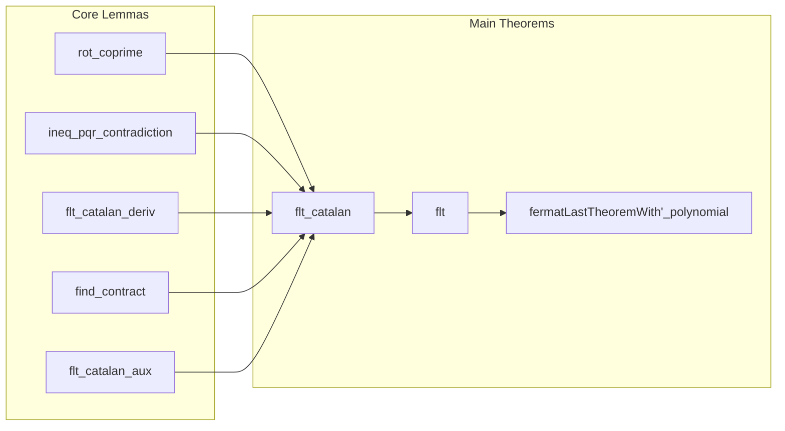

### Technical Brief: Polynomial.lean — Fermat’s Last Theorem for Polynomials over a Field

---

#### **1. Key Definitions & Theorems**

| Name | Type / Signature | Purpose |
|------|------------------|---------|
| `isUnit_C` | `{u : k} → u ≠ 0 → IsUnit (C u)` | Characterizes constant polynomials that are units: nonzero constants are invertible in `k[X]`. |
| `rot_coprime` | `IsCoprime a b → IsCoprime b c` (under Fermat-Catalan equation) | Rotates coprimality among `a, b, c` using the equation `u·a^p + v·b^q + w·c^r = 0`. |
| `ineq_pqr_contradiction` | `q·r + r·p + p·q ≤ p·q·r ∧ p·a < a+b+c ∧ … → False` | Derives contradiction from degree inequalities in Mason-Stothers argument. |
| `Polynomial.flt_catalan_deriv` | Under assumptions, `derivative a = derivative b = derivative c = 0` | Core lemma: if a nontrivial solution exists, all polynomials must have zero derivative. |
| `find_contract` | `derivative a = 0 ∧ char k > 0 ⇒ ∃ ca, a = expand ca` | In positive characteristic, zero derivative implies `a` is a `p`-th power (via `expand`/`contract`). |
| `Polynomial.flt_catalan_aux` | Under assumptions, `a.natDegree = 0` | Proves constancy of one polynomial via infinite descent (char `p > 0`) or direct integration (char `0`). |
| `Polynomial.flt_catalan` | Full Fermat-Catalan non-solvability: `a.natDegree = b.natDegree = c.natDegree = 0` | Main theorem: no non-constant coprime solutions to `u·a^p + v·b^q + w·c^r = 0` under exponent condition. |
| `Polynomial.flt` | Special case: `a^n + b^n = c^n`, `n ≥ 3`, `n ≠ 0` in `k` ⇒ all constant | Fermat’s Last Theorem for polynomials over a field. |
| `fermatLastTheoremWith'_polynomial` | `FermatLastTheoremWith' k[X] n` | Formalizes the standard “primitive” version: any solution is associate to a constant solution. |

---

#### **2. Naming Conventions**

- **Prefixes**:
  - `is_` / `Ne.isUnit_C`: properties of objects (`IsUnit`, `IsCoprime`, etc.)
  - `rot_`: rotation of hypotheses (e.g., `rot_coprime`)
  - `ineq_`: inequality-based lemmas (`ineq_pqr_contradiction`)
  - `find_`: existential construction (`find_contract`)
  - `flt_`: Fermat-related results (`flt_catalan`, `flt_catalan_deriv`, `flt_catalan_aux`)
- **Suffixes**:
  - `_deriv`: derivative-related conclusions
  - `_aux`: auxiliary lemmas for main theorem
  - `_contract`: contraction/expansion in positive characteristic
- **Constants**:
  - `ch`, `chp`, `chq`, `chr`: characteristic-related assumptions (`ringChar k`, `(p : k) ≠ 0`, etc.)
  - `hu`, `hv`, `hw`: nonzero coefficients

---

#### **3. Tactic Stack**

| Tactic | Usage Frequency | Purpose |
|--------|-----------------|---------|
| `simp_rw` | High | Rewriting with simplification (e.g., radical, natDegree, expand/contract) |
| `gcongr` | High | Congruence reasoning for inequalities (e.g., `p·a < a+b+c`) |
| `rw` | Very High | Rewriting equations, rotations, and definitions |
| `cases` / `rcases` | Medium | Extracting structure from existential/and goals |
| `induction ... using Nat.case_strong_induction_on` | Medium | Infinite descent in char `p > 0` case |
| `aesop` / `linarith` | Low | Linear arithmetic (e.g., `CharP.ringChar_ne_one`) |
| `convert` | Medium | Matching goals up to definitional equality |
| `have` / `suffices` | Very High | Introducing intermediate claims and subgoals |
| `exfalso` | Medium | Turning contradiction into goal |

---

#### **4. Proof Logic**

- **High-level structure**:
  1. **Mason-Stothers (Polynomial ABC)**: Used to derive either:
     - A degree inequality contradiction (`nd_lt` case), or
     - Zero derivatives (`dr0` case).
  2. **Zero derivative ⇒ structure**:
     - In **characteristic 0**: `derivative a = 0 ⇒ a` is constant (`eq_C_of_derivative_eq_zero`).
     - In **characteristic `p > 0`**: `derivative a = 0 ⇒ a = expand ca` (`find_contract`).
  3. **Infinite descent** (char `p > 0`):
     - Assume minimal `a.natDegree > 0`.
     - Use `expand` to reduce to smaller-degree solution `ca, cb, cc`.
     - Contradiction via induction hypothesis.
  4. **Symmetrization**:
     - Use `rot_coprime` and `add_rotate` to handle all three variables symmetrically in `flt_catalan`.

- **Key logical flow**:
  ```
  Solution ⇒ derivatives zero ⇒ (char 0: constant; char p: expandable)
  ⇒ descent or direct ⇒ contradiction unless degrees zero.
  ```

---

#### **5. Imports & Dependencies**

| Module | Role |
|--------|------|
| `Mathlib.Algebra.Polynomial.Expand` | `expand`, `contract`, `expand_contract`, `natDegree_expand` |
| `Mathlib.Algebra.GroupWithZero.Defs` | Basic ring/field arithmetic, units |
| `Mathlib.NumberTheory.FLT.Basic` | Classical FLT background, `FermatLastTheoremWith'` |
| `Mathlib.NumberTheory.FLT.MasonStothers` | **Mason-Stothers theorem** (`Polynomial.abc`) |
| `Mathlib.RingTheory.Polynomial.Content` | Content, primitive polynomials, Gauss’s lemma (indirectly via UFM) |
| `Mathlib.Tactic.GCongr` | Generalized congruence for inequalities |

---

#### **6. Mermaid Diagrams**

##### **Dependency Graph (Theoretical)**
```mermaid
graph TD
  A[Field k] --> B[Polynomial Ring k[X]]
  B --> C[UniqueFactorizationMonoid k[X]]
  B --> D[IsDomain k[X]]
  C --> E[Mason-Stothers (ABC) Theorem]
  D --> E
  E --> F[Fermat-Catalan Non-Solvability]
  F --> G[Fermat's Last Theorem for Polynomials]
  G --> H[Primitive Form: FLTWith']
```

##### **File Overview (Structure)**


---

#### **7. Summary**

This file formalizes the **polynomial Fermat-Catalan theorem**, a deep result in function field arithmetic, using:
- **Mason-Stothers (polynomial ABC)** to control degrees,
- **Infinite descent** in positive characteristic,
- **Derivative analysis** to reduce to constants.

It culminates in a fully formal proof of **Fermat’s Last Theorem for polynomials over arbitrary fields**, handling both characteristic zero and positive characteristic uniformly.

The proof is highly structured, with clear separation of:
- **auxiliary combinatorial lemmas** (`rot_coprime`, `ineq_pqr_contradiction`),
- **structural lemmas** (`find_contract`, `flt_catalan_deriv`),
- **descent/induction** in char `p`,
- **symmetrization** for full FLT.

It demonstrates mature use of Lean’s algebraic library, especially `Mathlib`’s `Polynomial`, `UFD`, and `NumberTheory.FLT` modules.
