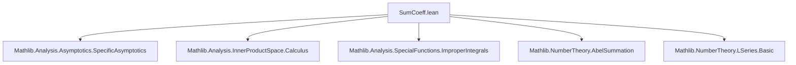
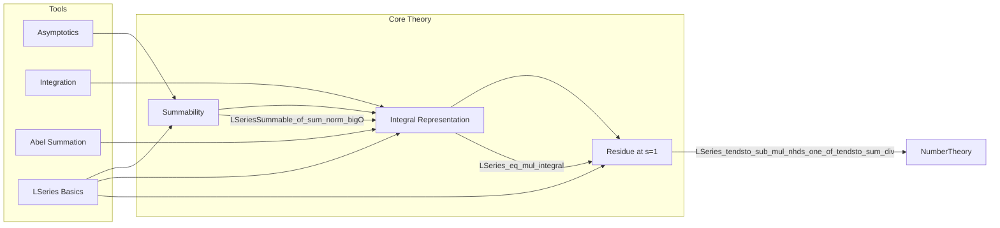

Here is a structured technical brief extracted from `SumCoeff.lean`, focusing on definitions, naming conventions, proof tactics, logical flow, imports, and theory dependencies.

---

### **1. Key Definitions & Theorems**

| Name | Type / Signature | Purpose |
|------|------------------|---------|
| `LSeriesSummable f s` | `Prop` | The L-series $\sum_{n=1}^\infty f(n) n^{-s}$ converges absolutely at $s \in \mathbb{C}$. |
| `LSeries f s` | `ℂ` (if summable) | Value of the Dirichlet series $\sum_{n=1}^\infty f(n) n^{-s}$ at $s$. |
| `Icc 1 n` | `Finset ℕ` | Finite interval $[1, n] = \{1, 2, ..., n\}$. |
| `⌊t⌋₊` | `ℕ` | Floor function mapping $t \in \mathbb{R}_{\ge 0} \mapsto \max\{k \in \mathbb{N} \mid k \le t\}$. |
| `IsBigO` | `Filter ℝ → (ℝ → ℝ) → (ℝ → ℝ) → Prop` | Big-O notation: $f = O(g)$ at a filter. |
| `Tendsto` | `Filter α → (α → β) → β → Prop` | Convergence of a function to a limit along a filter. |

#### Main Theorems

| Name | Statement (informal) |
|------|----------------------|
| `LSeriesSummable_of_sum_norm_bigO` | If $\sum_{k=1}^n \|f(k)\| = O(n^r)$ for $r \ge 0$, then $LSeries f$ converges for all $s$ with $\operatorname{Re}(s) > r$. |
| `LSeries_eq_mul_integral` | Under same hypotheses as above, $LSeries f(s) = s \int_1^\infty \left(\sum_{k=1}^{\lfloor t \rfloor} f(k)\right) t^{-(s+1)} \, dt$. |
| `LSeries_tendsto_sub_mul_nhds_one_of_tendsto_sum_div` | If $\frac{1}{n} \sum_{k=1}^n f(k) \to l$ and $LSeries f$ converges for all real $s > 1$, then $(s-1) LSeries f(s) \to l$ as $s \to 1^+$. |

---

### **2. Naming Conventions**

- **Prefixes**:
  - `LSeries_...`: All L-series related results.
  - `isBigO_...`, `tendsto_...`, `integrable_...`: Asymptotic and measure-theoretic properties.
  - `norm_...`, `sum_...`, `floor_...`: Structural components.

- **Suffixes**:
  - `_aux`: Intermediate lemmas used in main proofs.
  - `_and_...`: When adding extra assumptions (e.g., nonnegativity).
  - `_of_...`: When assumptions are phrased as conditions on objects (e.g., `of_sum_norm_bigO`).
  - `_congr'`, `_congr`: Congruence lemmas for equality up to almost everywhere or finite modifications.

- **Variable naming**:
  - `f : ℕ → ℂ`: general coefficient sequence.
  - `r : ℝ`: exponent in big-O bound.
  - `s : ℂ`: complex argument of L-series.
  - `t : ℝ`: real variable in integrals.
  - `n : ℕ`: integer index for partial sums.

---

### **3. Tactic Stack**

Frequently used tactics across the file:

| Tactic | Role |
|--------|------|
| `simp_rw` | Simplification with rewrite rules (especially for sums, norms, floor functions). |
| `filter_upwards` | Reasoning about filters (e.g., `atTop`, neighborhoods). |
| `eventually` / `eventually_ge_atTop` / `eventually_gt_atTop` | Extracting eventual behavior. |
| `rw [← ...]` | Rewriting using integral representations or definitions. |
| `convert` / `congr'` | Proving equality up to negligible sets or finite modifications. |
| `ring` / `linarith` | Algebraic simplifications and linear arithmetic. |
| `norm_num` / `field_simp` | Numerical simplifications and field simplifications. |
| `gcongr` | Goal congruence for inequalities under monotonicity. |
| `exact`, `refine`, `apply` | Standard proof construction. |
| `setIntegral_congr_fun`, `setIntegral_mono_on` | Manipulating Lebesgue integrals over sets. |
| `integrableOn_of_isBigO_atTop` | Integrability via comparison. |
| `tendsto_nhdsWithin_of_tendsto_nhds` | Relating one-sided and full neighborhood convergence. |

---

### **4. Proof Logic**

The logical flow follows a standard pattern in analytic number theory:

1. **Reduction to auxiliary lemmas**:
   - Many theorems are reduced to simpler cases (e.g., assuming $f(0) = 0$) via congruence lemmas (`LSeriesSummable_congr'`, `LSeries_congr`).
   - Use of `if_pos` / `if_neg` to handle zero-index terms.

2. **Asymptotic analysis**:
   - Big-O bounds on partial sums are used to control growth.
   - Comparison with power functions $t \mapsto t^a$ via `rpow` and `cpow`.

3. **Integral representation**:
   - Integration by parts or Abel summation is encoded via integral formulas involving floor functions.
   - Key step: replacing discrete sums with step functions $\sum_{k=1}^{\lfloor t \rfloor} f(k)$.

4. **Local integrability & convergence**:
   - Use of `locallyIntegrableOn`, `integrableOn`, and `integrableAtFilter`.
   - Control of integrals near infinity using `integrableAtFilter_rpow_atTop_iff`.

5. **Residue analysis near $s = 1$**:
   - Decomposition of integrals at a cutoff $T$.
   - Use of `LSeries_tendsto_sub_mul_nhds_one_of_tendsto_sum_div_aux₁`–`₃` to bound error terms.
   - Final step: squeeze argument using liminf/limsup and boundedness.

6. **Nonnegative case simplification**:
   - When $f(n) \ge 0$, absolute values drop and norms simplify (`abs_of_nonneg`), allowing stronger conclusions.

---

### **5. Imports**

The module depends on:

- `Mathlib.Analysis.Asymptotics.SpecificAsymptotics`: Big-O notation and asymptotics.
- `Mathlib.Analysis.InnerProductSpace.Calculus`: Differentiability and norms in ℂ.
- `Mathlib.Analysis.SpecialFunctions.ImproperIntegrals`: Improper integrals, especially of $t^s$.
- `Mathlib.NumberTheory.AbelSummation`: Abel summation formula (used implicitly in integral representations).
- `Mathlib.NumberTheory.LSeries.Basic`: Basic definitions of L-series and convergence.

---

### **6. Mermaid Diagrams**

#### **Dependency Graph (Module Level)**



#### **Theory Overview (High-Level Structure)**



#### **Proof Strategy for Main Theorem**

```mermaid
flowchart TD
  A[Assume: (∑_{k=1}^n f(k))/n → l] --> B[Show: (s−1)·LSeries f(s) → l as s→1⁺]
  B --> C[Use integral rep: LSeries f(s) = s ∫ ...]
  C --> D[Split integral at T]
  D --> E[Bound near 1 using hT: ‖S(t)−lt‖ ≤ ε t]
  E --> F[Bound tail using lemma₂]
  F --> G[Combine bounds → squeeze argument]
  G --> H[Conclude convergence]
```

---

Let me know if you'd like a formal dependency graph (e.g., `.lean` file-level), or a visualization of the `LSeries_tendsto_sub_mul_nhds_one_of_tendsto_sum_div_aux₃` proof structure.
