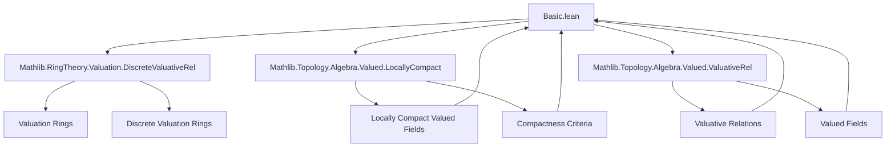

### Technical Brief: `Basic.lean` — Definition of Non-Archimedean Local Fields in Lean 4

---

#### **1. Key Definitions & Theorems**

| Name | Type / Signature | Purpose |
|------|------------------|---------|
| `IsNonarchimedeanLocalField` | `class` | Defines a *non-archimedean local field* as a topological field `K` with a valuative structure satisfying: valuative topology, local compactness, and nontriviality. Extends three properties. |
| `isCompact_closedBall` | `lemma` | Shows closed balls `{ x | valuation K x ≤ γ }` are compact in `K`. Core step toward proving `𝒪[K]` is compact. |
| `instance : CompactSpace 𝒪[K]` | `instance` | Proves the ring of integers `𝒪[K]` is compact, using `isCompact_closedBall K 1`. |
| `valueGroupWithZeroIsoInt` | `noncomputable def` | Constructs a unique order-preserving multiplicative isomorphism `ValueGroupWithZero K ≃*o ℤᵐ⁰`. Key for discreteness and rank ≤ 1. |
| `instance : ValuativeRel.IsDiscrete K` | `instance` | Derives discreteness of the valuation from the integer isomorphism. |
| `instance : ValuativeRel.IsRankLeOne K` | `instance` | Shows valuation rank ≤ 1 via Archimedean property pulled back along the isomorphism. |
| `instance : Finite 𝓀[K]` | `instance` | Proves the residue field `𝓀[K]` is finite, using compactness and discrete valuation ring structure. |
| `instance : CompleteSpace K` | `instance` | Under compatible uniform structure, `K` is complete. |
| `instance : CompleteSpace 𝒪[K]` | `instance` | The integer ring is also complete (as a closed subspace of a complete space). |
| `isAdicComplete` | `proof_wanted` | Unproven goal: `𝒪[K]` is complete in the `𝓂[K]`-adic topology. |

---

#### **2. Naming Conventions**

- **Prefixes**:
  - `is_`: Predicate classes (e.g., `IsValuativeTopology`, `IsNonarchimedeanLocalField`, `IsDiscreteValuationRing`)
  - `valuation_`: Functions/properties tied to the valuation (e.g., `valuation_surjective`, `valuation K`)
  - `isCompact_`, `isClosed_`, `isUniform_`, `isAdic_`: Properties of topological/algebraic structures.
- **Suffixes**:
  - `_space`: Typeclass for topological properties (`LocallyCompactSpace`, `CompactSpace`, `CompleteSpace`)
  - `_ring`: Algebraic structures (`IsDiscreteValuationRing`, `IsTopologicalDivisionRing`)
  - `_rel`: Relations or equivalence classes (`ValuativeRel`)
- **Notation**:
  - `𝒪[K]`: Ring of integers (via `Valued.integer K`)
  - `𝓀[K]`: Residue field
  - `𝓂[K]`: Maximal ideal of `𝒪[K]`
  - `ValueGroupWithZero K`: Value group with zero adjoined.

---

#### **3. Tactic Stack**

| Tactic | Usage Frequency | Role |
|--------|-----------------|------|
| `infer_instance` | Very High | Automatically fills typeclass goals (e.g., `IsTopologicalDivisionRing`, `ValuativeRel.IsNontrivial`) |
| `simp` / `simp only` | High | Simplifies goals using `local simp` attributes (e.g., `zero_lt_iff`) and definitional equalities |
| `obtain` / `have` / `let` | High | Structural proof decomposition, especially for existential witnesses |
| `convert` | Medium | Aligns goals up to definitional equality (e.g., image of compact sets under homeomorphisms) |
| `ext` | Medium | Extensionality for set equality (e.g., `ext x` after `preimage` manipulations) |
| `rw` / `dsimp` | Medium | Rewriting definitions (e.g., `div_mul_eq_mul_div`, `map_pow`) |
| `exact` / `refine` | Medium | Finishing proofs with known terms or partial constructions |
| `by_cases` | Medium | Case analysis on equalities (e.g., `hγ : γ = 0`) |
| `nontriviality` lemmas | Medium | e.g., `isNontrivial_iff_nontrivial_units.mp inferInstance` |

---

#### **4. Proof Logic**

The proof strategy follows a **structured chain of implications**:

1. **Start with assumptions**: `Field K`, `ValuativeRel K`, `TopologicalSpace K`, `IsNonarchimedeanLocalField K`.
2. **Derive algebraic-topological structure**:
   - Use `IsValuativeTopology` + `LocallyCompactSpace` + `ValuativeRel.IsNontrivial` to build:
     - `IsTopologicalDivisionRing K`
     - `CompactSpace 𝒪[K]`
3. **Analyze valuation structure**:
   - Prove closed balls are compact → `𝒪[K]` compact.
   - Use compactness + valuative properties to get:
     - `IsDiscreteValuationRing 𝒪[K]`
     - `Finite 𝓀[K]`
4. **Characterize value group**:
   - Construct `valueGroupWithZeroIsoInt` via locally finite order on units of the integer ring.
   - Pull back properties to deduce:
     - `IsDiscrete`
     - `IsRankLeOne`
5. **Completeness**:
   - Under uniform structure assumptions, use known equivalences:
     - `ProperSpace ↔ CompleteSpace ∧ ...`
     - `CompactSpace ↔ CompleteSpace ∧ ...`
   - Conclude `CompleteSpace K` and `CompleteSpace 𝒪[K]`.

**Missing**: `isAdicComplete` remains open — likely requires adic topology machinery (e.g., `IsAdicTopology`, `AdicCompleteness`).

---

#### **5. Imports & Dependencies**

| Module | Role |
|--------|------|
| `Mathlib.RingTheory.Valuation.DiscreteValuativeRel` | Core valuative theory, discrete valuations, valuation rings |
| `Mathlib.Topology.Algebra.Valued.LocallyCompact` | Locally compact valued fields, compactness criteria |
| `Mathlib.Topology.Algebra.Valued.ValuativeRel` | General valuative relations, equivalence classes, integer rings |

**Key dependencies**:
- `Valued`, `ValuativeRel`, `integer`, `ValueGroupWithZero`
- `UniformSpace`, `IsUniformAddGroup`, `IsTopologicalAddGroup`
- `LocallyFiniteOrder`, `MonoidHom.mrange`, `Units.map`

---

#### **6. Mermaid Diagrams**

##### **Dependency Graph (Module-Level)**



##### **Overview of Theory Flow**

```mermaid
flowchart LR
  A[Field K + ValuativeRel K + TopologicalSpace K] --> B[IsNonarchimedeanLocalField K]
  B --> C1[IsValuativeTopology K]
  B --> C2[LocallyCompactSpace K]
  B --> C3[ValuativeRel.IsNontrivial K]
  C1 & C2 & C3 --> D[IsTopologicalDivisionRing K]
  C2 --> E[isCompact_closedBall]
  E --> F[CompactSpace 𝒪[K]]
  F --> G[IsDiscreteValuationRing 𝒪[K]]
  F --> H[Finite 𝓀[K]]
  F --> I[valueGroupWithZeroIsoInt]
  I --> J[ValuativeRel.IsDiscrete K]
  I --> K[ValuativeRel.IsRankLeOne K]
  C2 & J & K & G & H --> L[CompleteSpace K / 𝒪[K]]  %% via uniform structure
  style A fill:#f9f,stroke:#333
  style B fill:#bbf,stroke:#333
  style L fill:#9f9,stroke:#333
```

---

#### **7. Summary**

This module formalizes the foundational theory of **non-archimedean local fields** in Lean 4, leveraging valuative relations and topology. It establishes equivalence between analytic properties (local compactness, valuation topology) and algebraic ones (discrete valuation ring, finite residue field, integer ring compactness). The central technical achievement is the isomorphism `ValueGroupWithZero K ≃*o ℤᵐ⁰`, which drives discreteness and rank ≤ 1. Completeness follows under uniform assumptions. The only major open goal is `isAdicComplete`, suggesting future work on adic topologies and completion.

--- 

Let me know if you'd like a formalized checklist of required lemmas for `isAdicComplete` or a plan to complete it.
