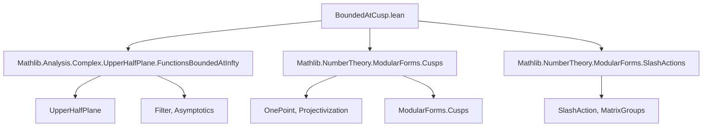

### Technical Brief: `BoundedAtCusp.lean`

---

#### **1. Key Definitions & Theorems**

| Name | Type / Signature | Purpose |
|------|------------------|---------|
| `IsBoundedAt` | `def IsBoundedAt (c : OnePoint ℝ) (f : ℍ → ℂ) (k : ℤ) : Prop` | Defines that $f$ is bounded at cusp $c$ iff for all $g \in \mathrm{GL}(2,\mathbb{R})$ with $g \cdot \infty = c$, the transformed function $f \mid_k g$ is bounded at $\infty$. |
| `IsZeroAt` | `def IsZeroAt (c : OnePoint ℝ) (f : ℍ → ℂ) (k : ℤ) : Prop` | Defines that $f$ vanishes at cusp $c$ iff for all $g \in \mathrm{GL}(2,\mathbb{R})$ with $g \cdot \infty = c$, the transformed function $f \mid_k g$ vanishes at $\infty$. |
| `IsBoundedAtImInfty` | `IsBoundedAtImInfty f` (imported) | $f$ is bounded as $\operatorname{Im}(z) \to \infty$. |
| `IsZeroAtImInfty` | `IsZeroAtImInfty f` (imported) | $f(z) \to 0$ as $\operatorname{Im}(z) \to \infty$. |
| `slash` (lemmas) | `IsZeroAtImInfty.slash`, `IsBoundedAtImInfty.slash` | Show stability of vanishing/boundedness under slash action when $g_{10} = 0$ (i.e., $g \cdot \infty = \infty$). |
| `isBoundedAt_iff`, `isZeroAt_iff` | `lemma isBoundedAt_iff (hg : g • ∞ = c)` | Reduction to a single $g$: checking boundedness/vanishing at $c$ reduces to checking it for *any* $g$ with $g \cdot \infty = c$. |
| `isBoundedAt_iff_exists_SL2Z`, `isZeroAt_iff_exists_SL2Z` | `lemma isBoundedAt_iff_exists_SL2Z (hc : IsCusp c 𝒮ℒ)` | For cusps $c$ in the standard fundamental set $\mathcal{S}$, boundedness/vanishing at $c$ is equivalent to existence of $\gamma \in \mathrm{SL}_2(\mathbb{Z})$ mapping $\infty$ to $c$ such that $f \mid_k \gamma$ is bounded/vanishing at $\infty$. |
| `isBoundedAt_iff_forall_SL2Z`, `isZeroAt_iff_forall_SL2Z` | `lemma isBoundedAt_iff_forall_SL2Z (hc : IsCusp c 𝒮ℒ)` | For cusps $c$, boundedness/vanishing at $c$ is equivalent to *all* $\gamma \in \mathrm{SL}_2(\mathbb{Z})$ with $\gamma \cdot \infty = c$ satisfying boundedness/vanishing of $f \mid_k \gamma$ at $\infty$. |

---

#### **2. Naming Conventions**

- **Prefixes**:
  - `isBoundedAt_`, `isZeroAt_`: for properties at cusps.
  - `IsBoundedAtImInfty`, `IsZeroAtImInfty`: for behavior at the cusp $\infty$.
- **Suffixes**:
  - `_iff`, `_smul_iff`, `_add`: for equivalence and closure properties.
- **Slash notation**:
  - `f ∣[k] g`: slash action of weight $k$.
  - `SlashAction.slash_mul`: algebraic property of slash action.

---

#### **3. Tactic Stack**

Frequently used tactics:
- `rw`: rewriting definitions (`IsBoundedAt`, `IsZeroAt`, `slash_def`, etc.)
- `simp`: simplification using `slash_mul`, `smul_infty_eq_self_iff`, `SemigroupAction.mul_smul`
- `simpa`: simplifying with assumptions and target
- `apply`, `exact`: for direct lemma application
- `convert`, `refine`: for partial proof construction
- `tendsto_smul_atImInfty`, `comp`, `const_mul_left`: analysis lemmas for asymptotics

No heavy automation (e.g., `aesop`, `linarith`) — proofs are mostly structural and rely on known lemmas from `Mathlib`.

---

#### **4. Proof Logic**

- **Structure**: Most proofs follow a pattern:
  1. Unfold definitions (`rw [IsBoundedAt, ...]`)
  2. Reduce to known behavior at $\infty$ via change-of-coordinate $g$
  3. Use stability lemmas (`slash`, `comp_tendsto`, `const_mul_left`)
  4. Apply equivalence principles (`isBoundedAt_iff`, `smul_iff`)
- **Induction**: Not used.
- **Case analysis**: Used implicitly via `smul_infty_eq_self_iff.mp` and `isCusp_SL2Z_iff'`.
- **Equivalence reasoning**: Central — many lemmas are bidirectional (`↔`) and proven via mutual implication.

---

#### **5. Imports**

| Module | Purpose |
|--------|---------|
| `Mathlib.Analysis.Complex.UpperHalfPlane.FunctionsBoundedAtInfty` | Defines `IsBoundedAtImInfty`, `IsZeroAtImInfty`, and asymptotic analysis tools |
| `Mathlib.NumberTheory.ModularForms.Cusps` | Defines cusps, `OnePoint ℝ`, action of $\mathrm{GL}(2,\mathbb{R})$ on $\mathbb{P}^1(\mathbb{R})$, and `IsCusp` |
| `Mathlib.NumberTheory.ModularForms.SlashActions` | Defines slash action $f \mid_k g$, its algebraic properties (`slash_mul`, etc.) |

---

#### **6. Mermaid Diagrams**

##### **Dependency Graph (Module-Level)**



##### **Overview of Theory Flow**

```mermaid
flowchart LR
  subgraph Definitions
    D1[IsBoundedAt c f k]
    D2[IsZeroAt c f k]
  end

  subgraph Base Case (∞)
    B1[IsBoundedAtImInfty f]
    B2[IsZeroAtImInfty f]
  end

  subgraph Equivalences
    E1[isBoundedAt_infty_iff]
    E2[isZeroAt_infty_iff]
    E3[isBoundedAt_iff]
    E4[isZeroAt_iff]
  end

  subgraph SL2Z Reduction
    R1[isBoundedAt_iff_exists_SL2Z]
    R2[isZeroAt_iff_exists_SL2Z]
    R3[isBoundedAt_iff_forall_SL2Z]
    R4[isZeroAt_iff_forall_SL2Z]
  end

  D1 -->|via| E3
  D2 -->|via| E4
  E3 -->|special case| E1
  E4 -->|special case| E2
  R1 -->|uses| E3
  R2 -->|uses| E4
  R3 -->|uses| E3
  R4 -->|uses| E4

  B1 -->|stability| E1
  B2 -->|stability| E2
```

---

#### **7. Summary**

This file formalizes the foundational theory of **boundedness and vanishing at cusps** for functions on the upper half-plane, using the slash action of $\mathrm{GL}(2,\mathbb{R})$ and reduction to the standard cusp $\infty$. It leverages:
- The transitive action of $\mathrm{GL}(2,\mathbb{R})$ on $\mathbb{P}^1(\mathbb{R})$,
- The structure of cusps as $\mathrm{SL}_2(\mathbb{Z})$-orbits,
- Asymptotic analysis tools for $\operatorname{Im}(z) \to \infty$.

The key insight is that checking boundedness/vanishing at a cusp $c$ reduces to checking it for *any* (or *all*) $\gamma \in \mathrm{SL}_2(\mathbb{Z})$ mapping $\infty$ to $c$, after applying the slash action.

This is foundational for defining modular forms, cusp forms, and their behavior at cusps in the language of automorphic forms.
