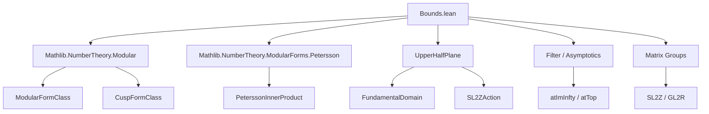

### Technical Brief: Bounds.lean — Formalization of Norm Bounds for Modular Forms and Cusp Forms

---

#### **1. Key Definitions & Theorems**

| Name | Type / Signature | Purpose |
|------|------------------|---------|
| `exists_bound_fundamental_domain_of_isBigO` | `{f : ℍ → E} → Continuous f → f =O[atImInfty] (z ↦ z.im ^ t) → ∃ F, ∀ τ ∈ 𝒟, ‖f τ‖ ≤ F * τ.im ^ t` | Bounds a function on the *truncated* fundamental domain using behavior at infinity and compactness. |
| `exists_bound_of_invariant_of_isBigO` | `{f : ℍ → E} → Continuous f → 0 ≤ t → f =O[atImInfty] (z ↦ z.im ^ t) → f invariant under SL(2, ℤ) → ∃ C, ∀ τ, ‖f τ‖ ≤ C * (max (im τ) (1 / im τ)) ^ t` | Extends the bound from the fundamental domain to all of ℍ using invariance and SL(2, ℤ)-translates. |
| `exists_bound_of_subgroup_invariant_of_isBigO` | Same as above but for finite-index subgroups Γ ≤ SL(2, ℤ). | Generalizes to arithmetic subgroups of SL(2, ℤ). |
| `exists_bound_of_subgroup_invariant_of_isArithmetic_of_isBigO` | Same as above but for arithmetic subgroups Γ ≤ GL(2, ℝ). | Final generalization to arithmetic subgroups of GL(2, ℝ). |
| `ModularFormClass.exists_petersson_le` | `0 ≤ k → Γ.IsArithmetic → ∃ C, ∀ τ, ‖petersson k f f' τ‖ ≤ C * max τ.im (1 / τ.im) ^ k` | Bounds the Petersson inner product of two modular forms. |
| `CuspFormClass.petersson_bounded_left/right` | `∃ C, ∀ τ, ‖petersson k f f' τ‖ ≤ C` | Shows Petersson inner product is *uniformly* bounded when one argument is a cusp form. |
| `CuspFormClass.exists_bound` | `∃ C, ∀ τ, ‖f τ‖ ≤ C / τ.im ^ (k / 2)` | **Norm bound for cusp forms**: decays like $ (\operatorname{im} \tau)^{-k/2} $. |
| `ModularFormClass.exists_bound` | `0 ≤ k → ∃ C, ∀ τ, ‖f τ‖ ≤ C * max 1 (1 / τ.im ^ k)` | **Norm bound for modular forms**: grows at most like $ \max(1, (\operatorname{im} \tau)^{-k}) $. |
| `qExpansion_coeff_isBigO_of_norm_isBigO` | `f =O (τ ↦ τ.im ^ (-e)) ⇒ a_n =O (n ↦ n^e)` | General principle: norm decay ⇒ coefficient growth bound via contour integration. |
| `ModularFormClass.qExpansion_isBigO` | `0 ≤ k ⇒ a_n =O (n ↦ n^k)` | **Polynomial bound for Fourier coefficients of modular forms** (non-optimal, but elementary). |
| `CuspFormClass.qExpansion_isBigO` | `a_n =O (n ↦ n^{k/2})` | **Hecke’s bound** for cusp forms (non-optimal, but elementary). |

---

#### **2. Naming Conventions**

- **Prefixes**:
  - `exists_...`: Existential bounds (constructive or non-constructive).
  - `qExpansion_...`: Related to Fourier coefficients.
  - `petersson_...`: Petersson inner product properties.
- **Suffixes**:
  - `_of_isBigO`: Bounds derived from asymptotic behavior at infinity.
  - `_of_invariant`: Bounds using invariance under group action.
  - `_of_subgroup_invariant`: Bounds for arithmetic subgroups.
  - `_left` / `_right`: Asymmetric behavior (e.g., left argument is cusp form).
- **Other**:
  - `norm_...`, `bdd_...`, `isBigO_...`: Asymptotic or norm-related lemmas.
  - `strictWidthInfty`: Refers to the width of the cusp at infinity.

---

#### **3. Tactic Stack**

| Tactic | Usage Frequency | Purpose |
|--------|------------------|---------|
| `obtain` / `rcases` | High | Extract witnesses and decompose existential hypotheses. |
| `rw` / `simp_rw` | Very High | Rewriting using definitions (e.g., `petersson`, `slash`, `qExpansion`). |
| `gcongr` | High | Handle inequalities involving multiplicative factors. |
| `norm_cast` / `lift ... to NNReal` | Medium | Manage real/complex/NNReal norm comparisons. |
| `fun_prop` | Medium | Prove continuity in function spaces. |
| `intervalIntegral.norm_integral_le_integral_norm` | Medium | Bound Fourier coefficients via contour integrals. |
| `nlinarith` | Medium | Solve polynomial inequalities from norm estimates. |
| `field_simp`, `field` | Medium | Simplify rational expressions involving `im τ`. |
| `mod_cast` | Medium | Cast integer exponents to reals for `rpow`. |
| `filter_upwards`, `eventually_*` | Medium | Handle asymptotic filters (`atTop`, `atImInfty`). |
| `congr` | Low | Prove equality of expressions (e.g., in `max`/`rpow` simplifications). |

---

#### **4. Proof Logic**

The logical flow across the file follows a **three-stage strategy**:

1. **Local bound on truncated fundamental domain**  
   Use continuity + compactness to bound $ f $ on $ \mathcal{D}_y = \{ \tau \in \mathcal{D} : \operatorname{im} \tau \ge y \} $, and asymptotics at $ i\infty $ to bound $ \operatorname{im} \tau \ge y $.

2. **Global bound via group invariance**  
   For any $ \tau \in \mathbb{H} $, find $ g \in \Gamma $ such that $ g \cdot \tau \in \mathcal{D} $, then use invariance $ f(g \cdot \tau) = f(\tau) $ and control $ \operatorname{im}(g \cdot \tau) $ in terms of $ \operatorname{im} \tau $ (via $ \operatorname{im}(g \cdot \tau) = \frac{\operatorname{im} \tau}{|c\tau + d|^2} $).

3. **Coefficient bounds via contour integration**  
   Express Fourier coefficients as contour integrals over horizontal lines $ \operatorname{im} \tau = y $, then use the norm bound $ \|f(\tau)\| \le C \cdot y^{-e} $ to estimate the integral. Optimize over $ y $ (typically $ y = 1/n $) to get $ a_n = O(n^e) $.

Induction is *not* used; the arguments are analytic and rely on:
- Compactness of fundamental domains,
- Invariance under arithmetic groups,
- Asymptotic analysis at cusps,
- Complex analysis (Cauchy’s theorem, contour integrals).

---

#### **5. Imports & Dependencies**

| Module | Role |
|--------|------|
| `Mathlib.NumberTheory.Modular` | Core modular form theory: modular forms, cusp forms, slash operators, $q$-expansions. |
| `Mathlib.NumberTheory.ModularForms.Petersson` | Petersson inner product, its transformation law, boundedness at cusps. |
| `UpperHalfPlane` | Geometry of $ \mathbb{H} $, fundamental domain $ \mathcal{D} $, action of $ \mathrm{SL}(2, \mathbb{Z}) $. |
| `Filter`, `Asymptotics`, `Topology` | Asymptotic notation (`O`, `o`), filters (`atImInfty`, `atTop`). |
| `Matrix.*` | Linear algebra over $ \mathbb{R}, \mathbb{C} $, group actions (`SL(2, ℤ)`, `GL(2, ℝ)`). |
| `ModularForm`, `ConjAct`, `Pointwise` | Modular form classes, group actions on functions, period groups. |

---

#### **6. Mermaid Diagrams**

##### **Dependency Graph (Top-Level)**



##### **Overview of Theory Flow**

```mermaid
flowchart LR
  subgraph "Group-Theoretic Setup"
    G1[SL(2, ℤ) action on ℍ]
    G2[Fundamental domain 𝒟]
    G3[Truncated domain 𝒟_y]
    G4[Arithmetic subgroups Γ]
  end

  subgraph "Analytic Bounds"
    A1[Continuity + Compactness ⇒ bound on 𝒟_y]
    A2[Asymptotics at i∞ ⇒ bound for large im τ]
    A3[Invariance ⇒ extend to ℍ]
    A4[Petersson inner product bounds]
  end

  subgraph "Modular/Cusp Forms"
    M1[ModularFormClass.exists_bound]
    M2[CuspFormClass.exists_bound]
    M3[ModularFormClass.qExpansion_isBigO]
    M4[CuspFormClass.qExpansion_isBigO]
  end

  subgraph "Fourier Coefficients"
    F1[qExpansion_coeff_isBigO_of_norm_isBigO]
    F2[Contour integral representation]
    F3[Optimize over y = 1/n]
  end

  G1 --> G2 --> G3
  G4 --> G1
  A1 & A2 --> A3
  A3 --> M1 & M2
  M1 & M2 --> F1
  F1 --> F2 --> F3 --> M3 & M4
```

---

#### **7. Summary**

This file formalizes **classical analytic bounds** for modular forms and cusp forms over arithmetic subgroups:
- **Norm bounds**: $ \|f(\tau)\| \ll \max(1, (\operatorname{im} \tau)^{-k}) $ (modular), $ \ll (\operatorname{im} \tau)^{-k/2} $ (cusp).
- **Coefficient bounds**: $ a_n \ll n^k $ (modular), $ a_n \ll n^{k/2} $ (cusp) — i.e., **Hecke’s bound**.

The proofs are *elementary* (no deep analytic number theory), relying on:
- Geometry of the upper half-plane,
- Group-theoretic reduction to the fundamental domain,
- Asymptotic analysis at cusps,
- Complex integration for coefficient estimates.

These results are foundational for:
- Convergence of $L$-functions,
- Growth of Fourier coefficients,
- Construction of Petersson inner products,
- Further development of modular symbol theory and Galois representations.

--- 

Let me know if you'd like a **dependency graph of lemmas** (e.g., which lemmas depend on `exists_bound_fundamental_domain_of_isBigO`) or a **proof sketch in natural language** for a specific theorem.
