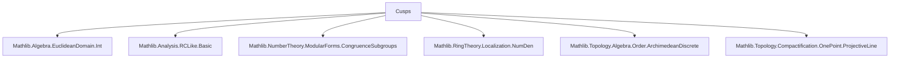
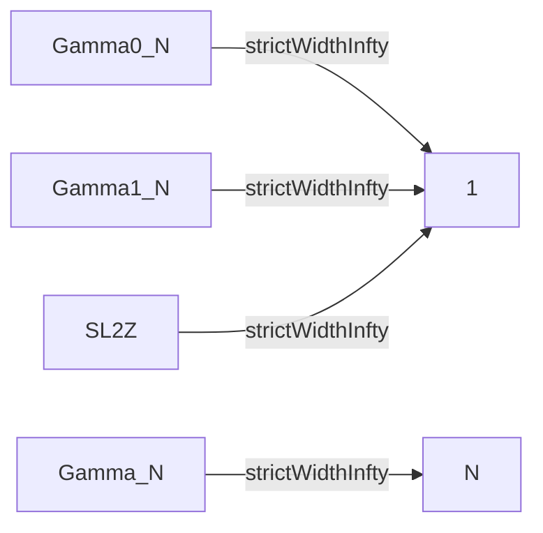

### Technical Brief: Cusps.lean

---

#### **1. Key Definitions & Theorems**

| Name | Type / Signature | Purpose |
|------|------------------|---------|
| `IsCusp` | `def IsCusp (c : OnePoint ℝ) (𝒢 : Subgroup (GL (Fin 2) ℝ)) : Prop` | Defines a *cusp* as a fixed point of a parabolic element in `𝒢`. |
| `cusps_subMulAction` | `def cusps_subMulAction (𝒢 : Subgroup (GL (Fin 2) ℝ)) : SubMulAction 𝒢 (OnePoint ℝ)` | Constructs the action of `𝒢` on its cusps. |
| `CuspOrbits` | `abbrev CuspOrbits (𝒢 : Subgroup (GL (Fin 2) ℝ))` | Type of orbits of `𝒢` acting on its cusps. |
| `cosetToCuspOrbit` | `noncomputable def cosetToCuspOrbit (𝒢 : Subgroup (GL (Fin 2) ℝ)) [𝒢.IsArithmetic]` | Surjection from `SL(2, ℤ) / (𝒢 ∩ SL(2, ℤ))` to cusp orbits. |
| `strictPeriods` | `def strictPeriods : AddSubgroup R` | Additive subgroup of `R` of `x` such that `[1, x; 0, 1] ∈ 𝒢`. |
| `periods` | `protected noncomputable def periods : AddSubgroup R` | Additive subgroup of `x` such that `±[1, x; 0, 1] ∈ 𝒢`. |
| `strictWidthInfty` | `noncomputable def strictWidthInfty : ℝ` | Minimal positive `x` with `[1, x; 0, 1] ∈ 𝒢`, or `0` if none. |
| `widthInfty` | `noncomputable def widthInfty : ℝ` | Minimal positive `x` with `±[1, x; 0, 1] ∈ 𝒢`. |
| `isCusp_SL2Z_iff` | `lemma isCusp_SL2Z_iff {c : OnePoint ℝ}` | Cusps of `SL(2, ℤ)` are exactly `ℙ¹(ℚ)`. |
| `isCusp_SL2Z_iff'` | `lemma isCusp_SL2Z_iff' {c : OnePoint ℝ}` | Cusps of `SL(2, ℤ)` are exactly its orbit of `∞`. |
| `Subgroup.IsArithmetic.isCusp_iff_isCusp_SL2Z` | `lemma` | Arithmetic subgroups have same cusps as `SL(2, ℤ)`. |
| `finite_cusp_orbits` | `instance [𝒢.IsArithmetic] : Finite (CuspOrbits 𝒢)` | Arithmetic subgroups have finitely many cusp orbits. |
| `strictWidthInfty_pos_iff` | `lemma` | `∞` is a cusp iff `strictWidthInfty > 0`, under det `±1` and discrete topology. |
| `strictWidthInfty_pos` | `lemma [𝒢.IsArithmetic]` | For arithmetic `𝒢`, `strictWidthInfty > 0`. |
| `strictPeriods_Gamma`, `strictWidthInfty_Gamma` | `@[simp] lemma` | Explicit formulas for principal congruence subgroups `Γ(N)`. |

---

#### **2. Naming Conventions**

- **Predicates**: `is_`, `Is_`, `mem_`, `commensurable_`, `regular_`, `finite_`, `discrete_`, `regularAtInfty`.
- **Group-theoretic constructions**: `periods`, `strictPeriods`, `adjoinNegOne`, `pointwise_smul`, `commensurable`.
- **Action-related**: `smul`, `ConjAct.toConjAct`, `MulAction.orbitRel`, `cusps_subMulAction`.
- **Cusp-specific**: `IsCusp`, `CuspOrbits`, `cosetToCuspOrbit`.
- **Width-related**: `strictWidthInfty`, `widthInfty`.
- **Matrix-specific**: `upperRightHom`, `mapGL`, `map`, `GL`, `SL`, `T` (ModularGroup.T).
- **OnePoint-related**: `infty`, `coe`, `map`, `smul_infty_eq_ite`, `smul_infty_eq_self_iff`.

Prefixes like `is_`, `mem_`, `strict_`, `width_`, `period_`, `commensurable_`, `regular_` are heavily used.

---

#### **3. Tactic Stack**

Frequent tactics used in proofs:

- `simp` / `simp only` — simplification with lemmas, especially matrix entries, `map`, `smul`, `mem_`.
- `aesop` — for routine automation (e.g., `surjective_cosetToCuspOrbit`, `finite_cusp_orbits`).
- `grind` — custom tactic (likely from Mathlib’s `Grind` module) for solving matrix equalities by evaluating entries.
- `fin_cases` — for case analysis on `Fin 2` indices.
- `rcases`, `obtain`, `rintro` — destructuring existential/universal hypotheses.
- `rw`, `rwa`, `convert`, `refine`, `apply` — rewriting and proof construction.
- `norm_num`, `ring`, `linarith` — arithmetic simplifications.
- `grind`, `simp`, `aesop` — used in combination for matrix computations.
- `discharge`-style reasoning via `have`, `suffices`, `by_cases`.

---

#### **4. Proof Logic**

- **Inductive/constructive structure**: Proofs often proceed by:
  - **Case analysis** on `c : OnePoint ℝ` (`∞` vs `coe q`).
  - **Decomposition** of parabolic elements using `isParabolic_iff_of_upperTriangular`.
  - **Lifting elements** via `exists_mem_SL2`, `num_den_reduced`, `exists_SL2_col`.
  - **Relating subgroups** via `relIndex`, `commensurable`, `inf`, `comap`.
  - **Using algebraic structure**: additive subgroups of `ℝ`, cyclic structure (`zmultiples`), discrete topology.
  - **Transferring properties** across commensurable subgroups (e.g., cusps, finiteness).
- **Key logical flow**:
  - Show `∞` is a cusp ⇔ existence of parabolic fixing `∞`.
  - Use classification of parabolics fixing `∞` as upper-triangular unipotents (up to sign).
  - Translate to additive subgroup conditions (`strictPeriods`, `periods`).
  - Use discrete topology + det `±1` to deduce positivity of width.
  - For arithmetic subgroups, reduce to `SL(2, ℤ)` via commensurability.

---

#### **5. Imports**

| Module | Purpose |
|--------|---------|
| `Mathlib.Algebra.EuclideanDomain.Int` | Euclidean domain structure on `ℤ`, PID properties. |
| `Mathlib.Analysis.RCLike.Basic` | Real-closed-like structure, used for `ℝ`-analysis. |
| `Mathlib.NumberTheory.ModularForms.CongruenceSubgroups` | Definitions of `Γ₀(N)`, `Γ₁(N)`, `Γ(N)`, `ModularGroup`. |
| `Mathlib.RingTheory.Localization.NumDen` | Number/denominator decomposition in fraction fields. |
| `Mathlib.Topology.Algebra.Order.ArchimedeanDiscrete` | Discrete additive subgroups of `ℝ`. |
| `Mathlib.Topology.Compactification.OnePoint.ProjectiveLine` | `OnePoint K` as one-point compactification of `K`, action of `GL(2, K)`. |

---

#### **6. Theory Overview & Dependency Diagram**

##### **High-Level Theory Flow**

```
OnePoint K
   │
   ├─ Action of GL(2, K) on OnePoint K
   │   └─ Fixed points of parabolics → Cusps
   │
   ├─ SL(2, ℤ)-transitivity on OnePoint ℚ
   │   └─ Every cusp of SL(2, ℤ) is SL(2, ℤ)-equivalent to ∞
   │
   └─ Subgroup theory
       ├─ Parabolic elements → strict/period subgroups
       │   └─ Widths (strict, width) defined via additive subgroups
       │
       ├─ Arithmetic subgroups
       │   ├─ Commensurable with SL(2, ℤ)
       │   └─ Same cusps, finite cusp orbits
       │
       └─ Congruence subgroups
           └─ Explicit period/width formulas (e.g., Γ(N) has width N)
```

##### **Mermaid Diagrams**

**Dependency Graph (Module-Level)**



**Theory Flow (Cusp Structure)**

```mermaid
graph LR
  A[OnePoint K] --> B[Action of GL(2, K)]
  B --> C[Fixed points of parabolics]
  C --> D[IsCusp c 𝒢]
  D --> E[strictPeriods / periods]
  E --> F[strictWidthInfty / widthInfty]
  D --> G[Commensurability]
  G --> H[Arithmetic subgroups]
  H --> I[Finite CuspOrbits]
  I --> J[cosetToCuspOrbit surjection]
```

**Congruence Subgroup Widths**



---

#### **7. Summary**

This file formalizes the theory of *cusps* for subgroups of `GL(2, ℝ)`, with emphasis on arithmetic subgroups (especially congruence subgroups of `SL(2, ℤ)`). It connects:

- **Geometric** (fixed points of parabolics),
- **Algebraic** (strict/period subgroups, widths),
- **Topological** (discrete subgroups, finite index),
- **Number-theoretic** (congruence subgroups, ℚ-points of ℙ¹).

The main results are:

- Classification of cusps of `SL(2, ℤ)` as `ℙ¹(ℚ)`.
- Invariance of cusps under commensurability (hence for all arithmetic subgroups).
- Finiteness of cusp orbits for arithmetic subgroups.
- Explicit computation of widths for congruence subgroups.

The formalization is highly structured, leveraging `OnePoint`, `MulAction`, `AddSubgroup`, and `DiscreteTopology` to unify geometric and algebraic perspectives.

--- 

Let me know if you'd like a **proof sketch** of a specific lemma (e.g., `isCusp_SL2Z_iff` or `strictWidthInfty_pos`), or a **dependency graph at the lemma level**.
