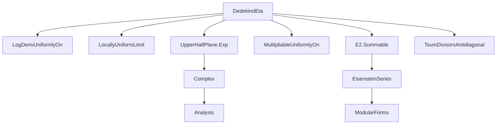
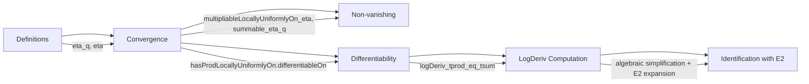

### Technical Brief: Dedekind Eta Function in Lean 4 (`DedekindEta.lean`)

---

#### **1. Key Definitions & Theorems**

| Name | Type / Signature | Purpose |
|------|------------------|---------|
| `eta_q` | `ℕ → ℂ → ℂ`, `eta_q n z = q^(n+1)` with `q = e^(2πiz)` | Inner term of the infinite product defining η |
| `eta` | `ℂ → ℂ`, `η z = q^(1/24) * ∏'ₙ (1 - q^(n+1))` | Dedekind eta function |
| `eta_ne_zero` | `z ∈ ℍₒ → η z ≠ 0` | Non-vanishing of η on upper half-plane |
| `differentiableAt_eta_of_mem_upperHalfPlaneSet` | `z ∈ ℍₒ → DifferentiableAt ℂ η z` | Differentiability of η on ℍ |
| `logDeriv_eta_eq_E2` | `logDeriv η z = (π * I / 12) * E2 z` | Logarithmic derivative of η is proportional to Eisenstein series *E₂* |
| `multipliableLocallyUniformlyOn_eta` | Uniform convergence of product on compact subsets | Enables termwise differentiation and log-derivative computation |
| `summable_logDeriv_one_sub_eta_q` | Summability of log-derivatives of factors | Key for applying `logDeriv_tprod_eq_tsum` |

---

#### **2. Naming Conventions**

- **Prefixes**:
  - `eta_`: All definitions/lemmas related to η or its building blocks.
  - `logDeriv_`: Lemmas about logarithmic derivatives.
  - `summable_`: Lemmas about absolute convergence of series/products.
  - `multipliable_`: Lemmas about infinite products converging multiplicatively.
- **Suffixes**:
  - `_eq`: Equality lemmas (e.g., `eta_q_eq_cexp`).
  - `_ne_zero`: Non-vanishing results.
  - `_tprod`: Related to infinite products (`tprod_ne_zero`, `tsum_logDeriv_eta_q`).
  - `_qParam`: Related to `Periodic.qParam`.
- **Notation**:
  - `𝕢 h z` for `q^h = e^(2πi h z)`
  - `ℍₒ` for upper half-plane set `upperHalfPlaneSet`
  - `η` for `eta`

---

#### **3. Tactic Stack**

Frequently used tactics:
- `simp`, `simp_rw`, `simp only`: Simplification with local definitions and lemmas.
- `ring`, `grind`: Algebraic simplification (especially for complex arithmetic).
- `aesop`: Automated reasoning for structural equalities (e.g., function compositions).
- `fun_prop`: Propagation of differentiability/continuity properties.
- `filter_upwards`: Filter-based reasoning (e.g., uniform convergence on compacts).
- `convert`, `rw`, `apply`: Core rewriting and proof construction.
- `tsum_congr`, `tsum_mul_left`, `tsum_pnat_eq_tsum_succ`: Manipulation of infinite sums.

---

#### **4. Proof Logic**

The proof strategy follows a standard complex-analytic approach to modular forms:

1. **Well-definedness & convergence**:
   - Show `eta_q n z` lies strictly inside unit disk for `z ∈ ℍ`, via `norm_exp_two_pi_I_lt_one`.
   - Prove `∑ ‖eta_q n z‖` converges ⇒ infinite product converges absolutely/uniformly on compacts (`multipliableLocallyUniformlyOn_eta`).
2. **Non-vanishing**:
   - Use `eta_tprod_ne_zero` (based on `tprod_one_add_ne_zero_of_summable`) to show product ≠ 0.
3. **Differentiability**:
   - Apply `hasProdLocallyUniformlyOn.differentiableOn` to get differentiability of product.
4. **Logarithmic derivative**:
   - Compute derivative of each factor: `logDeriv (1 - eta_q n ·)`.
   - Prove summability of these derivatives (`summable_logDeriv_one_sub_eta_q`).
   - Apply `logDeriv_tprod_eq_tsum` to exchange log-derivative and infinite product.
   - Simplify using known expansions of `E2` and divisor sums (`G2_eq_tsum_cexp`, `riemannZeta_two`, `tsum_pow_div_one_sub_eq_tsum_sigma`).
5. **Final identification**:
   - Match resulting expression with definition of `E2` to conclude `logDeriv η = (π i / 12) * E2`.

Induction is *not* used; the proof relies on analytic convergence and algebraic manipulation.

---

#### **5. Imports & Dependencies**

**Core libraries used**:
- `Mathlib.Analysis.Calculus.LogDerivUniformlyOn`: Logarithmic derivatives and uniform convergence.
- `Mathlib.Analysis.Complex.LocallyUniformLimit`: Locally uniform limits and differentiability.
- `Mathlib.Analysis.Complex.UpperHalfPlane.Exp`: Exponential map on upper half-plane.
- `Mathlib.Analysis.Normed.Module.MultipliableUniformlyOn`: Infinite products and uniform convergence.
- `Mathlib.NumberTheory.ModularForms.EisensteinSeries.E2.Summable`: Summability of *E₂* Fourier coefficients.
- `Mathlib.NumberTheory.TsumDivisorsAntidiagonal`: Summation over divisor pairs (used in *E₂* expansion).

**Key external modules**:
- `Periodic.qParam`, `UpperHalfPlane`, `EisensteinSeries.E2`, `Complex.exp`.

---

#### **6. Mermaid Diagrams**

##### **Dependency Graph (Module-Level)**

##### **Overview of File Structure**

---

#### **7. Summary**

This file formalizes the foundational analytic properties of the **Dedekind eta function** in the context of modular forms. It establishes:
- Convergence and non-vanishing on the upper half-plane,
- Holomorphicity,
- A precise formula for its logarithmic derivative in terms of the weight-2 Eisenstein series *E₂*.

The formalization is highly structured, leveraging Lean’s robust analysis library for infinite products and uniform convergence, and connects modular forms with complex analysis in a mathematically rigorous way.

--- 

Let me know if you'd like a formalized dependency graph (e.g., `.dot` format) or a breakdown of how `E2` is defined in this context.
