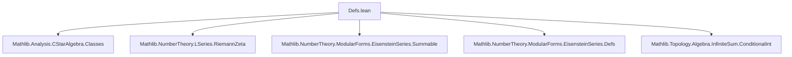

**Technical Brief: `Defs.lean` — Eisenstein Series $E_2$ and Defect Function $D_2$**

---

### 1. **Key Definitions & Theorems**

| Name | Type | Purpose |
|------|------|---------|
| `e2Summand` | `ℤ → ℍ → ℂ` | Auxiliary summand: for fixed $m$, sums over $n$ the weight-2 Eisenstein summand $e_{2}([m,n],z)$. |
| `e2Summand_summable` | `Summable (n ↦ eisSummand 2 ![m, n] z)` | Guarantees convergence of the inner sum defining `e2Summand`. |
| `e2Summand_zero_eq_two_riemannZeta_two` | `e2Summand 0 z = 2 ζ(2)` | Identifies the $m=0$ term as twice the Riemann zeta value at 2. |
| `e2Summand_even` | `(e2Summand · z).Even` | Symmetry: $e_2(-m,z) = e_2(m,z)$. |
| `G2` | `ℍ → ℂ` | Unnormalized weight-2 Eisenstein series: conditional sum over symmetric intervals $[{-N},N]$. |
| `E2` | `ℍ → ℂ` | Normalized Eisenstein series: $E_2(z) = \frac{1}{2ζ(2)} G_2(z)$. |
| `D2` | `SL(2,ℤ) → ℍ → ℂ` | Defect function measuring failure of $G_2$ to be a modular form of weight 2. |
| `D2_one` | `D2 1 = 0` | Trivial defect for identity matrix. |
| `denom_aux` | `((A * B) 1 0)·denom B z = (A 1 0)·det B + (B 1 0)·denom (A*B) z` | Algebraic identity for denominator cocycle. |
| `D2_mul` | `D2 (A * B) = (D2 A) ∣[(2)] B + D2 B` | 2-cocycle identity: $D_2(AB) = D_2(A)\|_2 B + D_2(B)$. |
| `D2_inv` | `(D2 A)|_2 A⁻¹ = -D2 A⁻¹` | Inversion property of defect. |
| `D2_T` | `D2 T = 0` | Defect vanishes for translation $T = \begin{pmatrix}1&1\\0&1\end{pmatrix}$. |
| `D2_S` | `D2 S z = 2πi / z` | Defect for inversion $S = \begin{pmatrix}0&-1\\1&0\end{pmatrix}$. |

---

### 2. **Naming Conventions**

- **Prefixes**:
  - `e2Summand_`: auxiliary sum for $m$-th slice of $G_2$.
  - `D2_`: properties of defect function for weight 2.
  - `eisSummand`: generic Eisenstein summand (imported).
- **Suffixes**:
  - `_even`: symmetry property.
  - `_zero_eq_...`: special case evaluation.
  - `_mul`, `_inv`, `_one`, `_T`, `_S`: group-theoretic identities.
- **Notation**:
  - `∣[(k)]` denotes the weight-$k$ slash operator: $(f\|_k γ)(z) = (cz+d)^{-k} f(γ·z)$.
  - `∑'[symmetricIcc ℤ] m` is conditional summation over symmetric integer intervals.

---

### 3. **Tactic Stack**

Frequently used tactics:
- `simp`, `simp only`, `simp_rw`
- `ring`, `field_simp`, `linarith`
- `tsum_congr`, `tsum_comp_neg`, `linear_right_summable`, `grind` (custom automation)
- `ext`, `intro`, `apply`, `rw`, `symm`, `congr`
- `have`, `simpa`, `mod_cast`, `rw_mod_cast`

---

### 4. **Proof Logic**

- **Structure**: Most proofs follow a *computational* pattern:
  1. Expand definitions (`D2`, `e2Summand`, `G2`, `denom`).
  2. Use algebraic identities (`denom_aux`, `Matrix.two_mul_expl`).
  3. Simplify using `modularGroup` action (`sl_moeb`, `denom_apply`, `num`/`denom` formulas).
  4. Apply field simplifications and ring manipulations.
- **Induction/Recursion**: Not used here — all proofs are direct algebraic verifications.
- **Symmetry arguments**: Use `tsum_congr` and `Int.reduceNeg` to prove evenness.

---

### 5. **Imports & Scope**

**Primary Dependencies**:
- `Mathlib.Analysis.CStarAlgebra.Classes`: for `ℍ` (upper half-plane) and complex analysis tools.
- `Mathlib.NumberTheory.LSeries.RiemannZeta`: for `riemannZeta`, zeta function values.
- `Mathlib.NumberTheory.ModularForms.EisensteinSeries.*`: core Eisenstein series infrastructure.
- `Mathlib.Topology.Algebra.InfiniteSum.ConditionalInt`: for conditional sums over ℤ.

**Scope**: This module defines foundational objects for weight-2 Eisenstein series, especially the *non-modular* object $E_2$, and quantifies its failure to be modular via the defect $D_2$. It sets up the cocycle identity needed to study transformation laws.

---

### 6. **Mermaid Diagrams**

#### **Dependency Graph (Module-Level)**



#### **Theoretical Overview (Module Content)**

```mermaid
flowchart LR
  subgraph Definitions
    e2[e2Summand m z]
    G2[G2 z = ∑'_{m∈ℤ} e2Summand m z]
    E2[E2 = (2ζ(2))⁻¹ • G2]
    D2[D2(γ) z = (2πi·γ₁₀)/(denom γ z)]
  end

  subgraph Properties
    even[e2Summand even in m]
    ζ[e2Summand 0 = 2ζ(2)]
    cocycle[D2 is 2-cocycle: D2(AB) = D2(A)|₂B + D2(B)]
    trivial[D2(1)=0, D2(T)=0]
    S[D2(S) z = 2πi/z]
  end

  e2 --> even
  e2 --> ζ
  G2 --> e2
  E2 --> G2
  D2 --> cocycle
  D2 --> trivial
  D2 --> S
```

---

### 7. **Key Insight**

- $E_2$ is *not* a modular form of weight 2, but satisfies:
  $$
  E_2\big|_2 γ - E_2 = \frac{12}{2πi} D_2(γ)
  $$
  The function $D_2$ is a 1-cocycle in group cohomology, and its explicit formula enables computation of the anomaly (e.g., for $S$ and $T$ generators).

- The use of *conditional* summation (`∑'[symmetricIcc ℤ]`) reflects the non-absolute convergence of the weight-2 Eisenstein series — a subtle analytic point.

--- 

Let me know if you'd like a formalization roadmap for proving modularity of $E_2$ up to correction terms, or a comparison with the usual $q$-expansion definition.
