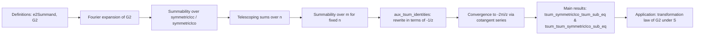

### Technical Brief: Summability of the Eisenstein Series `E2`

---

#### **1. Key Definitions & Theorems**

| Name | Type / Purpose |
|------|----------------|
| `e2Summand` | `ℤ → ℍ → ℂ`, the summand in the definition of the weight-2 Eisenstein series `G2`. Even in the integer argument. |
| `G2` | `ℍ → ℂ`, the (non-holomorphic) Eisenstein series of weight 2, defined as a symmetrically summed `∑' m, e2Summand m z`. |
| `qExpansion_identity_pnat` | Identity linking the $q$-expansion of the Eisenstein series to divisor sums $\sigma_1(n)$. Used to derive the Fourier expansion. |
| `G2_eq_tsum_cexp` | $G2(z) = 2\zeta(2) - 8\pi^2 \sum_{n=1}^\infty \sigma_1(n) q^n$, where $q = e^{2\pi i z}$. |
| `hasSum_e2Summand_symmetricIcc` / `hasSum_e2Summand_symmetricIco` | Establish convergence of the Eisenstein series under symmetric interval summation (`symmetricIcc`, `symmetricIco`). |
| `tendsto_e2Summand_atTop_nhds_zero` | Shows the summand tends to 0 at infinity — necessary for summability over symmetric intervals. |
| `tsum_symmetricIco_tsum_sub_eq` | **Main result**: $\displaystyle \sum'_{n \in \mathbb{Z}} \sum'_{m \in \mathbb{Z}} \left(\frac{1}{mz + n} - \frac{1}{mz + n + 1}\right) = -\frac{2\pi i}{z}$. Sum over $n$ first (symmetric), then $m$. |
| `tsum_tsum_symmetricIco_sub_eq` | **Main result**: $\displaystyle \sum'_{m \in \mathbb{Z}} \sum'_{n \in \mathbb{Z}} \left(\frac{1}{mz + n} - \frac{1}{mz + n + 1}\right) = 0$. Sum over $m$ first, then $n$ (symmetric). |
| `telescope_aux` | Telescoping identity: $\sum_{n=-b}^{b-1} \left(\frac{1}{mz + n} - \frac{1}{mz + n + 1}\right) = \frac{1}{mz - b} - \frac{1}{mz + b}$. |
| `tsum_symmetricIco_linear_sub_linear_add_one_eq_zero` | For fixed $m$, the symmetric sum over $n$ of the telescoping difference is 0. |
| `aux_tsum_identity_1` / `aux_tsum_identity_2` | Decomposition and re-expression of sums over $\mathbb{Z}$ in terms of $-1/z$, used to relate to cotangent series. |
| `aux_tendsto_tsum` | Shows that the symmetric partial sums over $n$ of the $m$-summed expression converge to $-2\pi i / z$. |
| `tendsto_tsum_one_div_linear_sub_succ_eq` | Intermediate convergence lemma for double sums over finite symmetric intervals. |
| `tendsto_double_sum_S_act` | Relates the double sum under $S = \begin{pmatrix} 0 & -1 \\ 1 & 0 \end{pmatrix}$ action to $G2(S \cdot z)$. |
| `tsum_symmetricIco_tsum_eq_S_act` | $\displaystyle \sum'_{n} \sum'_{m} \frac{1}{(mz + n)^2} = \frac{1}{z^2} G2(S \cdot z)$. Key for transformation law. |

---

#### **2. Naming Conventions**

- **Prefixes**:
  - `e2Summand_`: properties of the weight-2 Eisenstein summand.
  - `G2_`: properties of the Eisenstein series $G_2$.
  - `tendsto_`: convergence of sums or expressions.
  - `hasSum_`: existence of a sum (i.e., convergence to a specific value).
  - `summable_`: absolute convergence (in the filter sense).
  - `aux_`: auxiliary lemmas used in proofs of main results.
  - `telescope_`: telescoping sum identities.
  - `one_div_linear_`: identities involving differences of reciprocals of linear forms.

- **Suffixes**:
  - `_eq`: equality to a specific value.
  - `_sub_eq`: equality involving a subtraction (often telescoping).
  - `_identity`: algebraic or analytic identity.
  - `_tendsto`: convergence statement.
  - `_symmetricIcc` / `_symmetricIco`: summation over symmetric intervals $[-N, N]$ or $[-N, N)$.

---

#### **3. Tactic Stack**

| Tactic | Usage |
|--------|-------|
| `grind` | Automated simplification and rewriting (custom tactic in this codebase). |
| `simp_rw` | Simplify with rewriting (used heavily for $q$-expansions, exponentials). |
| `congr` | Prove equality of sums via termwise equality. |
| `tsum_congr` | Termwise equality for infinite sums. |
| `rw [← tsum_mul_left]`, `rw [← tsum_neg]` | Rearranging infinite sums using linearity. |
| `apply summable_*.congr` | Transfer summability via termwise equivalence. |
| `convert` | Partial equality with proof obligations left. |
| `field` | Simplify field expressions (e.g., $a/b - c/d$). |
| `ring` / `ring_nf` | Simplify polynomial expressions. |
| `aesop` | Automated reasoning for basic arithmetic and inequalities. |
| `nth_rw` | Rewrite at a specific position in an expression. |
| `ext` | Extensionality for function equality. |

---

#### **4. Proof Logic**

- **Structure**:
  1. **Fourier expansion of $G_2$**:
     - Derive partial sum formula `G2_partial_sum_eq`.
     - Show convergence via `aux_G2_tendsto` using geometric series and divisor sum identities.
     - Conclude $G_2(z)$ equals its $q$-expansion.

  2. **Summability over symmetric intervals**:
     - Use evenness of `e2Summand` and decay at infinity (`tendsto_e2Summand_atTop_nhds_zero`) to switch between `symmetricIcc` and `symmetricIco`.

  3. **Double sum analysis**:
     - For fixed $m \ne 0$, inner sum over $n$ telescopes to 0 (`tsum_symmetricIco_linear_sub_linear_add_one_eq_zero`).
     - For fixed $n$, inner sum over $m$ is expressed via cotangent series (`aux_tsum_identity_1`, `aux_tsum_identity_2`), leading to exponential sums.
     - Use geometric series convergence (`aux_tendsto_tsum_cexp_pnat`) to show the symmetric partial sums converge to $-2\pi i / z$.

  4. **Transformation under $S$**:
     - Use change of variables $z \mapsto -1/z$ to swap sums.
     - Show convergence to $\frac{1}{z^2} G_2(S \cdot z)$, yielding the transformation law.

- **Key logical flow**:
  - **Induction-free**: rely on filter-theoretic convergence (via `Tendsto`, `HasSum`, `Summable`).
  - **Symmetric summation** avoids conditional convergence issues.
  - **Cotangent series** is the analytic bridge between arithmetic sums and exponential expansions.

---

#### **5. Imports**

| Module | Purpose |
|--------|---------|
| `Mathlib.NumberTheory.ModularForms.EisensteinSeries.E2.Defs` | Definitions of $E_2$, $G_2$, slash operators, modular group action. |
| `Mathlib.NumberTheory.ModularForms.EisensteinSeries.QExpansion` | $q$-expansion machinery, divisor sums $\sigma_k$, geometric series convergence. |

---

#### **6. Mermaid Diagrams**

##### **Dependency Graph (High-Level)**

```mermaid
graph TD
  A[ModularForms.EisensteinSeries.E2.Defs] --> B[Summable.lean]
  C[ModularForms.EisensteinSeries.QExpansion] --> B

  B --> D[TransformationLaw.lean]  %% future use
  B --> E[ModularForms.EisensteinSeries.E2.Transformation]

  subgraph Theory
    B -- defines --> F[G2 q-expansion]
    B -- proves --> G[Summability over symmetric intervals]
    B -- uses --> H[Cotangent series expansion]
    B -- uses --> I[Geometric series convergence]
  end
```

##### **Overview of File Structure**



---

#### **7. Summary**

This file establishes rigorous convergence properties of the weight-2 Eisenstein series $G_2$, especially its $q$-expansion and behavior under symmetric summation. Crucially, it computes the discrepancy between two natural orderings of summation for the telescoping double sum $\sum_{m,n} \left(\frac{1}{mz+n} - \frac{1}{mz+n+1}\right)$, yielding the correction term $-2\pi i / z$ that appears in the non-holomorphic transformation law of $G_2$ under the modular $S$-transformation.

The proof strategy combines:
- **Algebraic telescoping**,
- **Analytic convergence via geometric/cotangent series**,
- **Filter-theoretic summability arguments**.

This is foundational for proving the modular transformation law of $G_2$, which is essential in the theory of quasimodular forms.

--- 

Let me know if you'd like a formalized dependency graph (e.g., in Lean’s `docs` format) or a breakdown of how this feeds into the transformation law.
