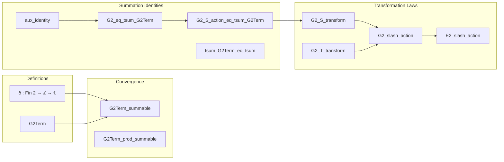

### Technical Brief: `Transform.lean` — Slash Action on the Weight-2 Eisenstein Series

---

#### **1. Key Definitions & Theorems**

| Name | Type / Statement | Purpose |
|------|------------------|---------|
| `δ : Fin 2 → ℤ → ℂ` | `δ x = if x = ![0,0] then 1 else if x = ![0,-1] then 2 else 0` | Auxiliary correction term for telescoping sums; supports absolute convergence of `G2Term`. |
| `G2Term (z : ℍ) (m : Fin 2 → ℤ) : ℂ` | `((m 0 * z + m 1)^2 * (m 0 * z + m 1 + 1))⁻¹ + δ m` | Absolutely convergent summand used to re-express `G2`. |
| `G2_eq_tsum_G2Term` | `G2 z = ∑' m n, G2Term z ![m, n]` | Shows `G2` equals an absolutely convergent double sum via `G2Term`. |
| `G2_S_transform` | `G2 z = z⁻² * G2 (S • z) - (-2 * π * I / z)` | Core transformation law under $S = \begin{pmatrix}0 & -1 \\ 1 & 0\end{pmatrix}$; includes correction term. |
| `G2_T_transform` | `G2 ∣[2] T = G2` | Invariance under $T = \begin{pmatrix}1 & 1 \\ 0 & 1\end{pmatrix}$. |
| `D2 : SL(2, ℤ) → ℍ → ℂ` | *(implicit, defined elsewhere)* | Cocycle correction term: $D_2(\gamma)(z)$ satisfies $G_2 \mid [2] \gamma = G_2 - D_2(\gamma)$. |
| `G2_slash_action` | `G2 ∣[2] γ = G2 - D2 γ` | Full transformation law for all $\gamma \in SL_2(\mathbb{Z})$, via generators $S,T$. |
| `E2_slash_action` | `E2 ∣[2] γ = E2 - (1/(2 ζ(2))) • D2 γ` | Normalized version using $E_2 = G_2 / (2 ζ(2))$. |

---

#### **2. Naming Conventions**

- **Prefixes**:
  - `G2_`, `E2_`: Functions related to weight-2 Eisenstein series.
  - `δ_`, `G2Term_`: Auxiliary constructions for convergence and summation tricks.
  - `slash_`, `D2_`: Slash action and cocycle correction.
- **Suffixes**:
  - `_transform`: Transformation law under group element.
  - `_action`: Full group action identity (e.g., `G2_slash_action`).
  - `_eq_tsum_`, `_tsum_`: Identities involving (double) infinite sums.
  - `_summable`: Proof of absolute convergence.
- **Other**:
  - `aux_`: Auxiliary lemmas (e.g., `aux_identity`).
  - `_eq_S_act`, `_eq_tsum_G2Term`: Intermediate steps in proving transformation.

---

#### **3. Tactic Stack**

Frequently used tactics in this file:

| Tactic | Role |
|--------|------|
| `simp` / `simp_rw` | Simplification of definitions (`δ`, `G2Term`, `SL_slash_def`, etc.). |
| `grind` | Custom tactic (likely from `Mathlib.Tactic`) for grinding through algebraic equalities and field simplifications. |
| `aesop` | Automated reasoning for linear arithmetic, inequalities, and basic logic. |
| `ring` / `ring_nf` | Polynomial simplification and normalization. |
| `rw` | Rewriting using lemmas (especially summability, convergence, and cocycle properties). |
| `congr` / `congr'` | Congruence reasoning for function extensionality and sum equality. |
| `induction ... using ..._induction` | Structural induction over subgroup closure (for `G2_slash_action`). |
| `filter_upwards` | For cofinite filter arguments (e.g., `δ_eventually_cofinite`). |
| `have`, `set`, `nth_rw` | Intermediate proof steps and strategic rewriting. |

---

#### **4. Proof Logic**

The proof strategy follows a **three-stage decomposition**:

1. **Absolute Convergence Setup**  
   - Express `G2` as an absolutely convergent double sum using `G2Term` and `δ`.  
   - Prove `G2Term_summable`, `G2Term_prod_summable`, and `G2_eq_tsum_G2Term`.

2. **Swapping Summation Order via S-Action**  
   - Use `G2_S_action_eq_tsum_G2Term` to relate $z^{-2} G_2(S \cdot z)$ to the same double sum but with summation order swapped.  
   - The correction term $-2\pi i / z$ arises from the difference between:
     - $\sum_m \sum_n$ and $\sum_n \sum_m$,
     - captured by lemmas like `tsum_symmetricIco_tsum_sub_eq` and `tsum_tsum_symmetricIco_sub_eq`.

3. **Group-Theoretic Extension**  
   - Use that $SL_2(\mathbb{Z}) = \langle S, T \rangle$, and prove transformation laws for generators:
     - `G2_T_transform`: trivial invariance.
     - `G2_S_transform`: nontrivial correction.
   - Extend to all $\gamma$ via:
     - `Subgroup.closure_induction` (induction on group generators),
     - Cocycle properties of `D2` (`D2_one`, `D2_mul`, `D2_inv`).

---

#### **5. Imports & Dependencies**

| Import | Purpose |
|--------|---------|
| `Mathlib.NumberTheory.ModularForms.EisensteinSeries.E2.Summable` | Provides convergence lemmas, especially for sums like $\sum_{m,n} (mz+n)^{-2}$, and key identities (`tsum_symmetricIco_tsum_sub_eq`, etc.). |
| `Mathlib.LinearAlgebra.Matrix.FixedDetMatrices` | Defines `SL(2, ℤ)` and matrix group actions (e.g., `S`, `T`, slash action). |
| `UpperHalfPlane`, `ModularForm`, `ModularGroup`, `Complex`, `MatrixGroups`, `Set`, `SummationFilter` | Foundational structures for modular forms, group actions, and analysis on $\mathbb{H}$. |
| `Real`, `Topology` | For real/complex analysis, topology of $\mathbb{H}$, and filter-based convergence. |

---

#### **6. Mermaid Diagrams**

##### **Dependency Graph (High-Level)**

```mermaid
graph TD
  A[Transform.lean] --> B[Mathlib.NumberTheory.ModularForms.EisensteinSeries.E2.Summable]
  A --> C[Mathlib.LinearAlgebra.Matrix.FixedDetMatrices]
  B --> D[Summability lemmas]
  B --> E[tsum_symmetricIco_tsum_sub_eq]
  C --> F[SL₂(ℤ) definitions]
  C --> G[Slash action]
  A --> H[ModularForms infrastructure]
  H --> I[EisensteinSeries module]
  H --> J[ModularGroup]
```

##### **Overview of File Structure**



---

#### **7. Summary**

This file formalizes the *non-modularity* of the weight-2 Eisenstein series $G_2$ (and $E_2$) under $SL_2(\mathbb{Z})$. Unlike higher-weight Eisenstein series, $G_2$ fails to be modular due to a **nontrivial cocycle correction** $D_2(\gamma)$. The proof hinges on:
- A clever telescoping decomposition (`δ`, `G2Term`) to achieve absolute convergence,
- Swapping summation order under the $S$-action, and
- Group-theoretic induction over $SL_2(\mathbb{Z})$.

The formalization is highly structured, with auxiliary lemmas isolating analytic and algebraic components, and leverages Lean’s filter-based summability infrastructure for rigorous handling of conditionally convergent series.

--- 

Let me know if you'd like the `D2` definition extracted or a formalization of the cocycle property.
