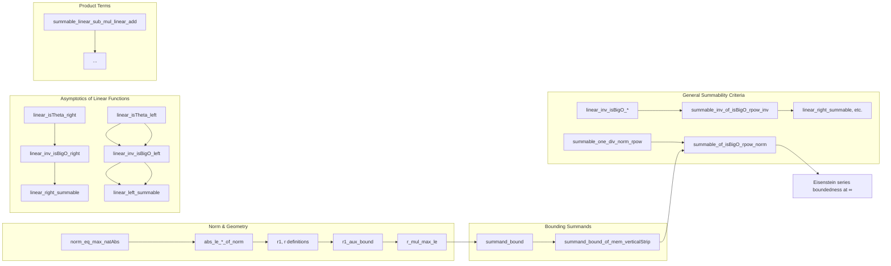

Here is the structured technical metadata extracted from the `Summable.lean` file:

---

### **1. Key Definitions & Theorems**

| Name | Type / Signature | Purpose |
|------|------------------|---------|
| `norm_eq_max_natAbs` | `∀ x : Fin 2 → ℤ, ‖x‖ = max (x 0).natAbs (x 1).natAbs` | Identifies the norm on `Fin 2 → ℤ` with the max of natural absolute values. |
| `norm_symm` | `∀ x y : ℤ, ‖![x, y]‖ = ‖![y, x]‖` | Symmetry of the norm under swapping components. |
| `abs_le_left_of_norm`, `abs_le_right_of_norm` | `|n| ≤ ‖![n, m]‖`, `|m| ≤ ‖![n, m]‖` | Lower bounds on the norm in terms of component absolute values. |
| `abs_norm_eq_max_natAbs`, `abs_norm_eq_max_natAbs_neg` | `‖![1, n+1]‖ = n+1`, `‖![1, -(n+1)]‖ = n+1` | Computes norm for specific integer vectors. |
| `r1`, `r` | `r1 z = z.im² / (z.re² + z.im²)`, `r z = min z.im √(r1 z)` | Auxiliary functions bounding `|c·z + d|` from below. |
| `r1_aux_bound` | `r1 z ≤ |c·z + d|²` under `1 ≤ d²` | Key inequality linking `r1` to the complex linear expression. |
| `r_mul_max_le` | `r z * ‖x‖ ≤ ‖x₀·z + x₁‖` for nonzero `x` | Core inequality bounding linear forms by norm. |
| `summand_bound`, `summand_bound_of_mem_verticalStrip` | `‖x₀·z + x₁‖⁻ᵏ ≤ r(z)⁻ᵏ · ‖x‖⁻ᵏ` | Bounds Eisenstein summands by product of `z`-dependent and `x`-dependent terms. |
| `summable_one_div_norm_rpow` | `2 < k ⇒ Summable (x ↦ ‖x‖⁻ᵏ)` | Main summability result for `‖x‖⁻ᵏ` over `ℤ²`. |
| `linear_right_summable`, `linear_left_summable` | `2 ≤ k ⇒ Summable (d ↦ (c·z + d)⁻ᵏ)`, similar for `c` | Summability of Eisenstein summands in one variable. |
| `summable_linear_sub_mul_linear_add`, `summable_linear_right_add_one_mul_linear_right`, `summable_linear_left_mul_linear_left` | Various summability results for products like `(c₁z − n)(c₂z + n)`⁻¹ | Needed for convergence of related series (e.g., in derivative or difference analysis). |
| `summable_of_isBigO_rpow_norm` | `2 < a ∧ f =O[cofinite] ‖·‖⁻ᵃ ⇒ Summable f` | General summability criterion via big-O decay. |
| `aux_isBigO_linear`, `vec_add_const_isTheta`, `isBigO_linear_add_const_vec` | Big-O comparisons between linear forms and norms | Technical tools to reduce general Eisenstein summands to norm-based decay. |

---

### **2. Naming Conventions**

- **`norm_` prefix**: Properties of the norm on `Fin 2 → ℤ` (e.g., `norm_eq_max_natAbs`, `norm_symm`).
- **`r1`, `r`**: Specialized bounding functions for `|c·z + d|`.
- **`aux_` prefix**: Auxiliary lemmas used in proofs (e.g., `auxbound1`, `auxbound2`, `aux_isBigO_linear`).
- **`linear_` prefix**: Results about linear functions in one variable over `ℤ` (e.g., `linear_isTheta_right`, `linear_inv_isBigO_left`).
- **`summable_` prefix**: Summability theorems (e.g., `summable_one_div_norm_rpow`, `linear_right_summable`).
- **`isBigO_`, `isLittleO_`, `isTheta_`**: Asymptotic comparison lemmas.
- **`div_`, `max_`, `mul_`**: Often used for algebraic manipulations involving division, max, multiplication.

---

### **3. Tactic Stack**

- **Core tactics**: `simp`, `rw`, `refine`, `gcongr`, `grind`, `filter_upwards`, `apply`, `exact`, `cases`.
- **Analysis-specific**:
  - ` positivity` (for positivity of reals),
  - `norm_cast`, `real`, `ring`, `linarith`, `lia` (for arithmetic),
  - `Real.sqrt_le_sqrt_iff`, `Real.rpow_le_rpow_of_nonpos`, `Real.summable_nat_rpow`.
- **Asymptotic analysis**:
  - `isBigO`, `isLittleO`, `isTheta`, `inv`, `pow`, `mul`, `comp_neg_int`.
- **Order/filter**:
  - `Filter.eventually_gt_atTop`, `tendsto_atTop_nhds_zero`, `cofinite`.
- **Algebraic simplifications**:
  - `div_mul_cancel₀`, `mul_assoc`, `add_zero`, `pow_two`, `inv_pow`.

---

### **4. Proof Logic**

- **Norm analysis**: Prove structural properties of the norm on `Fin 2 → ℤ`, especially relating it to max of abs values.
- **Bounding linear forms**: Use geometry of the upper half-plane (`z ∈ ℍ`) and vertical strips to bound `|c·z + d|` below by `r(z)·‖x‖`.
- **Reduction to norm decay**: Show that Eisenstein summands are dominated by `‖x‖⁻ᵏ`, then apply summability of `‖x‖⁻ᵏ` for `k > 2`.
- **One-variable summability**: Reduce to known asymptotics (`IsTheta`, `IsBigO`) for linear functions over `ℤ`, then apply `summable_inv_of_isBigO_rpow_inv`.
- **Product terms**: Use closure properties of `O`/`o`/`Θ` (e.g., multiplication, composition) to handle products like `(c₁z + n)(c₂z + n)`.

---

### **5. Imports**

| Module | Purpose |
|--------|---------|
| `Mathlib.Analysis.Complex.UpperHalfPlane.Topology` | Geometry of `ℍ`, vertical strips, topology. |
| `Mathlib.Analysis.PSeries` | Summability of $n^{-k}$ (used in `summable_one_div_norm_rpow`). |
| `Mathlib.Order.Interval.Finset.Box` | Partitioning `ℤ²` into boxes for summability argument. |
| `Mathlib.Analysis.Asymptotics.Defs` | Big-O, little-o, Θ notation and their algebraic properties. |

---

### **6. Mermaid Diagrams**

#### **Dependency Graph (High-Level)**

```mermaid
graph TD
  A[UpperHalfPlane Topology] --> B[VerticalStrip, z.im > 0]
  C[PSeries] --> D[Summability of n^(-k) for k > 1]
  E[Finset.Box] --> F[Partition ℤ² into boxes]
  G[Asymptotics] --> H[IsBigO/IsTheta/IsLittleO calculus]

  B --> I[EisensteinSeries.norm_eq_max_natAbs]
  D --> J[summable_one_div_norm_rpow]
  F --> J
  H --> K[linear_isTheta_right, linear_inv_isBigO_*]
  K --> L[linear_right_summable, linear_left_summable]
  I --> M[r_mul_max_le, summand_bound]
  M --> N[summable_of_isBigO_rpow_norm]
  L --> N
  N --> O[Eisenstein series boundedness at ∞]
```

#### **Overview of File Structure**



---

Let me know if you'd like a formalized dependency graph in `lean` or a visualization of the `EisensteinSeries` namespace structure.
