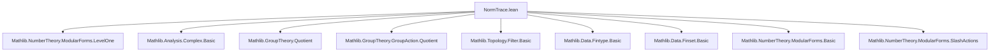

Here is the **technical metadata extraction** for the Lean 4 file `NormTrace.lean`, structured as requested:

---

### **1. Key Definitions & Theorems**

| Name | Type / Signature | Purpose |
|------|------------------|---------|
| `quotientFunc` | `quotientFunc (q : 𝒬) (τ : ℍ) : ℂ` | Packages translates of `f` under `ℋ` over the quotient `ℋ ⧸ (𝒢 ⊓ ℋ)`; used to define trace/norm. |
| `SlashInvariantForm.trace` | `trace : SlashInvariantForm ℋ k` | Trace map: sum over `ℋ`-cosets of translates of `f`. |
| `SlashInvariantForm.norm` | `norm : SlashInvariantForm ℋ (k * Nat.card 𝒬)` | Norm map: product over `ℋ`-cosets of translates of `f`. Requires `ℋ.HasDetPlusMinusOne`. |
| `ModularForm.trace` | `trace : ModularForm ℋ k` | Trace of a modular form (respects holomorphy & boundedness at cusps). |
| `CuspForm.trace` | `trace : CuspForm ℋ k` | Trace of a cusp form (preserves vanishing at cusps). |
| `ModularForm.norm` | `norm : ModularForm ℋ (k * Nat.card 𝒬)` | Norm of a modular form; weight scales by index. Requires `ℋ.HasDetPlusMinusOne`. |
| `ModularForm.norm_ne_zero` | `(hf : f ≠ 0) → norm ℋ f ≠ 0` | Norm is nonzero if `f` is nonzero. |
| `ModularForm.norm_eq_zero_iff` | `norm ℋ f = 0 ↔ f = 0` | Characterization of when norm vanishes. |
| `ModularForm.isZero_of_neg_weight` | `{k < 0} → f = 0` | Weighted modular forms of negative weight vanish under arithmeticity. |
| `ModularForm.eq_const_of_weight_zero₀` | `f : ModularForm 𝒢 0 ⇒ ∃ c, f = const c` | Weight-zero modular forms are constant (for arithmetic `𝒢` with det = 1). |
| `ModularForm.eq_const_of_weight_zero` | `f : ModularForm 𝒢 0 ⇒ ∃ c, f = const c` | Generalization of above to arbitrary arithmetic `𝒢`. |

---

### **2. Naming Conventions**

- **Prefixes**:
  - `quotientFunc_`: functions defined on quotient space.
  - `trace`, `norm`: standard algebraic constructions.
  - `slash_action_eq'`, `bdd_at_cusps'`, `holo'`: properties of slash-invariant forms/modular forms.
  - `isZero_of_`, `eq_const_of_`: structural classification lemmas.

- **Suffixes**:
  - `_smul`, `_mk`, `_sum`, `_prod`: indicate interaction with group actions, quotients, sums/products.
  - `_ne_zero`, `_eq_zero_iff`: logical characterizations of zero/nonzero behavior.

- **Notation**:
  - `𝒬` := `ℋ ⧸ (𝒢.subgroupOf ℋ)` (quotient type).
  - `∣[k] g` := slash action of weight `k` by group element `g`.
  - `q.liftOn` := definition on quotient via representative.

---

### **3. Tactic Stack**

Frequently used tactics in proofs:

| Tactic | Role |
|--------|------|
| `simp` / `simp_rw` | Simplify using definitional equalities and lemmas like `quotientFunc_mk`, `quotientFunc_smul`. |
| `induction ... using Quotient.inductionOn` | Handle quotient-based definitions. |
| `rw [QuotientGroup.leftRel_apply, Quotient.eq, Quotient.eq_iff_equiv]` | Work with coset equality. |
| `congr_fun`, `ext` | Extensionality for functions. |
| `exact`, `refine`, `apply` | Direct proof steps, especially for `slash_action_eq'`. |
| `simpa using ...` | Simplify goal using a hypothesis. |
| `convert`, `infer_instance` | Typeclass inference and congruence. |
| `tendsto_finset_sum`, `finsetProd`, `sum`, `prod` | Handle convergence/boundedness of sums/products. |
| `contrapose!`, `rw [← DFunLike.coe_injective.eq_iff]` | Logical manipulations and coercion reasoning. |
| `mod_cast` | Cast integer inequalities to real ones. |

---

### **4. Proof Logic**

- **Structure of proofs**:
  - **Step 1**: Define object (e.g., `trace`, `norm`) as a function on underlying type.
  - **Step 2**: Prove invariance under slash action (`slash_action_eq'`) using:
    - `quotientFunc_smul`
    - `Equiv.sum_comp` / `Equiv.prod_comp`
    - `SlashAction.sum_slash`, `prod_slash`
  - **Step 3**: Verify analytic properties:
    - **Holomorphy**: via `translate f r⁻¹`.holo' and `sum`/`prod` of holomorphic functions.
    - **Boundedness at cusps**: via `translate f _`.bdd_at_cusps' and `Finset.sum`/`prod` lemmas.
    - **Vanishing at cusps (cusp forms)**: similar, using `zero_at_cusps'`.
  - **Step 4**: For structural results (e.g., weight 0 ⇒ constant), reduce to level 1 via `norm` and use known classification (`levelOne_weight_zero_const`, `levelOne_neg_weight_eq_zero`).

- **Induction pattern**:
  - Quotient induction (`Quotient.inductionOn`) for coset-dependent definitions.
  - Finite type reasoning via `Fintype.ofFinite 𝒬`.

---

### **5. Imports**

- `Mathlib.NumberTheory.ModularForms.LevelOne`: Provides foundational results on level 1 modular forms (e.g., `levelOne_weight_zero_const`, `levelOne_neg_weight_eq_zero`).
- `UpperHalfPlane`, `ModularForm`, `SlashInvariantForm`, `Topology.Filter`, `Manifold`: ambient theory for modular forms and analytic behavior.
- `Group.Quotient`, `Group.Action.Quotient`, `Group.Subgroup.Basic`: for quotient group constructions and actions.
- `Data.Fintype.Basic`, `Data.Finset.Basic`: for finite index arguments and summation over cosets.

---

### **6. Mermaid Diagrams**

#### **Dependency Graph (Module-Level)**



#### **Overview of Theory Flow**

```mermaid
flowchart LR
  subgraph Setup
    G[Subgroups 𝒢, ℋ ≤ GL₂(ℝ)]
    I[Finite relative index: 𝒢.relindex ℋ ≠ 0]
    Q[Quotient 𝒬 = ℋ ⧸ (𝒢 ⊓ ℋ)]
  end

  subgraph Construction
    QF[quotientFunc : 𝒬 × ℍ → ℂ]
    T[SlashInvariantForm.trace = ∑_𝒬 quotientFunc]
    N[SlashInvariantForm.norm = ∏_𝒬 quotientFunc]
  end

  subgraph Lifting
    MT[ModularForm.trace]
    CT[CuspForm.trace]
    MN[ModularForm.norm]
  end

  subgraph Applications
    NZ[ModularForm.norm ≠ 0 iff f ≠ 0]
    NW[Weight < 0 ⇒ f = 0]
    WC[Weight 0 ⇒ f constant]
  end

  G --> I --> Q --> QF
  QF --> T & N
  T --> MT & CT
  N --> MN
  MN --> NZ
  MN --> NW
  MN --> WC
```

---

Let me know if you'd like a **formal specification** of the trace/norm maps in terms of universal properties, or a **proof sketch** of `ModularForm.isZero_of_neg_weight`.
